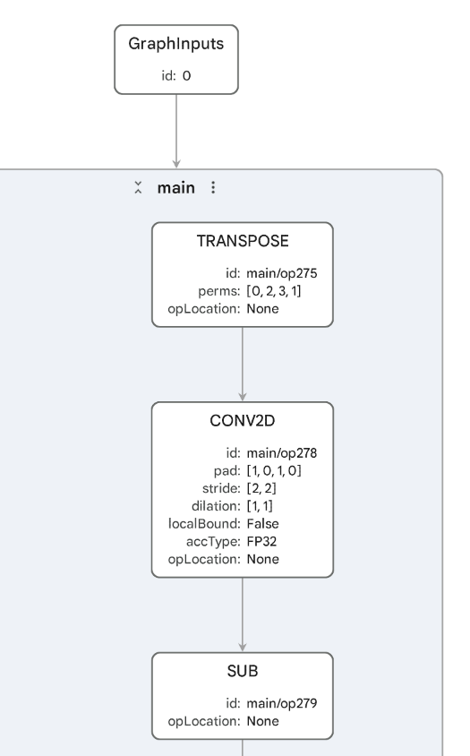
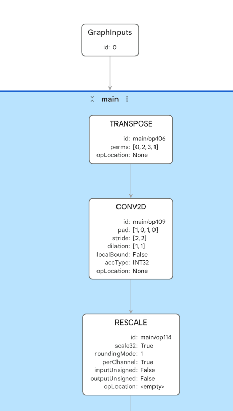
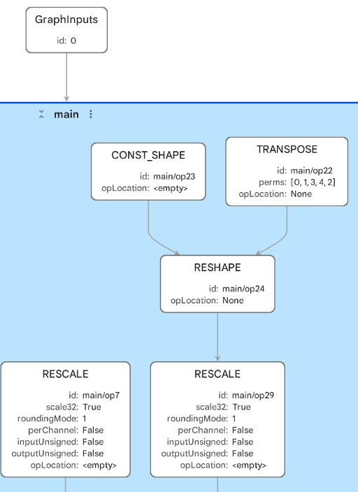
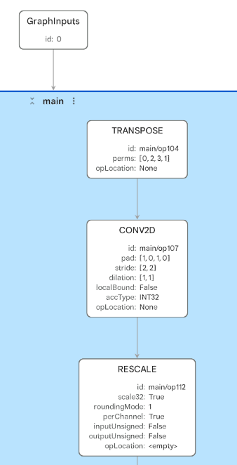
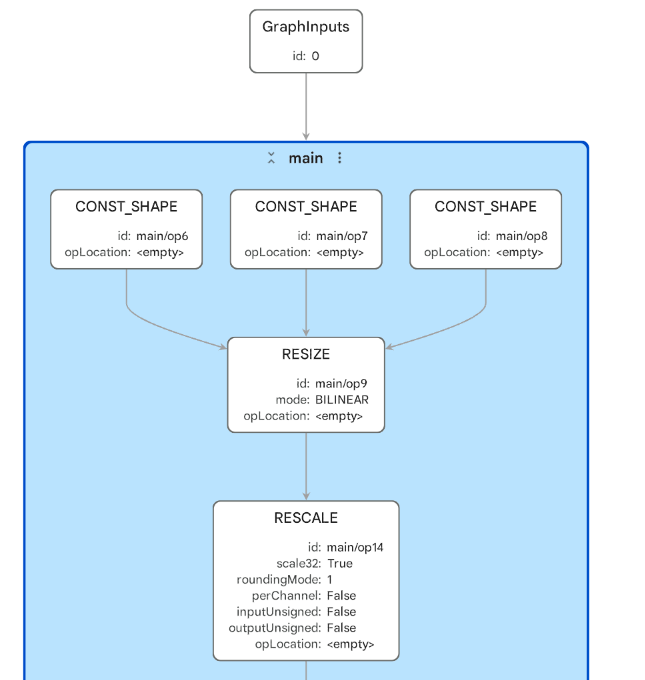

## Inspect the TOSA intermediate representation

Tensor Operator Set Architecture (TOSA) is a stable operator-level intermediate representation (IR) used between model export and backend-specific compilation or conversion.

Ethos-U `.pte` files show the final ExecuTorch program after supported regions have been delegated or left outside the NPU delegate. With TOSA, you can inspect an earlier stage: the graph representation that backend tools such as Vela or the Arm ML SDK Model Converter can consume.

You don't need separate TOSA artifacts for the Cortex-A portable, Cortex-A XNNPACK, or Cortex-M examples. Those routes don't need a TOSA IR: portable kernels stay in the ExecuTorch operator path, XNNPACK uses an ExecuTorch delegate for Cortex-A CPU acceleration, and Cortex-M uses its own Cortex-M or CMSIS-NN-oriented lowering path. TOSA becomes relevant for the backend routes that consume it, such as Ethos-U and VGF.

Inspecting TOSA is useful when you want to identify whether:

- Lowering produced the operators you expected
- Tensors are in the expected shapes and data types
- Quantization changed the graph structure
- An unsupported operation split the graph into separate artifacts
- This TOSA artifact is ready to feed into the next backend tool

Unlike `.pte` views, these graphs don't show ExecuTorch runtime instructions or delegate calls. Instead, they show TOSA operators such as `CONV2D`, `DEPTHWISE_CONV2D`, `RESCALE`, `CLAMP`, and `RESHAPE`.

## Inspect Ethos-U TOSA artifacts

Start with the same MobileNetV2 cases you inspected as `.pte` files.

Open the FP32 TOSA artifact `ml-model-artifacts/tosa/mv2_fp32.tosa`.

Inspect the graph and look for the following:

- Whether the input is in the right shape `[1, 3, 224, 224]`
- Whether the output shape is `[1, 1000]`
- Whether the tensor types are FP32
- What convolution, add, clamp, and pooling patterns are visible



The artifact shows that the FP32 model can be represented in TOSA. In Model Explorer, you'll see a large graph with about 800 nodes. Most of the graph is made from constants and arithmetic around the MobileNetV2 operator structure: `CONV2D`, `DEPTHWISE_CONV2D`, `MUL`, `ADD`, `SUB`, `CLAMP`, one `AVG_POOL2D`, and a final `RESHAPE`.

This doesn't mean the graph can run on Ethos-U. Ethos-U expects supported quantized integer workloads, so the FP32 `.pte` you inspected earlier didn't contain an `EthosUBackend` delegate region.

Now, open the INT8 TOSA artifact `ml-model-artifacts/tosa/mv2_int8.tosa`.

Compare it with the FP32 TOSA graph:

- The input and output shapes still match MobileNetV2: `[1, 3, 224, 224]` to `[1, 1000]`.
- Tensor types are INT8.
- You'll see many `RESCALE` operations, which are common in quantized graphs.
- You'll still see the core CNN structure, including `CONV2D`, `DEPTHWISE_CONV2D`, `ADD`, `AVG_POOL2D`, and `RESHAPE`.



The INT8 graph is still a full MobileNetV2 graph, but the operator mix changes. You'll see fewer floating-point arithmetic nodes and many `RESCALE` nodes. These are used in quantized graphs to move values between quantization scales after integer operations. The convolution and depthwise convolution operators use INT32 accumulation, which is typical for INT8 convolution workloads.

This is the kind of TOSA graph that can be compiled by the Ethos-U Vela compiler into an Ethos-U command stream, then packaged into a `.pte`.

## Inspect fragmented TOSA artifacts

Next, inspect the TOSA artifacts from the LRN example: `ml-model-artifacts/tosa/mv2_lrn_int8_1.tosa` and `ml-model-artifacts/tosa/mv2_lrn_int8_2.tosa`.

The LRN `.pte` contained two `EthosUBackend` delegate nodes with non-delegated work between them. These two TOSA files help explain why.

Inspect both TOSA files and look for the following:

- Why the example produced more than one TOSA artifact
- The input and output shapes for each fragment
- The fragment that contains most of the MobileNetV2 CNN structure
- The fragment that represents the graph region after the inserted LRN-related work
- Whether the fragment boundaries are consistent with the two `EthosUBackend` regions in the `.pte`





The first LRN TOSA file is the smaller fragment. It has two inputs, with shapes `[1, 1280, 7, 7]` and `[1, 1, 1280, 7, 7]`, and one `[1, 1000]` output. The file contains the later part of the graph after the inserted LRN-related work, including a small number of `RESCALE`, `TABLE`, `MUL`, `AVG_POOL2D`, and `CONV2D` operations.

The second LRN TOSA file is the larger fragment. It starts from the original image input shape `[1, 3, 224, 224]` and contains most of the quantized MobileNetV2 CNN structure. The file has many `RESCALE`, `CONV2D`, and `DEPTHWISE_CONV2D` operations, and produces intermediate outputs with shapes `[1, 1280, 7, 7]` and `[1, 1, 1284, 7, 7]` that cross the break in the graph.

The graph fragmentation has become visible as multiple backend-ready TOSA artifacts. That matches the fragmented `.pte` view, where two `EthosUBackend` delegate regions were separated by non-delegated work.

The two TOSA files show where the backend-supported graph was split. They don't measure the cost of that split or confirm that the non-delegated operators can run in the deployed runtime. Runtime profiling is needed to identify whether boundary-related work or non-delegated operators dominate execution.

## Use TOSA outside ExecuTorch

TOSA isn't limited to ExecuTorch. ExecuTorch can lower supported graph partitions to TOSA, but a different framework, internal compiler, or proprietary model frontend can also produce TOSA directly.

That makes the TOSA adapter useful even when there is no `.pte` file in the workflow. For example, you might be:

- Converting from a framework, ONNX graph, or internal model dialect into TOSA
- Writing a compiler, graph optimizer, or Vela-like backend tool that consumes TOSA
- Checking whether your frontend produced the TOSA operators, tensor shapes, layouts, and quantized types you expected
- Looking for missed optimization opportunities, such as long chains of `ADD`, `MUL`, `RESHAPE`, or layout operations that could potentially be fused or lowered differently
- Comparing two frontend or compiler versions to see whether the generated TOSA graph became simpler, more fragmented, or more backend-friendly

One valid artifact flow is:

```output
Custom model format or framework
        |
Frontend or compiler conversion
        |
       TOSA
        |
Arm backend compiler or model converter
        |
Target-specific artifact
```

This matters because TOSA provides a contract between the model frontend and the backend tool. If the TOSA graph has the expected operators, shapes, layouts, and quantized types, the backend compiler or converter has a clearer input to work from. If the graph looks noisy, fragmented, or unexpectedly generic, the issue might be in the frontend conversion, an earlier graph optimization pass, or the backend support boundary.

## Inspect TOSA for VGF conversion

TOSA can also feed workflows that use the ML extensions for Vulkan. The Arm ML SDK Model Converter takes TOSA as input, applies transforms and optimizations, lowers to Standard Portable Intermediate Representation - Vulkan (SPIR-V) graph IR, and packages the result into a VGF file.

You'll use a small neural upscaling model that takes a low-resolution image-like tensor and produces a higher-resolution output. This makes it a useful compact example for workflows using the ML extensions for Vulkan and for neural graphics.

These artifacts were generated in the [Quantize neural upscaling models with ExecuTorch](https://learn.arm.com/learning-paths/mobile-graphics-and-gaming/quantize-neural-upscaling-models/) Learning Path. To learn how to generate the `.tosa` and `.vgf` files yourself, and how to apply post-training quantization (PTQ) and quantization-aware training (QAT) before export, complete that Learning Path.

Open the TOSA artifacts used by the VGF examples: `ml-model-artifacts/tosa/small_upscaler_ptq.tosa` and `ml-model-artifacts/tosa/small_upscaler_qat.tosa`.

These small upscaler graphs are INT8 TOSA artifacts. In Model Explorer, look for:

- Input shape `[1, 16, 16, 3]`
- Output shape `[1, 32, 32, 3]`
- `RESIZE` with bilinear mode
- `CONV2D` operations
- `RESCALE` operations from quantized arithmetic
- Similarities and differences between the PTQ and QAT artifacts



Don't expect a major visual difference between the PTQ and QAT TOSA graphs. They represent the same small upscaler architecture and were lowered to the same visible TOSA structure: 41 nodes, including one bilinear `RESIZE`, three `CONV2D` operations, four `RESCALE` operations, three `CONST_SHAPE` nodes, and constants for weights and quantization parameters.

The important difference is how the quantized model parameters were produced. PTQ applies quantization after training, usually using calibration data to choose quantization parameters. It's simpler and faster to apply, so it's often the first option to try. QAT simulates quantization during training, so the model can adapt to quantization effects. It takes more work, but can recover accuracy when PTQ causes too much quality loss.

In Model Explorer, that difference is not likely to appear as a different graph shape. Look instead at tensor metadata, constants, scales, shifts, zero-points, and any downstream accuracy or runtime behavior.

These files are useful because they connect the TOSA view to the VGF view. TOSA shows the backend-neutral graph representation. In the next section, you'll see the VGF artifact produced for integration with the ML extensions for Vulkan and neural graphics.

## What you've accomplished and what's next

You've inspected TOSA as the intermediate representation between model lowering and backend compilation or conversion. For Ethos-U, TOSA helps explain why FP32 doesn't delegate, why INT8 can produce a compact NPU region, and why an inserted unsupported operation can fragment the graph. You've also seen that TOSA isn't ExecuTorch-specific and can be produced by other frontends.

Next, you'll inspect VGF artifacts and see what the TOSA-to-VGF conversion produces for workflows using the ML extensions for Vulkan.
