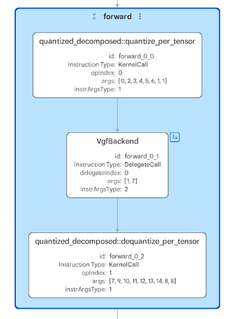
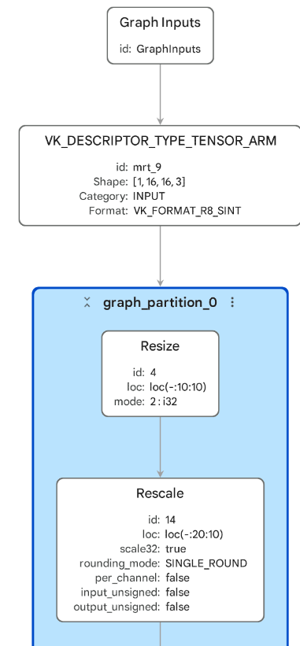

## Inspect VGF artifacts for the ML extensions for Vulkan

VGF is the artifact used by Arm ML SDK for Vulkan workflows. It's useful in workflows using the ML extensions for Vulkan, and in neural graphics applications where you need to inspect the graph consumed by the Vulkan runtime.

In the previous section, you inspected the TOSA artifacts for a small neural upscaling model, obtained from the [Quantize neural upscaling models with ExecuTorch](https://learn.arm.com/learning-paths/mobile-graphics-and-gaming/quantize-neural-upscaling-models/) Learning Path. You'll now inspect the VGF and PTE artifacts produced from that flow.

Although that flow uses ExecuTorch and generates `.pte` files as well, VGF isn't ExecuTorch-specific. If you have a `.tosa` file obtained from another flow, you can convert it to `.vgf` using the Arm ML SDK Model Converter.

## Compare PTE and VGF views

There are two related but different Model Explorer views in a VGF workflow:

| View | Open with | Layer inspected | What to look for |
| --- | --- | --- | --- |
| VGF-backend `.pte` | PTE adapter | ExecuTorch program and deployment container | Where the VGF backend call appears, and whether there's surrounding quantize, dequantize, or CPU work |
| Standalone `.vgf` | VGF adapter | Backend graph for the ML extensions for Vulkan | The operators, tensors, shapes, constants, descriptors, and graph connectivity the Vulkan runtime will consume |

Use the `.pte` file when you want to understand how ExecuTorch wraps and calls the VGF backend. Use the `.vgf` file when you want to inspect the VGF artifact used with the ML extensions for Vulkan. You can also open the VGF backend in Model Explorer from the `.pte` file and see the same view as opening the file directly.

## Open the VGF-backend PTE

Start with the PTQ small upscaler `ml-model-artifacts/pte/small_upscaler_ptq_vgf.pte` packaged as an ExecuTorch program.

Inspect the graph and look for the following:

- Whether there's a `VgfBackend` delegate node
- The work that happens before and after the backend call
- Whether the top-level graph shows the internal upscaler operators
- What this view tells you about the ExecuTorch runtime path



In Model Explorer, the `.pte` looks compact. You'll see a `quantized_decomposed::quantize_per_tensor` node, a single `VgfBackend` delegate node, a `quantized_decomposed::dequantize_per_tensor` node, and graph inputs and outputs.

This is similar to the Ethos delegation. Apart from inputs and outputs and the quantize and dequantize operators, the model is completely delegated to the backend.

Expand the `VgfBackend` delegate graph:



Now, open the matched standalone VGF artifact `ml-model-artifacts/vgf/small_upscaler_ptq.vgf`.

The VGF artifact shows the same view as the `VgfBackend` delegate graph.

Inspect the graph and look for the following:

- The input tensor shape and Vulkan tensor format that are shown
- The output shape the graph produces
- Whether you can see the `Resize` and `Conv2D` structure from the TOSA graph
- Where the `Rescale` operations appear
- The details that are visible here that were hidden behind the `VgfBackend` node in the `.pte` view

The VGF graph shows the backend-level structure consumed by the workflow using the ML extensions for Vulkan. For the PTQ upscaler, you'll see a small graph with the same high-level structure you saw in TOSA:

- `Resize`
- `Rescale`
- `Conv2D`
- `Rescale`
- `Conv2D`
- `Rescale`
- `Conv2D`
- `Rescale`

You'll also see Vulkan tensor descriptor nodes such as `VK_DESCRIPTOR_TYPE_TENSOR_ARM`. The input descriptor has shape `[1, 16, 16, 3]` and format `VK_FORMAT_R8_SINT`. The graph produces an INT8 output with shape `[1, 32, 32, 3]`.

This is the view to use when you care about integration with the ML extensions for Vulkan: tensor shapes, tensor formats, graph connectivity, quantized operators, and backend-visible layout choices.

## (Optional) Look at other artifacts

<details>
<summary>Explore other VGF artifacts</summary>

The repository also contains the quantization-aware-training version and a toy `add_sigmoid` model (`.pte` and `.vgf`) from the [Prepare models for neural graphics](https://learn.arm.com/learning-paths/mobile-graphics-and-gaming/preparing-models-for-nt/) Learning Path.

```output
ml-model-artifacts/pte/small_upscaler_qat_vgf.pte
ml-model-artifacts/vgf/small_upscaler_qat.vgf
ml-model-artifacts/pte/add_sigmoid_vgf.pte
ml-model-artifacts/vgf/add_sigmoid.vgf
```

You can use Model Explorer to inspect these graphs in the same way.

</details>

## What you've accomplished and what's next

You've inspected the same VGF workflow from two angles. The `.pte` view shows the ExecuTorch program and where it calls the VGF backend. The standalone `.vgf` view shows the backend graph for the ML extensions for Vulkan: tensor descriptors, graph connectivity, operator structure, quantization-related rescale operations, and the input/output contract used by a neural graphics application.

You've used Model Explorer to inspect the main static artifacts in this Learning Path: `.pte` files for the deployed ExecuTorch program, `.tosa` files for backend-ready intermediate graphs, and `.vgf` files for integration with the ML extensions for Vulkan. These views answer what was exported, lowered, converted, and packaged.

Next, you'll add runtime profiling context. You'll load ETRecord and ETDump data to see how exported graph structure connects to measured operator and delegate events during execution.
