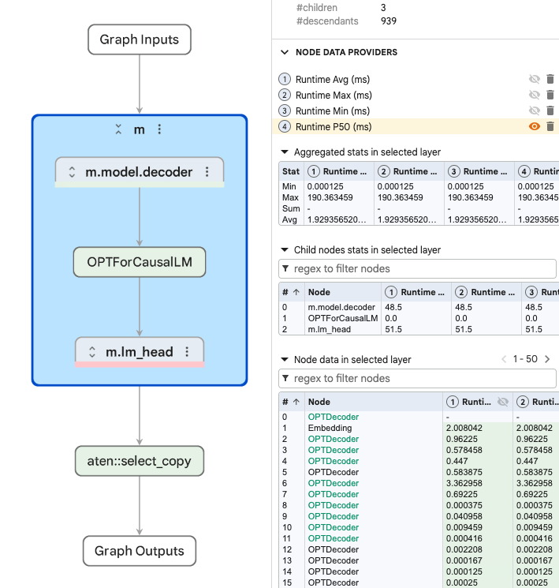
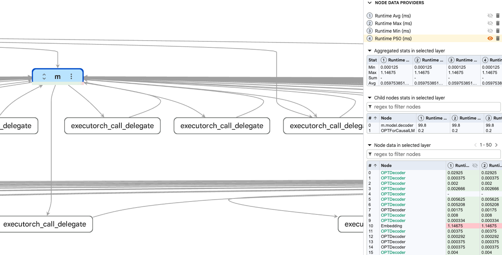
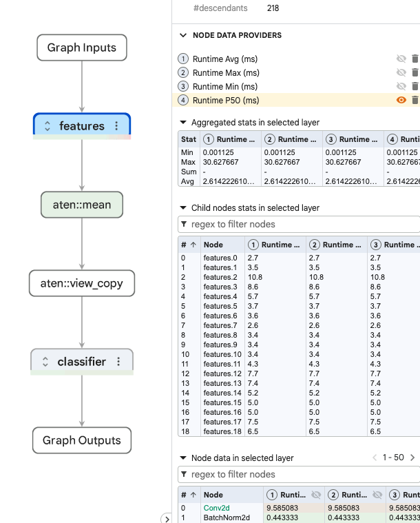
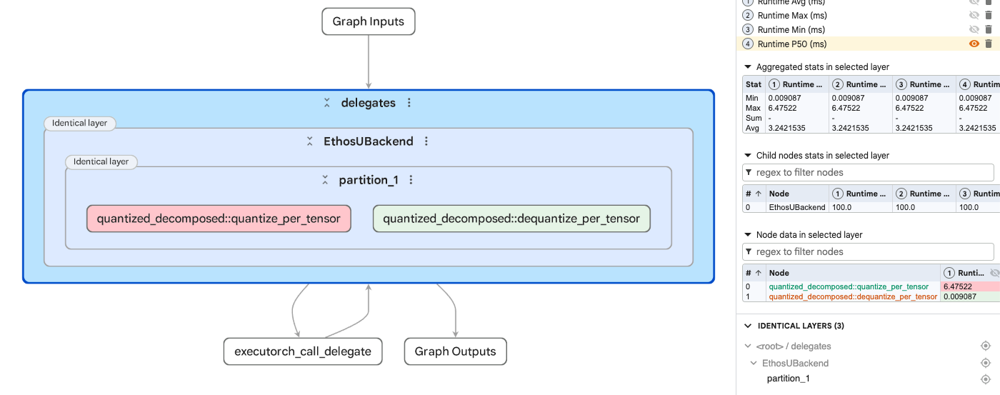
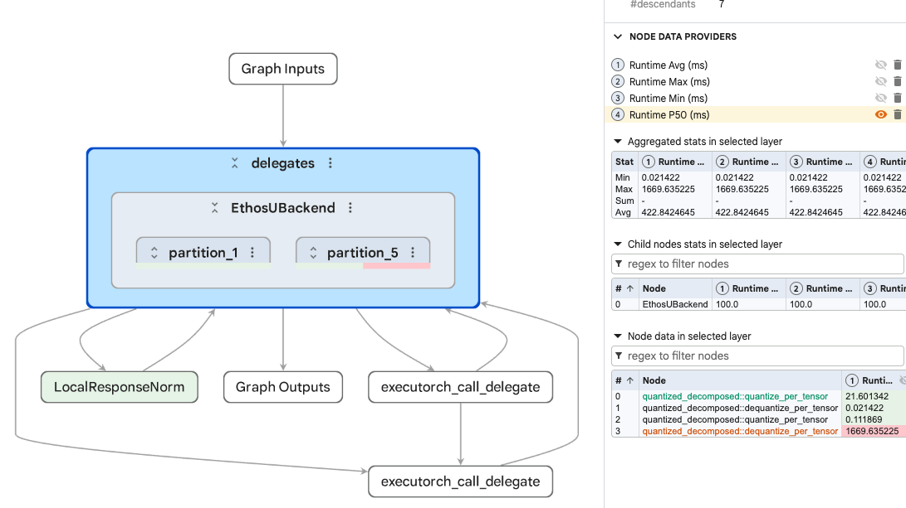

## View ExecuTorch runtime profiling data

In the previous sections, you inspected static artifacts. PTE, TOSA, and VGF views help you answer what was exported, lowered, compiled, converted, or packaged.

Runtime profiling answers a different set of questions. It tells you what happened when the artifact ran on a specific runtime, runner, target hardware, and tracing configuration.

In this final section, you use the [ExecuTorch extension for Model Explorer](https://github.com/arm/executorch-extension-model-explorer) to view profiling data overlaid onto the model graph. To do this, the extension reads ETRecord and ETDump files. This closes the loop: you start from graph inspection and end by connecting that graph structure to measured runtime behavior.

## ETRecord and ETDump

In ExecuTorch, ETRecord provides the export-time graph context. It preserves graph, operator, debug handle, and delegate partition metadata, allowing runtime measurements to map back to graph nodes.

ETDump contains runtime profiling data captured while the model executes with ExecuTorch event tracing enabled. The Model Explorer ETDump data provider presents aggregate timing measurements as overlays on graph nodes.

The two artifacts are most useful together:

| Artifact | Layer inspected | What it adds |
| --- | --- | --- |
| `.etrecord` | Export-time graph context | Graph structure, debug handles, operator names, and delegate partitions |
| `.etdp` | Runtime profiling data | Aggregate node timing data from a specific execution |
| `.pte` | ExecuTorch program | The packaged program and backend/delegate structure |

With the ETRecord loaded as graph context, the ETDump timing data becomes easier to interpret because runtime measurements are linked to the corresponding nodes in the exported graph.

## Generate ETRecord and ETDump

ETRecord and ETDump are created at different points in the ExecuTorch workflow:

- Generate the ETRecord when you export or lower the model.
- Generate the ETDump when you run the exported `.pte` program with event tracing enabled.
- Analyze them together with the ExecuTorch Inspector, or load them together in Model Explorer with the combined ExecuTorch extension.

This learning path provides `.etrecord` and `.etdp` files for you to use, but if you are interested in learning how to generate your own, a brief overview is covered here, including links to the relevant documentation. The [Profile ExecuTorch models with SME2 on Arm](https://learn.arm.com/learning-paths/cross-platform/sme-executorch-profiling/) learning path may also be of interest.

The [ExecuTorch ETRecord documentation](https://docs.pytorch.org/executorch/stable/etrecord.html) describes ETRecord as an ahead-of-time debug artifact. It contains the Edge dialect graph, debug handles, and delegate debug maps that allow runtime data to be linked back to graph nodes and, when available, Python source information.

For delegated models, see [Delegate visibility](https://github.com/arm/etrecord-adapter-model-explorer#delegate-visibility) for guidance on preserving the original operators and representing delegated regions in Model Explorer.

To generate an ETRecord, enable ETRecord generation during export or lowering, then retrieve it from the resulting program manager:

```python
from executorch.exir.program import to_edge
from torch.export import export

exported_program = export(model, example_inputs)

edge_program = to_edge(
    exported_program,
    generate_etrecord=True,
)

# Apply backend partitioning or lowering here if your flow uses it.
executorch_program = edge_program.to_executorch()

with open("model.pte", "wb") as f:
    f.write(executorch_program.buffer)

etrecord = executorch_program.get_etrecord()
etrecord.save("model.etrecord")
```

The [ExecuTorch ETDump documentation](https://docs.pytorch.org/executorch/stable/etdump.html) describes ETDump as the runtime trace artifact. To produce it from a native runner, build ExecuTorch with developer tools and event tracing enabled:

```bash
cmake \
  -DEXECUTORCH_BUILD_DEVTOOLS=ON \
  -DEXECUTORCH_ENABLE_EVENT_TRACER=ON \
  ...
```

If you use a runner such as `executor_runner`, ETDump generation is usually exposed as a command-line option:

```bash
./executor_runner \
  -model_path model.pte \
  -etdump_path model.etdp \
  -num_executions 1
```

If you are integrating ETDump into your own C++ runner, create an `ETDumpGen`, pass it into runtime loading or the Module API, execute the model, then write the returned buffer to a file:

```cpp
#include <cstdlib>
#include <fstream>
#include <memory>

#include <executorch/devtools/etdump/etdump_flatcc.h>
#include <executorch/extension/module/module.h>

using executorch::etdump::ETDumpGen;
using executorch::extension::Module;

Module module(
    "model.pte",
    Module::LoadMode::Mmap,
    std::make_unique<ETDumpGen>());

// Execute the model, for example with module.forward(...).

if (auto* etdump = dynamic_cast<ETDumpGen*>(module.event_tracer())) {
    const auto trace = etdump->get_etdump_data();

    if (trace.buf && trace.size > 0) {
        std::unique_ptr<void, decltype(&free)> guard(trace.buf, free);
        std::ofstream file("model.etdp", std::ios::binary);

        if (file) {
            file.write(static_cast<const char*>(trace.buf), trace.size);
        }
    }
}
```

For Python runtime experiments, ExecuTorch can also emit ETDump when loading a program with `enable_etdump=True`:

```python
from pathlib import Path

from executorch.runtime import Runtime

runtime = Runtime.get()
program = runtime.load_program(
    Path("model.pte"),
    enable_etdump=True,
    debug_buffer_size=int(1e7),
)

forward = program.load_method("forward")
outputs = forward.execute(inputs)

program.write_etdump_result_to_file("model.etdp", "debug_output.bin")
```

After generating the files, you can check them with the [ExecuTorch Inspector API](https://docs.pytorch.org/executorch/stable/model-inspector.html):

```python
from executorch.devtools import Inspector

inspector = Inspector(
    etdump_path="model.etdp",
    etrecord="model.etrecord",
)
inspector.print_data_tabular()
```

If you pass only an ETDump to the Inspector, you still get runtime events. If you also pass the matching ETRecord, the Inspector can correlate events with graph operators and delegate metadata.

## Load profiling data

The combined ExecuTorch extension for Model Explorer contains an ETRecord adapter and an ETDump data provider. The ETRecord adapter opens the exported graph, and the ETDump data provider provides associated runtime timing data alongside it.

Open the `.etrecord` first, then add the matching `.etdp` profiling data. Keep the pairs together: an ETDump from one export can be misleading if it is overlaid on a different ETRecord.

The workflow is:

```output
Open the ETRecord
    |
Inspect export-time graph context
    |
Load the matching ETDump profiling data
    |
Overlay runtime timing data
    |
Connect graph structure to runtime cost
```

## Inspect a portable kernel CPU profile

Start with a portable CPU run of OPT-125M:

```output
ml-model-artifacts/etrecord/opt125m_portable.etrecord
ml-model-artifacts/etdump/opt125m_portable.etdp
```

Inspect the graph and profiling overlay, then answer:

- Are there any delegate partitions?
- Is most of the time in native `OPERATOR_CALL` events?
- Which repeated operators dominate the profile?
- How does the runtime view compare with the portable `.pte` view you inspected earlier?



This is a pure portable CPU run. The ETDump contains about 1,199 events, with `Method::execute` around 9,082 ms. There are no delegate calls. Almost all runtime is in native calls, with repeated `aten.addmm` events forming the main hotspot.

Use this profile as the baseline. The graph has no accelerated delegate region to inspect, so the overlay points directly at CPU operator execution.

## Compare with XNNPACK delegation

Now open the XNNPACK version of the same model:

```output
ml-model-artifacts/etrecord/opt125m_xnnpack.etrecord
ml-model-artifacts/etdump/opt125m_xnnpack.etdp
```

Compare it with the portable profile:

- Do you see `XnnpackBackend` delegate events?
- How much of the total runtime is inside `DELEGATE_CALL` events?
- Which native operators still run outside the delegate?
- How much faster is this run than the portable CPU baseline?



The XNNPACK ETDump contains about 813 events, with `Method::execute` around 125 ms. The profile includes 98 delegate calls to `XnnpackBackend`. Delegate calls account for about 116.7 ms, while native calls account for about 8.5 ms.

This shows a clean CPU delegate acceleration pattern. The model still has some native work, but the expensive compute has moved into XNNPACK delegate calls. Compared with the portable run at about 9,082 ms, the runtime profile makes the acceleration effect visible.

## Inspect the FP32 Ethos-U example

Next, inspect the MobileNetV2 FP32 example. We tried to delegate this to an Ethos-U, but it does not produce an Ethos-U delegate region because Ethos-U requires supported quantized integer workloads:

```output
ml-model-artifacts/etrecord/mobilenetv2_fp32_ethosu.etrecord
ml-model-artifacts/etdump/mobilenetv2_fp32_ethosu.etdp
```

Look for:

- No `EthosUBackend` delegate calls
- Native `aten.convolution.default` events
- A large `Method::execute` total
- Runtime behavior that matches the FP32 `.pte` view from the Ethos-U section



The ETDump contains about 309 events, with `Method::execute` around 395 million cycles. There are no delegate calls, and the native call sum accounts for almost all of the runtime. The profile is dominated by CPU-side convolution work.

## Inspect clean Ethos-U delegation

Now open the regular INT8 MobileNetV2 Ethos-U profile:

```output
ml-model-artifacts/etrecord/mobilenetv2_int8_ethosu.etrecord
ml-model-artifacts/etdump/mobilenetv2_int8_ethosu.etdp
```

Inspect the overlay and answer:

- Is there one `EthosUBackend` delegate call?
- What work remains outside the delegate?
- Does the largest runtime cost come from the NPU event or from CPU-side quantization?
- How does this compare with the clean INT8 `.pte` view?



This is the clean Ethos-U delegation case. The ETDump is small, with about 13 events. `Method::execute` is around 6.59 million cycles. There is one `EthosUBackend` delegate call, and only a small number of native calls.

The important observation is that successful delegation does not mean every runtime cost is inside the accelerator. In this profile, the visible `DELEGATE_CALL` is about 96.9 thousand cycles, while the non-delegated `quantize_per_tensor` operation accounts for about 6.47 million cycles. The graph is cleanly delegated, but the measured runtime is dominated by non-delegated quantization rather than the delegate call itself.

## Inspect fragmented Ethos-U delegation

Finally, inspect the fragmented INT8 MobileNetV2 profile:

```output
ml-model-artifacts/etrecord/mobilenetv2_lrn_int8_ethosu.etrecord
ml-model-artifacts/etdump/mobilenetv2_lrn_int8_ethosu.etdp
```

Compare it with the clean INT8 profile:

- Are there two `EthosUBackend` delegate calls instead of one?
- Which native operators appear between or around the delegate regions?
- How large is the non-delegated native cost compared with the NPU cost?
- Do quantize and dequantize events appear around delegate boundaries?



Fragmentation can affect performance in different ways. Additional delegate boundaries can introduce data conversion, synchronization, or tensor movement. Non-delegated operators can also dominate runtime when their execution cost is much larger than the delegated work. Which effect matters most depends on the model, backend, and runtime.

In this trace, non-delegated work overwhelmingly dominates. The two `EthosUBackend` delegate calls account for about 105 thousand and 47 thousand cycles, while the overall `Method::execute` total is about 1.70 billion cycles. A large non-delegated `aten.convolution.default` island accounts for about 1.67 billion cycles. Quantize and dequantize operations add smaller costs around the delegate regions, including `dequantize_per_channel` at about 21.6 million cycles and `quantize_per_tensor` at about 6.47 million cycles.

This is the runtime version of the fragmentation pattern you saw in the `.pte` and TOSA sections. In this example, the performance difference is driven primarily by the large non-delegated convolution island, not by the additional delegate boundary.

## What you have learned

ETRecord and ETDump add runtime context to static graphs. ETRecord gives you the graph and debug metadata, while ETDump contributes runtime timing data. Used together through the combined ExecuTorch extension, they show which parts of the graph cost time on the target.

The OPT-125M profiles made the CPU case clear: the portable run stayed on native operators, while the XNNPACK run moved most of the work into delegate calls. The MobileNetV2 profiles showed the same pattern for Ethos-U. Native CPU execution, clean Ethos-U delegation, and fragmented delegation are much easier to tell apart once the runtime data is overlaid on the exported graph.

You have now completed the full artifact-inspection flow in this learning path. You started with `.pte` files to understand deployed ExecuTorch programs, moved through TOSA and VGF to inspect backend artifacts for the ML extensions for Vulkan, and finished with ETRecord and ETDump overlays to connect the graph to runtime cost. The next steps page points to deeper workflows for generating, running, profiling, and optimizing your own models.
