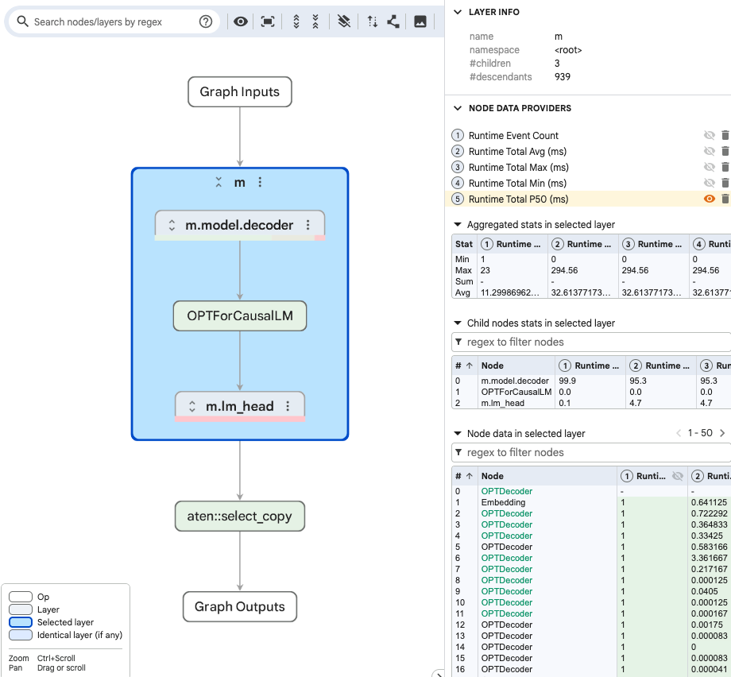

## View ExecuTorch runtime profiling data

PTE, TOSA, and VGF views help you learn what was exported, lowered, compiled, converted, or packaged.

Runtime profiling answers a different set of questions. With runtime profiling, you can learn what happened when the artifact ran on a specific runtime, runner, target hardware, and tracing configuration.

You'll use the [ExecuTorch extension for Model Explorer](https://github.com/arm/executorch-extension-model-explorer) to view profiling data overlaid onto the model graph. The extension reads ETRecord and ETDump files to connect graph nodes to measured runtime behavior.

## ETRecord and ETDump

ETRecord provides the export-time graph context. It preserves graph, operator, debug handle, and delegate partition metadata, allowing runtime measurements to map back to graph nodes.

ETDump contains runtime profiling data captured while the model executes with ExecuTorch event tracing enabled. The Model Explorer ETDump data provider presents aggregate timing measurements as overlays on graph nodes when the profiling events have matching debug handles. The provider excludes `DELEGATE_CALL` events. For the XNNPACK and Ethos-U artifacts in this Learning Path, events inside delegate calls don't contain the information needed to map timings to graph nodes, so Model Explorer doesn't display their timings. Use [ExecuTorch Inspector](https://docs.pytorch.org/executorch/stable/model-inspector.html) to view aggregate delegate timings from the matching ETRecord and ETDump.

Use the two artifacts together:

| Artifact | Layer inspected | What it adds |
| --- | --- | --- |
| `.etrecord` | Export-time graph context | Graph structure, debug handles, operator names, and delegate partitions |
| `.etdp` | Runtime profiling data | Aggregate timing data for events that map to graph nodes |

ETRecord and ETDump are created at different points:

- Generate the ETRecord when you export or lower the model.
- Generate the ETDump when you run the exported `.pte` program with event tracing enabled.
- Analyze them together with the ExecuTorch Inspector, or load them together in Model Explorer with the combined ExecuTorch extension.

For generation instructions, see the [ExecuTorch ETRecord documentation](https://docs.pytorch.org/executorch/stable/etrecord.html), and [ExecuTorch ETDump documentation](https://docs.pytorch.org/executorch/stable/etdump.html).

## Inspect a portable kernel CPU profile

Open the portable CPU ETRecord for OPT-125M:

```output
ml-model-artifacts/etrecord/opt125m_portable.etrecord
```

In Model Explorer, select **Add per-node data**, choose the ETDump profiling overlay, and load:

```output
ml-model-artifacts/etdump/opt125m_portable.etdp
```

Always use an ETDump from the same export as the ETRecord. Profiling data from a different export can map to the wrong nodes.

Inspect the graph and profiling overlay, then look for the following:

- No delegate partitions
- Timing data on concrete native-call events
- Repeated operators that dominate the profile
- How the runtime view compares with the portable `.pte` view that you inspected



This portable CPU ETDump contains about 1,199 events, including a `Method::execute` duration of around 9,082 ms. The provider excludes this wrapper event from the overlay and maps concrete native-call timings to graph nodes. Repeated `aten.addmm` operations form the main hotspot.

## What you've learned

ETRecord and ETDump add runtime context to static graphs. Model Explorer shows timings for profiling events that map to graph nodes.

You can now explore deeper workflows for generating, running, profiling, and optimizing your own models with Model Explorer.
