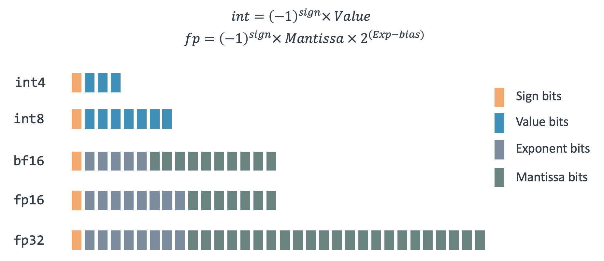

## Introduction

This Learning Path explores floating-point behavior across x86 and Arm architectures. Both architectures fully implement the IEEE 754 standard and produce identical results for all well-defined floating-point operations.

Any differences you encounter are limited to special undefined cases where the IEEE 754 standard explicitly permits different implementations. These cases represent edge conditions that can be avoided, not fundamental differences in floating-point results.

Arm processors provide completely reliable and accurate floating-point computation that is equivalent to x86 for all standard mathematical operations. By understanding the nuances of floating-point arithmetic and following best practices, you can write portable and robust code that performs consistently across platforms.

## Review of floating-point numbers

{}
If you are new to floating-point numbers, and would like some further information, see 
the Learning Path [Learn about integer and floating-point conversions](/learning-paths/cross-platform/integer-vs-floats/introduction-integer-float-types/). It covers data types and conversions.
{}

Floating-point numbers represent real numbers using limited precision, enabling efficient storage and computation of decimal values. In C/C++, floating-point variables are created with keywords such as  `float` or `double`. The IEEE 754 standard, established in 1985, defines the most widely used format for floating-point arithmetic, ensuring consistency across hardware and software.

IEEE 754 specifies two primary formats: single-precision (32-bit) and double-precision (64-bit). 

Each floating-point number consists of three components: 

- **Sign bit**: Determines the sign (positive or negative).
- **Exponent**: Sets the scale or magnitude.
- **Significand**: Holds the significant digits in binary.

The standard uses a biased exponent to handle both large and small numbers efficiently, and it incorporates special values such as NaN (Not a Number), infinity, and subnormal numbers. It supports rounding modes and exception handling, which help ensure predictable results. However, floating-point arithmetic is inherently imprecise, leading to small rounding errors.

The graphic below shows various forms of floating-point representation supported by Arm, each with varying number of bits assigned to the exponent and significand.

## Rounding errors 

Because computers use a finite number of bits to store a continuous range of numbers, rounding errors are introduced. The unit in last place (ULP) is the smallest difference between two consecutive floating-point numbers. It quantifies the rounding error, which arises because not all real values can be exactly represented. 

Operations round results to the nearest representable value, introducing small discrepancies. This rounding error, often measured in ULPs, reflects how far the computed value may deviate from the exact mathematical result. 

For example, with 3 bits for the significand and an exponent range of -1 to 2, only a limited set of values can be represented. The diagram below illustrates these values. 

Key takeaways:

- ULP size increases with magnitude.
- Larger numbers have wider spacing between values (larger ULPs).
- Smaller numbers have tighter spacing (smaller ULPs), reducing quantization error.
- ULP behavior impacts numerical stability and precision.

{}
Keep in mind that rounding and representation issues aren't bugs, they are a consequence of how floating-point math works at the hardware level. Understanding these fundamentals is useful when porting numerical code across architectures like x86 and Arm.
{}

In the next section, you'll explore why you may come across differences in undefined floating point operations and how you can use this information to write portable floating-point code. 
