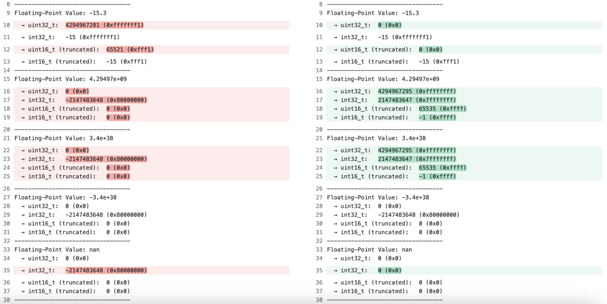

## Are there differences in behavior between x86 and Arm floating point?

Both the x86 and Arm architectures fully comply with the IEEE 754 standard for floating-point representation. For all well-defined operations, both architectures produce identical results. Differences only occur in cases where the IEEE 754 standard explicitly leaves behavior undefined, such as converting out-of-range floating-point values to integers. These are special undefined cases where the standard permits implementations to behave differently and is not a flaw or limitation of either architecture.

Understanding these undefined corner cases will help you correct any non-portable code.

### Undefined behavior in floating-point to integer conversion

The following example demonstrates undefined behavior that occurs when converting out-of-range floating-point values to integers. An out-of-range floating-point value is too large or too small to be represented within the limits of the floating-point format used, such as float or double. 

This behavior is explicitly undefined by the IEEE 754 standard and the C++ specification, meaning different architectures are permitted to handle these cases differently. 

The differences shown below only occur in undefined behavior cases. Normal floating-point operations produce identical results on both architectures.

An example of undefined behavior in floating-point code is provided below. You can run the example application on both an x86 and an Arm Linux system. If you are using AWS, use EC2 instance types `t3.micro` and `t4g.small` with Ubuntu 24.04.

To learn about floating-point conversions, use an editor to copy and paste the C++ code below into a new file named `conversions.cpp`.

```cpp
#include <iostream>
#include <cmath>
#include <limits>
#include <cstdint>

void convertFloatToInt(float value) {
    // Convert to unsigned 32-bit integer
    uint32_t u32 = static_cast<uint32_t>(value);

    // Convert to signed 32-bit integer
    int32_t s32 = static_cast<int32_t>(value);

    // Convert to unsigned 16-bit integer (truncation happens)
    uint16_t u16 = static_cast<uint16_t>(u32); 
    uint8_t u8 = static_cast<uint8_t>(value); 

    // Convert to signed 16-bit integer (truncation happens)
    int16_t s16 = static_cast<int16_t>(s32);

    std::cout << "Floating-Point Value: " << value << "\n";
    std::cout << "  → uint32_t:  " << u32 << " (0x" << std::hex << u32 << std::dec << ")\n";
    std::cout << "  → int32_t:   " << s32 << " (0x" << std::hex << s32 << std::dec << ")\n";
    std::cout << "  → uint16_t (truncated):  " << u16 << " (0x" << std::hex << u16 << std::dec << ")\n";
    std::cout << "  → int16_t (truncated):   " << s16 << " (0x" << std::hex << s16 << std::dec << ")\n";
    std::cout << "  → uint8_t (truncated):   " << static_cast<int>(u8) << std::endl;

    std::cout << "----------------------------------\n";
}

int main() {
    std::cout << "Demonstrating Floating-Point to Integer Conversion\n\n";

    // Test cases
    convertFloatToInt(42.7f);                   // Normal case
    convertFloatToInt(-15.3f);                  // Negative value -> wraps on unsigned
    convertFloatToInt(4294967296.0f);           // Overflow: 2^32 (UINT32_MAX + 1)
    convertFloatToInt(3.4e+38f);                // Large float exceeding UINT32_MAX
    convertFloatToInt(-3.4e+38f);               // Large negative float
    convertFloatToInt(NAN);                     // NaN behavior on different platforms
    return 0;
}
```

If you need to install the `g++` and `clang` compilers, run the commands below:

```bash
sudo apt update
sudo apt install g++ clang -y
```

Compile `conversions.cpp` on an Arm and an x86 Linux machine. 

The compile command is the same on both systems.

```bash
g++ conversions.cpp -o converting-float 
```

Run the program on both systems:

```bash
./converting-float
```

For easy comparison, the image below shows the x86 output (left) and Arm output (right). The  highlighted lines show the difference in output: 



As you can see, there are several cases where different behavior is observed in these undefined scenarios. For example, when trying to convert a signed number to an unsigned number or dealing with out-of-bounds values. 

## Avoid out-of-range conversions

The above differences demonstrate non-portable code. Undefined behavior, such as converting out-of-range floating-point values to integers, can lead to inconsistent results across platforms. To ensure portability and predictable behavior, it is essential to check for out-of-range values before performing such conversions.

You can check for out-of-range values using the code below. This approach ensures that the conversion is only performed when the value is within the valid range for the target data type. If the value is out of range, a default value is used to handle the situation gracefully. This prevents unexpected results and makes the code portable.

```cpp
constexpr float UINT32_MAX_F = static_cast<float>(UINT32_MAX);

void convertFloatToInt(float value) {
    // Convert to unsigned 32-bit integer with range checking
    uint32_t u32;
    if (!std::isnan(value) && value >= 0.0f && value <= UINT32_MAX_F) {
        u32 = static_cast<uint32_t>(value);
        std::cout << "The casted number is: " << u32 << std::endl;
    } else {
        u32 = 0; // Default value for out-of-range
        std::cout << "The float is out of bounds for uint32_t, using 0." << std::endl;
    }

    // ...existing code...
}
```

This checking provides a portable solution that identifies out-of-range values before casting and sets the out-of-range values to 0. By incorporating such checks, you can avoid undefined behavior and ensure that your code behaves consistently across different platforms.

### Key takeaways

- Arm and x86 produce identical results for all well-defined floating-point operations, both architectures comply with IEEE 754.
- Differences only occur in special undefined cases where the IEEE 754 standard explicitly permits different behaviors.
- An example undefined scenario is converting out-of-range floating-point values to integers.
- You should avoid relying on undefined behavior to ensure portability.

By understanding these nuances, you can confidently write code that behaves consistently across platforms.

