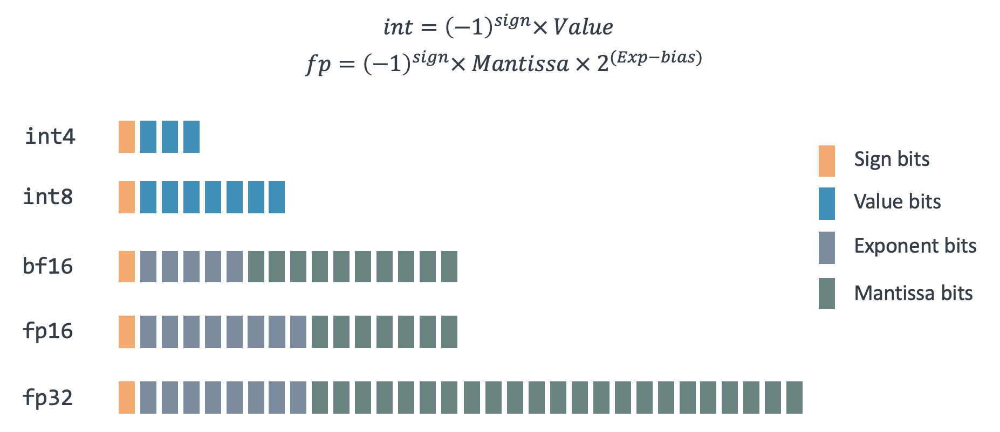
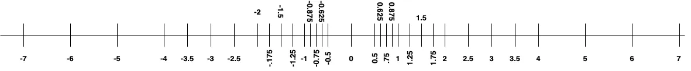

## Review of floating-point numbers

If you are unfamiliar with floating-point number representation, you can review [Learn about integer and floating-point conversions](/learning-paths/cross-platform/integer-vs-floats/introduction-integer-float-types/). It covers data types and conversions.

Floating-point numbers represent real numbers in computer systems, enabling efficient storage and computation of decimal values with varying degrees of precision. In C/C++, floating-point variables are created with keywords such as  `float` or `double`. The IEEE 754 standard, established in 1985, is the most widely used format for floating-point arithmetic, ensuring consistency across different hardware and software implementations.

IEEE 754 defines two primary formats: single-precision (32-bit) and double-precision (64-bit). 
Each floating-point number consists of three components: 

- **Sign bit**: Determines the sign (positive or negative).
- **Exponent**: Sets the scale or magnitude of the number.
- **Significand** (or mantissa): Holds the significant digits in binary form.

The standard uses a biased exponent to handle both large and small numbers efficiently, and it incorporates special values such as NaN (Not a Number), infinity, and subnormal numbers for robust numerical computation. A key feature of IEEE 754 is its support for rounding modes and exception handling, ensuring predictable behavior in mathematical operations. However, floating-point arithmetic is inherently imprecise due to limited precision, leading to small rounding errors.

The graphic below illustrates various forms of floating-point representation supported by Arm, each with varying number of bits assigned to the exponent and mantissa.

## Rounding errors 

Because computers use a finite number of bits to store a continuous range of numbers, rounding errors are introduced. The unit in last place (ULP) is the smallest difference between two consecutive floating-point numbers. It measures floating-point rounding error, which arises because not all real numbers can be exactly represented. 

When an operation is performed, the result is rounded to the nearest representable value, introducing a small error. This rounding error, often measured in ULPs, reflects how far the computed value may deviate from the exact mathematical result. For a simple example, if a floating-point schema with 3 bits for the mantissa (precision) and an exponent in the range of -1 to 2 is used, the possible values are represented in the graph below. 

Key takeaways:

- ULP size varies with the number’s magnitude.
- Larger numbers have bigger ULPs due to wider spacing between values.
- Smaller numbers have smaller ULPs, reducing quantization error.
- ULP behavior impacts numerical stability and precision in computations.

{}
Keep in mind that rounding and representation issues aren't bugs — they’re a consequence of how floating-point math works at the hardware level. Understanding these fundamentals is critical when porting numerical code across architectures like x86 and Arm.
{}

In the next section, you will explore how x86 and Arm differ in how they implement and optimize floating-point operations — and why this matters for portable, accurate software.
