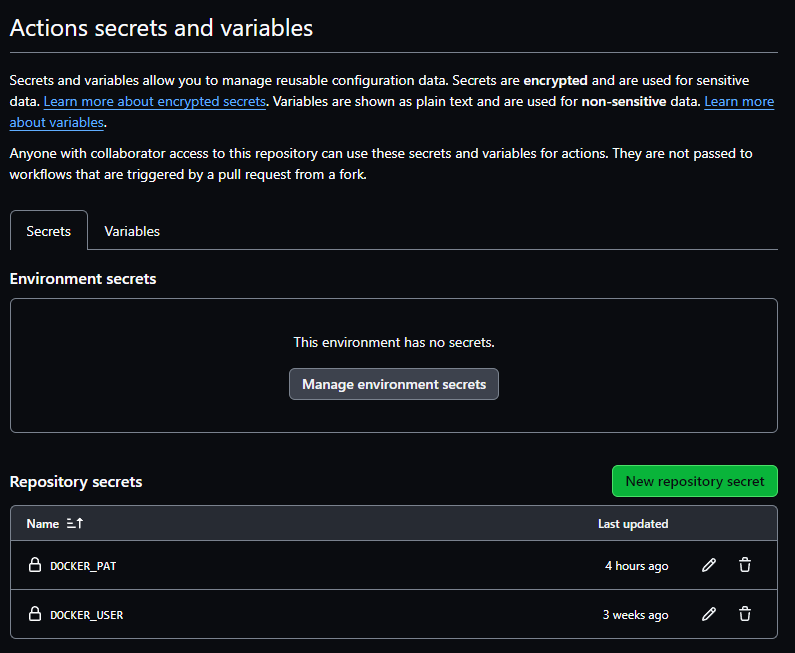
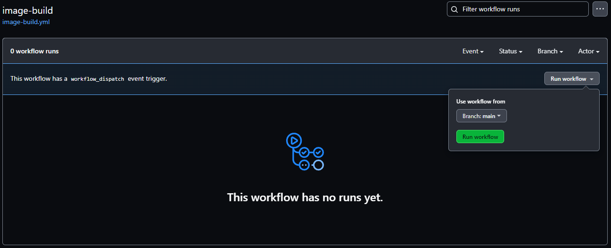
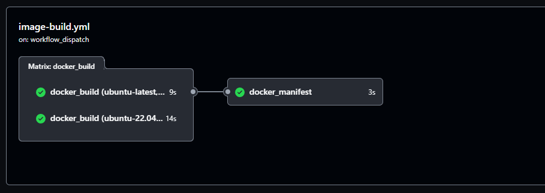

## Use GitHub Actions

You can use GitHub Actions to build multi-architecture images by creating a workflow file and using Arm-hosted runners.

## Create a new GitHub repository

To get started, create a new GitHub repository in your GitHub account. 

Log in to your GitHub account using your browser. Select the [New Button](https://github.com/new) to create a new repository. Give the repository a name. Click `Create Repository`. 

If you need more detailed instructions, there are numerous tutorials on how to create a repository or refer to the [GitHub documentation](https://docs.github.com/en/repositories/creating-and-managing-repositories/creating-a-new-repository).

## Set up secrets

The container images created by GitHub Actions are stored on Docker Hub. 

To run GitHub Actions, you need your Docker Hub username and a Personal Access Token (PAT). This enables you to automate the login to your Docker Hub account. 

To save your secrets, click on the `Settings` tab in your new GitHub repository. Expand the `Secrets and variables` on the left side and click `Actions`.

Add two secrets using the `New repository secret` button:
- `DOCKER_USER` with your Docker ID.
- `DOCKER_PAT` with your Personal Access Token. 



You have stored the secrets that allow you to login to Docker Hub and save container images.

## Add files to the repository

To use GitHub Actions to build a container image and store it on Docker Hub, you need to add two files to your repository.

First, create a file named `Dockerfile` with the contents below at the top of the repository.

```dockerfile
FROM ubuntu:latest
CMD echo -n "Architecture is " && uname -m
```

You can do this in the browser using the `Add file` button to create a new file, or upload the file from your computer. You can also use `git` from the command line.

Next, add the `image-build.yml` file with the contents below to the `.github/workflows` directory in your repository: 

```yml
name: image-build

on:
  workflow_dispatch:

env:
  USER: ${{secrets.DOCKER_USER}}

jobs:
  docker_build:
    runs-on: ${{ matrix.os }}
    strategy:
      matrix:
        include: 
          - os: ubuntu-latest
            arch: amd64
          - os: ubuntu-22.04-arm
            arch: arm64
    steps:
      - name: Checkout
        uses: actions/checkout@v4
      - name: Log in to Docker Hub
        uses: docker/login-action@v3
        with:
          username: ${{env.USER}}
          password: ${{secrets.DOCKER_PAT}}
      - name: Build and push
        run: |
            docker build --tag ${{env.USER}}/docker-uname:${{matrix.arch}}  .
            docker push ${{env.USER}}/docker-uname:${{matrix.arch}}

  docker_manifest:
    needs: docker_build
    runs-on: ubuntu-latest
    steps:
      - name: Log in to Docker Hub
        uses: docker/login-action@v3
        with:
          username: ${{env.USER}}
          password: ${{secrets.DOCKER_PAT}}
      - name: Create and push manifest
        run: |
            docker manifest create ${{env.USER}}/docker-uname ${{env.USER}}/docker-uname:amd64 ${{env.USER}}/docker-uname:arm64
            docker manifest push ${{env.USER}}/docker-uname
```

The workflow file uses a job matrix to run two jobs in parallel. One job runs `docker build` on the new Arm-hosted runner. The second job runs `docker build` on a standard runner with the `amd64` architecture. When both jobs are done, the final job uses `docker manifest` to create the multi-architecture image. 

With the two files and the two secrets in your repository, you are ready to run the action.

## Run the GitHub Action

To run the action, navigate to the `Actions` tab in your repository. 

Select the `image-build` on the left. 

Use the `Run workflow` drop-down on the right-hand side to click `Run workflow`. 



This triggers the `image-build` workflow to start, performing the following steps:
- Checkout the repository.
- Log in to Docker Hub.
- Run the `docker build` command to build an image from the `Dockerfile` and push the image to your Docker Hub account.

This flow is executed twice, once on the Arm-hosted runner to produce the `arm64` image, and once on the standard runner to produce the `amd64` image.

When the workflow completes, the new image is available in your Docker Hub account. 

You can use the `Actions` tab in your repository to see if the workflow runs, click on each one to review the commands, and check errors.



## Automate the build

Instead of manually triggering the build, you can modify the `image-build.yml` to automatically run the workflow when changes are made to the `Dockerfile`. Add the `push:` line as shown below to automatically run the action when a push is made to any branch in the repository.

```yml
name: image-build

on:
  workflow_dispatch:
  push:
```

If you make a change to your `Dockerfile` and push it to the repository, the workflow automatically runs.

You can now use GitHub Actions to build multi-architecture images without using QEMU instruction emulation or using a self-hosted runner on a Arm server. 
