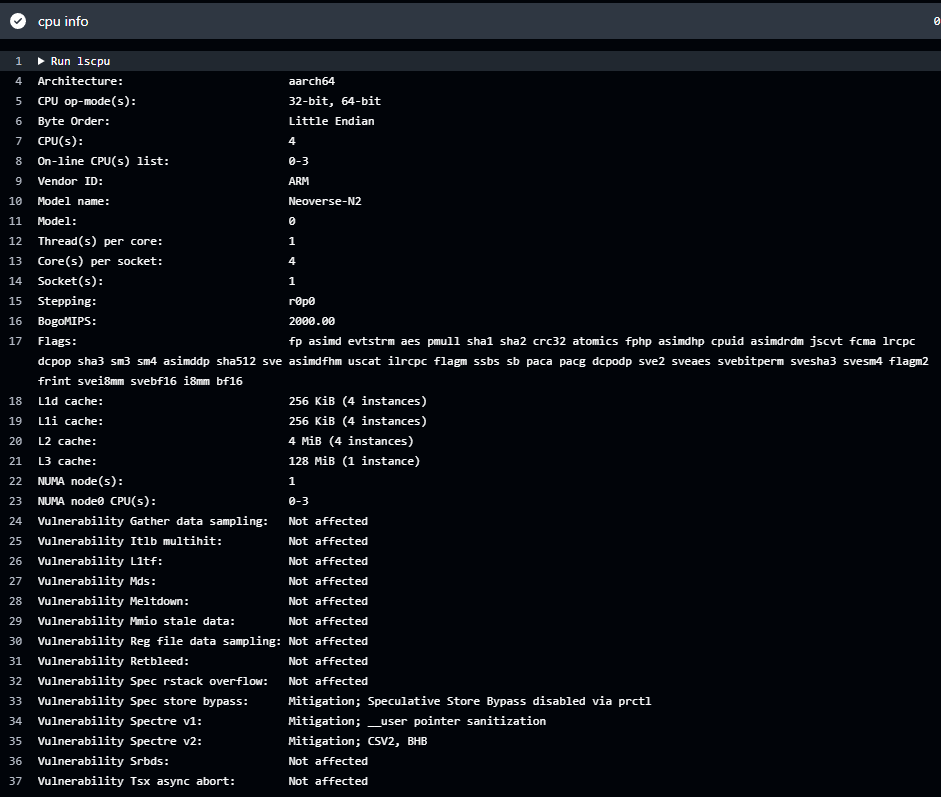

## What are Arm-hosted runners?

Runners are the machines that execute jobs in a GitHub Actions workflow. An Arm-hosted runner is a runner that is managed by GitHub and uses the Arm architecture. This means that you don't need to provide a server to run Actions workflows. GitHub provides the system and runs the Action workflows for you.

Arm-hosted runners are available for public and private repositories. 

If you have a free plan, Arm-hosted runners are available in public repositories at no cost, subject to standard usage limits. 

You can use Arm-hosted runners in private repositories with a Teams or Enterprise Cloud account (covered on the next page).

## What kind of server hardware is used by Arm-hosted runners?

You may have software that relies on Arm architecture features. Arm-hosted runners are powered by Cobalt 100 processors, based on the Arm Neoverse N2. The free runners have 4 vCPUs and Armv9-A features including Scalable Vector Extension 2 (SVE2). 

The output of the `lscpu` command is below.



## What do I need to change in my workflow to use Arm-hosted runners?

To use Arm-hosted Linux runners, use the `ubuntu-22.04-arm` and `ubuntu-24.04-arm` labels in your public repository workflow runs.

For example, if you have a workflow file with:

```console
runs-on: ubuntu-24.04
```

You can replace it with the Arm-hosted runner:

```console
runs-on: ubuntu-24.04-arm
```

## How can I find out more about the software installed on the Arm-hosted runners?

You can look at the [GitHub Actions Partner Images repository](https://github.com/actions/partner-runner-images/) for information about the runner images and installed software.

You can also use the repository to report issues or request additional software be added to the images. 


