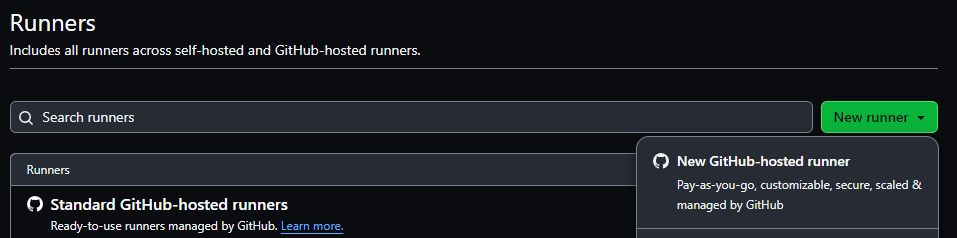
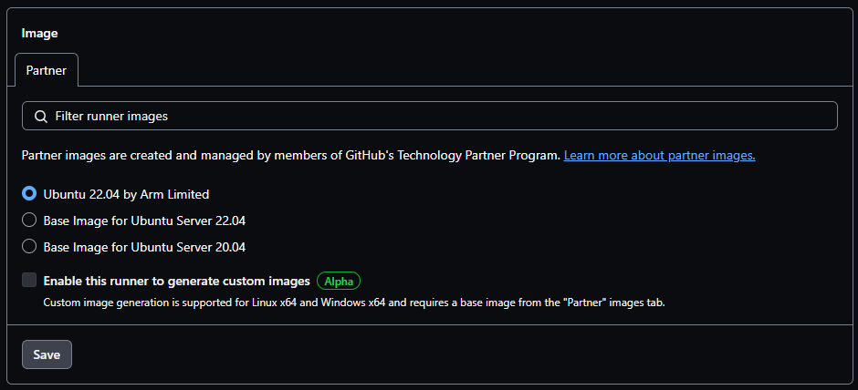
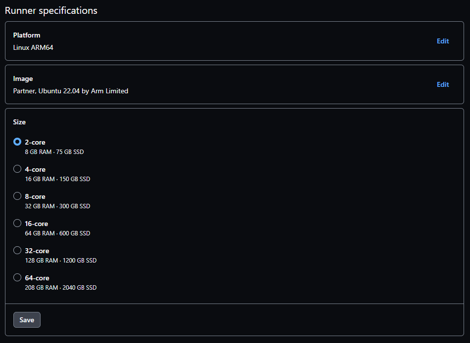

## How can I build multi-architecture container images?

Building multi-architecture container images for complex projects is challenging.

There are two common ways to build multi-architecture images, and both are explained in [Learn how to use Docker](/learning-paths/cross-platform/docker/).

The first method uses instruction emulation. You can learn about this method in [Build multi-architecture images with Docker buildx](/learning-paths/cross-platform/docker/buildx/). The drawback of emulation is slow performance, especially for complex builds which involve tasks such as compiling large C++ applications. 

The second method uses multiple machines, one for each architecture, and joins the images to create a multi-architecture image using Docker manifest. You can learn about this method in [Use Docker manifest to create multi-architecture images](/learning-paths/cross-platform/docker/manifest/). The drawback of the manifest method is its complexity as it requires multiple machines.

Arm-hosted runners from GitHub provide a way to create multi-architecture images with higher performance and lower complexity compared to the two methods described above. 

When you use Arm-hosted runners, you don't need to worry about self-hosting (managing servers) or instruction emulation (slow performance).

## What are Arm-hosted runners?

Runners are the machines that execute the jobs in a GitHub Actions workflow. An Arm-hosted runner is a runner that is managed by GitHub and uses the Arm architecture. This means that you don't need to provide a server to run Actions workflows. GitHub provides the system and runs the Action workflows for you.

Arm-hosted runners are available for Linux and Windows. 

This Learning Path uses Linux. 

{}
You must have a Team or Enterprise Cloud plan to use Arm-hosted runners.
{}

Two types of GitHub-hosted runners are available; standard runners, and larger runners. Larger runners are differentiated from standard runners because users can control the amount of RAM, the number of CPUs, and configure the allocated disk space. Larger runners have additional options for a static IP address and the ability to group runners and control settings across the runner group. Currently, Arm-hosted runners are a type of larger runner.

## How can I create an Arm-hosted runner?

Arm-hosted runners are created at the organization level.

Navigate to your organization and select the `Settings` tab. On the left pane, select `Actions->Runners`.

On the `Runners` page, select the `New runner` drop-down on the top right, and then select `New GitHub-hosted runner`.

Specify a name for the runner, this is the `runs-on` field in your workflows so make the name clear for others who use it.

Choose Linux ARM64 for the platform and click `Save`.

Specify the operating system image for the runner, select `Ubuntu 22.04 by Arm Limited`, and click `Save`.

Select the size of the runner, choose the 2-core option for this Learning Path, and click `Save`.

The `Capacity` section includes the maximum concurrency, which is the number of jobs to run at the same time. Specify at least two for this Learning Path.

You can also set the runner group for this runner. The runner group controls the settings for this runner. Pay attention to the runner group as you may need to return to the runner group settings if any configuration changes are needed.

Finally, click `Create runner`.

Your new Arm-hosted runner is now ready to use. Remember the runner name for use in the next section: `ubuntu-22.04-arm`. 
