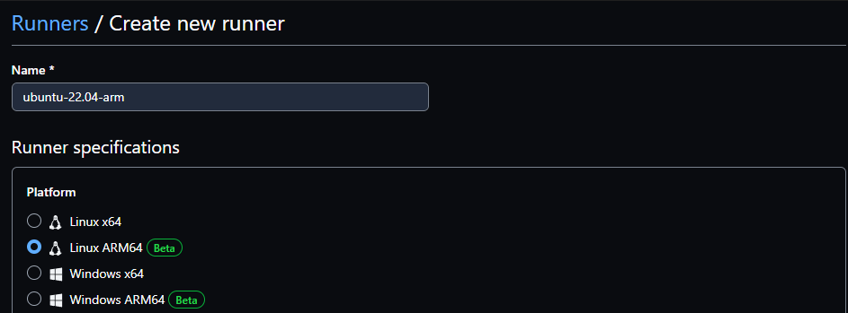
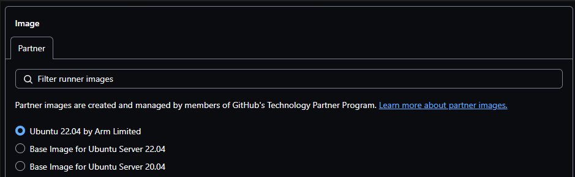
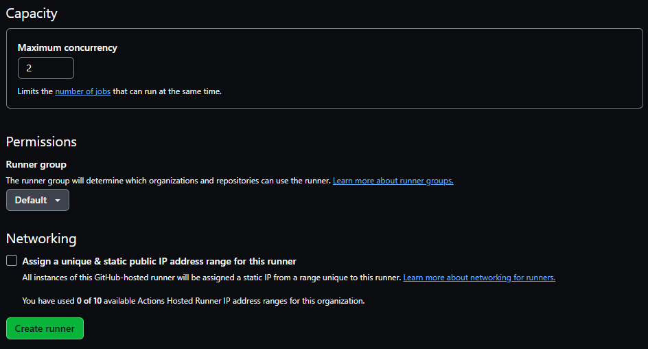

## Can I use Arm-hosted runners for private repositories?

Yes, you can use Arm-hosted runners in private repositories.

You must have a Team or Enterprise Cloud plan to use Arm-hosted runners.

Two types of GitHub-hosted runners are available; standard runners, and larger runners. Larger runners are differentiated from standard runners because users can control the amount of RAM, the number of CPUs, and configure the allocated disk space. Larger runners have additional options for a static IP address and the ability to group runners and control settings across the runner group. Currently, Arm-hosted runners are a type of larger runner.

## How can I create an Arm-hosted runner?

Arm-hosted runners are created at the organization level.

Navigate to your organization and select the `Settings` tab. On the left pane, select `Actions->Runners`.

On the `Runners` page, select the `New runner` drop-down on the top right, and then select `New GitHub-hosted runner`.

Specify a name for the runner, this is the `runs-on` field in your workflows so make the name clear for others who use it.

Choose Linux ARM64 for the platform and click `Save`.

Specify the operating system image for the runner, select `Ubuntu 22.04 by Arm Limited`, and click `Save`.

Select the size of the runner, choose the 2-core option for this Learning Path, and click `Save`.

The `Capacity` section includes the maximum concurrency, which is the number of jobs to run at the same time. Specify at least two for this Learning Path.

You can also set the runner group for this runner. The runner group controls the settings for this runner. Pay attention to the runner group as you may need to return to the runner group settings if any configuration changes are needed.

Finally, click `Create runner`.

Your new Arm-hosted runner is now ready to use. Remember the runner name for use in the next section: `ubuntu-22.04-arm`. 
