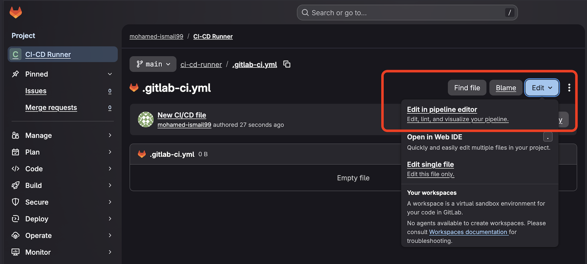

## How to Create a CI/CD Pipeline with Gitlab-hosted Runners?

To create the pipeline you only need to create a new **`.gitlab-ci.yml`** file in your Project and define it's stages. Nothing else is needed since Gtilab-hosted runners are readily avilable to any Project and doesn't need to be created or instantiated by the Gitlab users.

Once you run your pipeline with the correct **`tags`** Gitlab will create everything that you need and yep it is as simple as that.

## How are you going to test your pipeline functionality?

You will test the pipeline by building a Docker image from a simple C language "Hello World" program which can run on Arm64 instances/machines and to do that you will need to create the following files:

1) "main.c" File: which is the main program that will get executed when we will run your Docker image later. I only provided a simple example but please feel free to use any program that you like. Although, I advise to start with this simple program to test that everything is working then use anything later after by changing the **`main.c`** file.

```c
//main.c
#include <stdio.h>

int main(void) {
  printf("Hello from an Arm64 Docker image built on GitLab hosted Arm runners!\n");
  return 0;
}
```

2) DockerFile: This is the file has a set of instruction for Docker on how to create a Docker image. It simply instructs the Docker on your runner to build and package your **``hello``** app into a Docker image.

```DockerFile
# syntax=docker/dockerfile:1

FROM alpine:3.20 AS build
RUN apk add --no-cache build-base
WORKDIR /src
COPY main.c .
RUN gcc -O2 -static -s -o hello main.c

FROM scratch
COPY --from=build /src/hello /hello
ENTRYPOINT ["/hello"]

```

3) Optionally .dockerignore file: This file instructs Docker to ignor certain files that has nothing to do with the image that it will create.

```.dockerignore
.git
.gitlab-ci.yml
```

4) You will also need to create a YML file as I mentioned before which I will explain in more details in the next section.

To Create any of those files simple follow the same steps in the next section but instead of choosing **`.gitlab-ci.yml`** file just change the name to each of the corresponding file name above. Also, it's very important to create the 3 files from this section first because once you create and commit/save **`.gitlab-ci.yml`** file will simply run the pipeline. If the other 3 files didn't exist at that time then the pipeline will fail.

## How to Create .gitlab-ci.yml file in a Gitlab Project?

1. Start by going to the main project page where you will need to Create the CI/CD pipeline.

2. You can choose to create **`.gitlab-ci.yml`** file by using one of the 2 options circled in red in the image below. 


Option1: You can Click on **`Set up CI/CD`** button/link and follow the wizad to create an empty **`.gitlab-ci.yml`** file.

Option2: Click on the "+" button. From the popup menu click on **`New File`** option and name the file **`.gitlab-ci.yml`** and then click on **`Commit Changes`** button on the top right hand side like in the image below (Add any message as your commit message).


3. A page like the one in the image below will be visible with your **`.gitlab-ci.yml`** file. From here, you will need to Click on the **`Edit`** button. A menu will pop up, you will click on **`Edit in pipeline Editor`** which will allow you to add your CD/CD script.


4. In the pipeline editor, just copy and paste the following YML script and click on commit changes (Add any relevent message as your commit update message).
```YML
stages: [build, test, push]

variables:
  IMAGE_TAG: "$CI_REGISTRY_IMAGE:$CI_COMMIT_SHORT_SHA"
  IMAGE_LATEST: "$CI_REGISTRY_IMAGE:latest"

  # Talk to docker:dind over TLS (default behavior for docker:dind)
  DOCKER_HOST: "tcp://docker:2376"
  DOCKER_TLS_CERTDIR: "/certs"
  DOCKER_CERT_PATH: "/certs/client"
  DOCKER_TLS_VERIFY: "1"

build_test_push:
  stage: build
  tags:
    - saas-linux-small-arm64
  image: docker:27
  services:
    - name: docker:27-dind
  before_script:
    - uname -m
    - docker version
    - echo "$CI_REGISTRY_PASSWORD" | docker login -u "$CI_REGISTRY_USER" --password-stdin "$CI_REGISTRY"
  script:
    - docker build --pull -t "$IMAGE_TAG" .
    - docker run --rm "$IMAGE_TAG"
    - docker push "$IMAGE_TAG"

push_latest:
  stage: push
  tags:
    - saas-linux-small-arm64
  image: docker:27
  services:
    - name: docker:27-dind
  before_script:
    - echo "$CI_REGISTRY_PASSWORD" | docker login -u "$CI_REGISTRY_USER" --password-stdin "$CI_REGISTRY"
  script:
    - docker pull "$IMAGE_TAG"
    - docker tag "$IMAGE_TAG" "$IMAGE_LATEST"
    - docker push "$IMAGE_LATEST"
  rules:
    - if: $CI_COMMIT_BRANCH == $CI_DEFAULT_BRANCH
```
5. Once you commit the file updates, Gitlab will check the scripts for errors and will try to execute the pipeline directly. 
