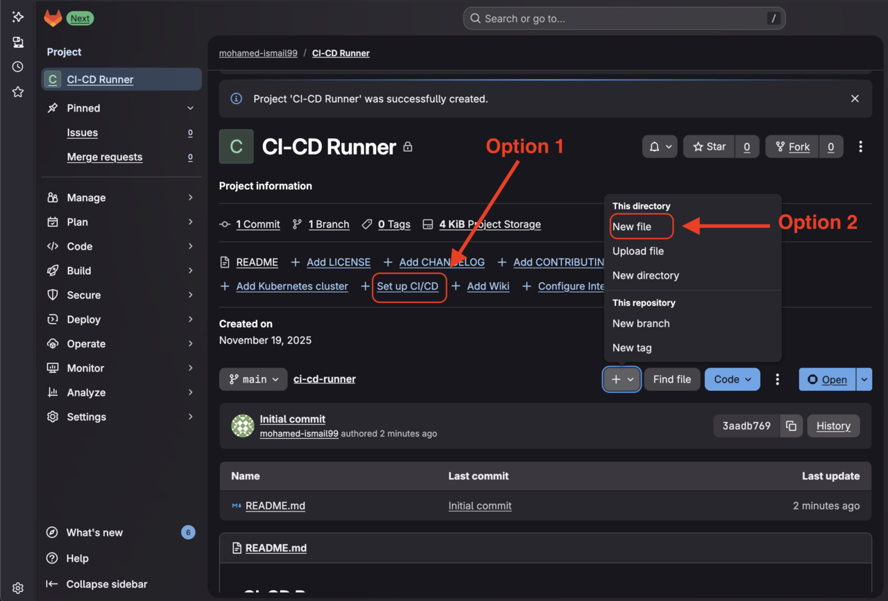
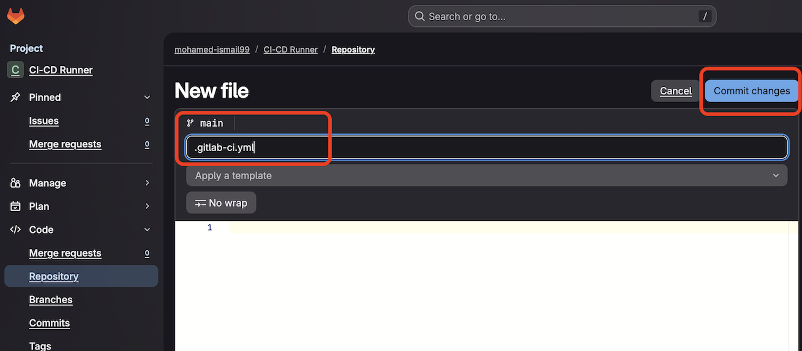

## Overview

This section guides you through building an Arm64 container image and creating a pipeline configuration for GitLab-hosted runners.

GitLab-hosted runners are available for any project without additional setup. To use Arm64 runners, create a `.gitlab-ci.yml` file in your project root and specify the Arm64 runner tag.

## Build an Arm64 container image

You will create a simple C application, containerize it for Arm64 architecture, and push it to GitLab Container Registry.

Create `main.c` with a simple test program:

```c
//main.c
#include <stdio.h>

int main(void) {
  printf("Hello from an Arm64 Docker image built on GitLab hosted Arm runners!\n");
  return 0;
}
```

This example provides a minimal starting point to verify your pipeline works correctly.

Create a `Dockerfile` with build instructions:

```Dockerfile
# DockerFile
# syntax=docker/dockerfile:1

FROM alpine:3.20 AS build
RUN apk add --no-cache build-base
WORKDIR /src
COPY main.c .
RUN gcc -O2 -static -s -o hello main.c

FROM scratch
COPY --from=build /src/hello /hello
ENTRYPOINT ["/hello"]

```

This multi-stage build compiles your C program with GCC on Alpine Linux, then copies only the statically-linked Arm64 binary to a minimal scratch image.

Optionally, create `.dockerignore` to exclude files from the build context:

```.dockerignore
.git
.gitlab-ci.yml
```

To create these files in GitLab, use the **+** button in your project and select **New File**. Name each file appropriately (`main.c`, `Dockerfile`, `.dockerignore`).

{}
Create these three files before adding the pipeline configuration. Once you commit the `.gitlab-ci.yml` file, the pipeline runs automatically. If the application files don't exist, the pipeline will fail.
{}

## Create pipeline configuration

From your project page, select **Set up CI/CD** or use the **+** button to create a new file:



Name the file `.gitlab-ci.yml`:



Select **Edit** > **Edit in pipeline editor**:


Add the following pipeline configuration. This defines three stages that build, test, and publish your Arm64 container image:
```yaml
stages: [build, test, push]

variables:
  IMAGE_TAG: "$CI_REGISTRY_IMAGE:$CI_COMMIT_SHORT_SHA"
  IMAGE_LATEST: "$CI_REGISTRY_IMAGE:latest"
  DOCKER_HOST: "tcp://docker:2376"
  DOCKER_TLS_CERTDIR: "/certs"
  DOCKER_CERT_PATH: "/certs/client"
  DOCKER_TLS_VERIFY: "1"

build_test_push:
  stage: build
  tags:
    - saas-linux-small-arm64
  image: docker:27
  services:
    - name: docker:27-dind
  before_script:
    - uname -m
    - apk add --no-cache util-linux
    - lscpu
    - docker version
    - echo "$CI_REGISTRY_PASSWORD" | docker login -u "$CI_REGISTRY_USER" --password-stdin "$CI_REGISTRY"
  script:
    - docker build --pull -t "$IMAGE_TAG" .
    - docker run --rm "$IMAGE_TAG"
    - docker push "$IMAGE_TAG"

push_latest:
  stage: push
  tags:
    - saas-linux-small-arm64
  image: docker:27
  services:
    - name: docker:27-dind
  before_script:
    - apk add --no-cache util-linux
    - lscpu
    - echo "$CI_REGISTRY_PASSWORD" | docker login -u "$CI_REGISTRY_USER" --password-stdin "$CI_REGISTRY"
  script:
    - docker pull "$IMAGE_TAG"
    - docker tag "$IMAGE_TAG" "$IMAGE_LATEST"
    - docker push "$IMAGE_LATEST"
  rules:
    - if: $CI_COMMIT_BRANCH == $CI_DEFAULT_BRANCH
```

### Understanding the pipeline configuration

**Runner selection:**
The `tags: saas-linux-small-arm64` directive selects GitLab's Arm64 runner. This ensures your build runs on Arm architecture, producing native Arm64 binaries.

**Build stage:**
The `build_test_push` job compiles your C program on the Arm64 runner. The `uname -m` and `lscpu` commands verify you're running on aarch64 architecture. The Docker build produces an Arm64 container image because the compilation happens on Arm64 hardware.

**Push stage:**
The `push_latest` job runs only on the default branch (typically `main`). It tags the successfully built image as `latest` and pushes it to GitLab Container Registry.

**Authentication:**
GitLab automatically provides `$CI_REGISTRY_PASSWORD` and `$CI_REGISTRY_USER` variables for authenticating to the container registry.

Commit the configuration. GitLab validates the syntax and starts the pipeline automatically. 
