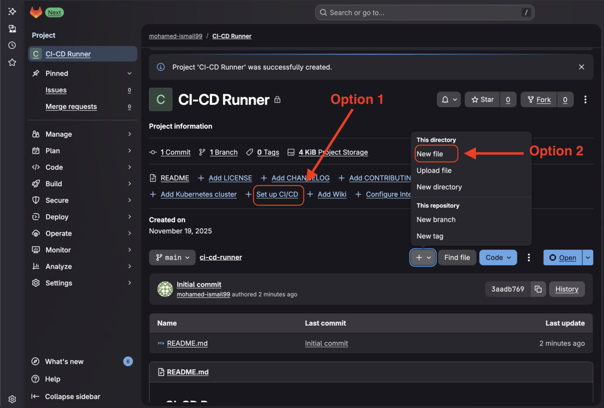

## How to Create a CI/CD Pipeline with Gitlab-hosted Runners?

To create the pipeline we only need to create a new **`.gitlab-ci.yml`** file in our Project and define it's stages. Nothing else is needed since Gtilab-hosted runners are readily available to any Project and doesn't need to be created or instantiated by the Gitlab users.

Once we run our pipeline with the correct **`tags`** Gitlab will create everything that we need and yep it is as simple as that.

## How to Create .gitlab-ci.yml file in a Gitlab Project?

1. Start by going to the main project page where we will need to Create the CI/CD pipeline.

2. We can choose to create **`.gitlab-ci.yml`** file by using one of the 2 options circled in red in the image below. 


Option1: We can Click on **`Set up CI/CD`** button/link and follow the wizard to create an empty **`.gitlab-ci.yml`** file.

Option2: Click on the "+" button. From the popup menu click on **`New File`** option and name the file **`.gitlab-ci.yml`** and then click on **`Commit Changes`** button on the top right hand side like in the image below (Add any message as your commit message).


3. A page like the one in the image below will be visible with our **`.gitlab-ci.yml`** file. From here, we will need to Click on the **`Edit`** button. A menu will pop up, We will click on **`Edit in pipeline Editor`** which will allow us to add our CD/CD script.


4. In the pipeline editor, just copy and paste the following YML script and click on commit changes (Add any relevent message as your commit update message).
```YML
# This file is a template, and might need editing before it works on your project.
# This is a sample GitLab CI/CD configuration file that should run without any modifications.
# It demonstrates a basic 3 stage CI/CD pipeline. Instead of real tests or scripts,
# it uses echo commands to simulate the pipeline execution.
#
# A pipeline is composed of independent jobs that run scripts, grouped into stages.
# Stages run in sequential order, but jobs within stages run in parallel.
#
# For more information, see: https://docs.gitlab.com/ee/ci/yaml/#stages
#
# You can copy and paste this template into a new `.gitlab-ci.yml` file.
# You should not add this template to an existing `.gitlab-ci.yml` file by using the `include:` keyword.
#
# To contribute improvements to CI/CD templates, please follow the Development guide at:
# https://docs.gitlab.com/development/cicd/templates/
# This specific template is located at:
# https://gitlab.com/gitlab-org/gitlab/-/blob/master/lib/gitlab/ci/templates/Getting-Started.gitlab-ci.yml

stages:          # List of stages for jobs, and their order of execution
  - build
  - test
  - deploy

build-job:       # This job runs in the build stage, which runs first.
  stage: build
  tags:
    - saas-linux-small-arm64    #Instruct Gitlab to use it's own Hosted runners that use Linux on Arm64 instance of size small.
  script:
    - echo "Compiling the code..."
    - echo "Compile complete."

unit-test-job:   # This job runs in the test stage.
  stage: test    # It only starts when the job in the build stage completes successfully.
  tags:
    - saas-linux-small-arm64    #Instruct Gitlab to use it's own Hosted runners that use Linux on Arm64 instance of size small.
  script:
    - echo "Running unit tests... This will take about 60 seconds."
    - sleep 60
    - echo "Code coverage is 90%"

lint-test-job:   # This job also runs in the test stage.
  stage: test    # It can run at the same time as unit-test-job (in parallel).
  tags:
    - saas-linux-small-arm64    #Instruct Gitlab to use it's own Hosted runners that use Linux on Arm64 instance of size small.
  script:
    - echo "Linting code... This will take about 10 seconds."
    - sleep 10
    - echo "No lint issues found."

deploy-job:      # This job runs in the deploy stage.
  stage: deploy  # It only runs when *both* jobs in the test stage complete successfully.
  tags:
    - saas-linux-small-arm64    #Instruct Gitlab to use it's own Hosted runners that use Linux on Arm64 instance of size small.
  environment: production
  script:
    - echo "Deploying application..."
    - echo "Application successfully deployed."
```
5. Once you commit the file updates, Gitlab will check the scripts for errors and will try to execute the pipeline directly. 
