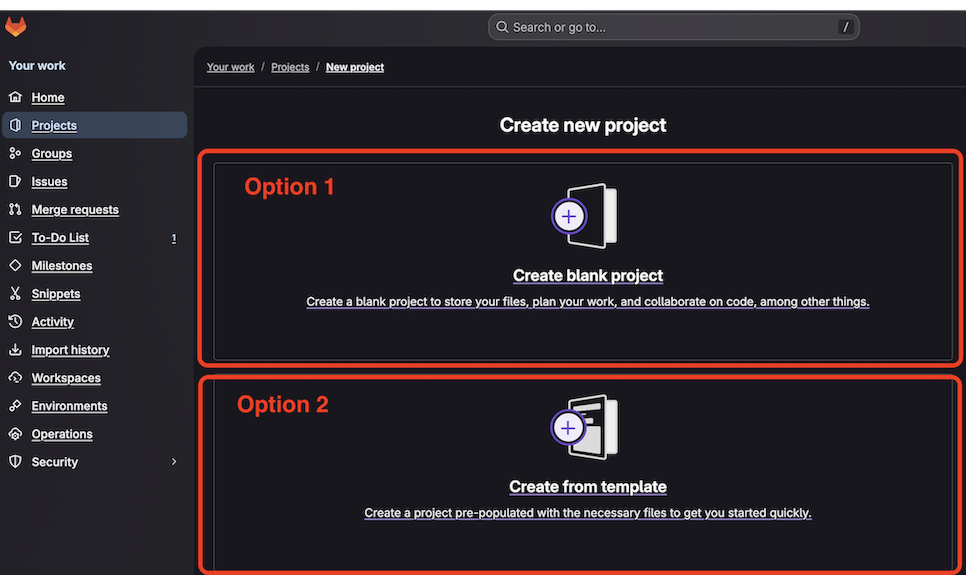
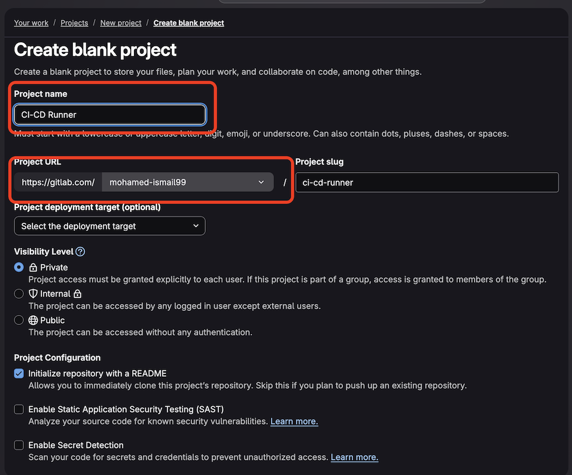
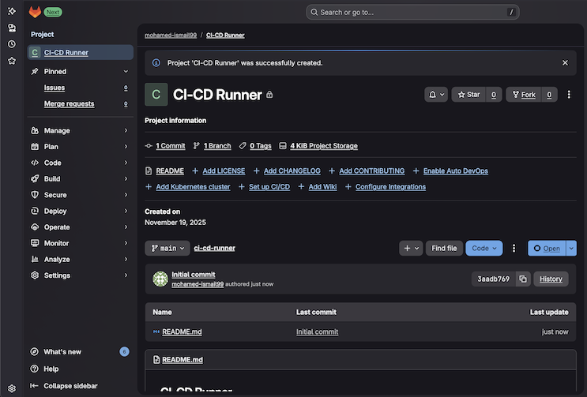

Before you begin, log in to your [GitLab account](https://gitlab.com/) or create a new one.

You need a GitLab project to store your application code and CI/CD configuration. You can either create a new project or use an existing one.

{}
If you're using an existing project, skip to the next section.
{}

## Create a new project

Navigate to **Projects** in the left sidebar and select **New Project**:

Choose **Create blank project** or **Create from template** (select **GitLab CI/CD components** if using a template):

Provide a project name (for example, `arm-runner-demo`) and select your preferred project URL. Select **Create Project**:

Your new project is ready:

With your project created, you can now add application files and configure the CI/CD pipeline to use Arm64 runners.
