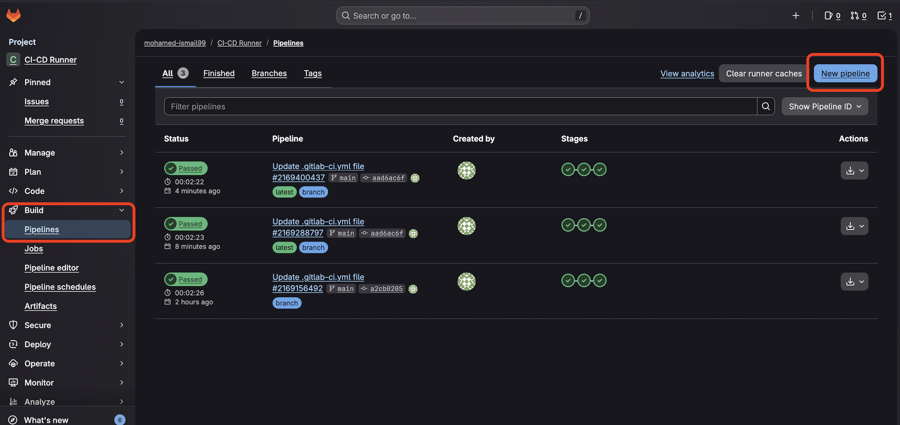
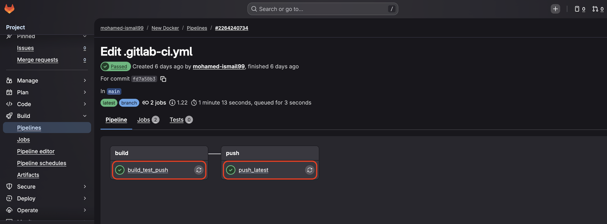
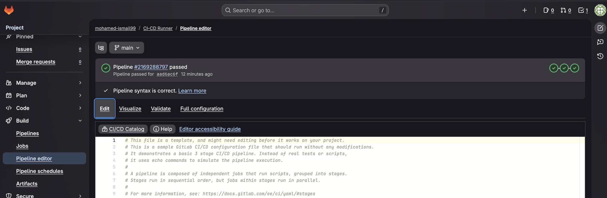

## Pipeline Script explanation:

The Pipeline script has multiple sections where each section instructs the pipeline operator on what todo or use and how each Stage looks like.

### First Section: Stages

In this section we are describing how many squentional stages will our pipeline have and what are their names (ex. **`Build, Test and Deploy`**). If we would like all the stages or jobs to run simultinously then we simply don't define this section.

### Second Section: Build-Job part of the Build stage

In this section we are defining the Build-Job as part of the Build stage. This stage will run on Gitlab-Hosted runner that uses Linux OS on Arm64 instance of size small.

{}
Gitlab offers 3 Arm64 based Instances that use Linux as their OS.

- saas-linux-small-arm64
- saas-linux-medium-arm64
- saas-linux-large-arm64

For more information about all Arm and other avilable Gitlab-hosted runners check [Gitlab-Hosted Runners](https://docs.gitlab.com/ci/runners/hosted_runners/linux/) page.

{}

### Other Sections: 

The rest of the other sections follow the same patthern. You will notice that the **`Test`** stage for example has 2 Jobs in it (unit-test-job and lint-test-job). The **`Deploy`** stage here has only 1 Job called **`deploy-job`**.
As you get to learn more YML scripting you will be able to add a lot more complex functionality to your pipelines.

{}
Gitlab offers a lot of documentions on how to create pipeline that fits different needs and also offer common templates for them as well. You can access then from [Use CI/CD to build your application](https://docs.gitlab.com/topics/build_your_application/) page.
{}

## How to run your pipeline for testing and to check the results:

From the left hand side panel, Navigate to **`Build`** then to **`Pipeline`** then click on **`New pipeline`** button on the top right hand side just like the image below. In the new window click on **`New pipeline`** button again and your pipeline will start to execute.

To check the status of your pipeline and to check the output of any of it's Jobs simply click on any of the **`Jobs`** as the image below (with red rectangle around them).

## Gitlab Helpful tools

If you navigate to your pipeline editor from before you will notice that there are more tabs in that page other than the **`Edit`** tab. 

### The other Tabs are:

1. Visualize: which can visulaize your pipeline for you as you edit it's componenets which can be very helpful especially for complex pipelines.
2. Validate: which can validate your pipeline script as you are editting them and saving from time to time so that you can catch any issues with you code early on.
