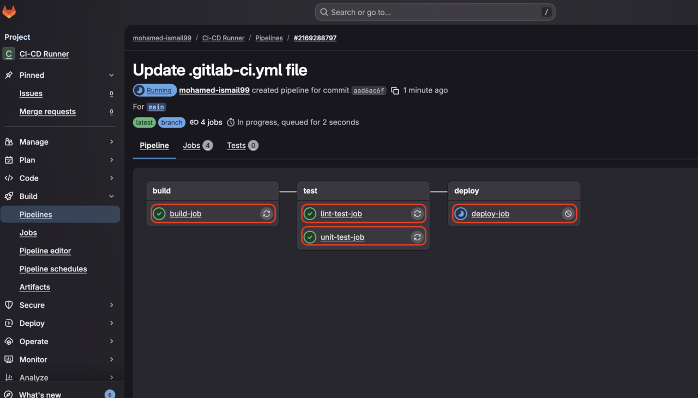

## Pipeline Script explanation:

The Pipeline script has multiple sections where each section instructs the pipeline operator on what todo or use and how each Stage looks like.

### First Section: The stages

In this section you are describing how many squentional stages that your pipeline will have and what are their names (ex. **`Build, Test and Push`**). If you would like all the stages or jobs to run simultinously then you simply don't define this section.

I am also defining some **`Variables`** that I will use in the other sections for simplisty.

### Second Section: build_test_push part for the Build stage

In this section you are defining the build_test_push as the Build stage. This stage will run on Gitlab-Hosted runner that uses Linux OS on Arm64 instance of size small. I used the **`lscpu`** command to print out the CPU information for reference.

{}
Gitlab offers 3 Arm64 based Instances that use Linux as their OS. In the Free tier you can only use the small version.

- saas-linux-small-arm64
- saas-linux-medium-arm64
- saas-linux-large-arm64

For more information about all Arm and other available Gitlab-hosted runners check [Gitlab-Hosted Runners](https://docs.gitlab.com/ci/runners/hosted_runners/linux/) page.

{}

I am also saving my Docker image in GitLab registery because it's the easiest way to do that but you can modify your pipeline to save your image in any other registery that you prefer. To get the Gitlab registery creditiationals I am using **`$CI`** variables that are defined in the Gitlab enviornment and saving them in Docker for simplisty. Please note it's always recommended to encrypt your information or save it in a sercrets/passwords manages.  

### Third Section: 

You will notice that in this stage I am simply testing that I am able to get the image that I saved in my registery before and pushing it back as the latest version.

The rest of the other sections follow the same pattern. You will notice that the **`Test`** stage for example has 2 Jobs in it (unit-test-job and lint-test-job). The **`Deploy`** stage here has only 1 Job called **`deploy-job`**.
As you get to learn more YML scripting you will be able to add a lot more complex functionality to your pipelines.

{}
Gitlab offers a lot of documentation on how to create pipeline that fits different needs and also offer common templates for them as well. You can access then from [Use CI/CD to build your application](https://docs.gitlab.com/topics/build_your_application/) page.
{}

## How to run your pipeline for testing and to check the results:

From the left hand side panel, Navigate to **`Build`** then to **`Pipeline`** then click on **`New pipeline`** button on the top right hand side just like the image below. In the new window click on **`New pipeline`** button again and your pipeline will start to execute.


To check the status of your pipeline and to check the output of any of it's Jobs simply click on any of the **`Jobs`** as the image below (with red rectangle around them).


You can also download the docker image that you saved in your gitlab registery and run it on an Arm64 instance/box for testing using the following bash script.

```bash
docker login registry.gitlab.com
docker pull registry.gitlab.com/<namespace>/<project>:latest
docker run --rm registry.gitlab.com/<namespace>/<project>:latest
```

If everything works correctly you should see an output like in the box below.

```output
Hello from an Arm64 Docker image built on GitLab hosted Arm runners!
```

You can also check your Gitlab Registery by going to your project then:

- Go to Deploy → Container Registry
- You should see new-docker
- With tags like latest and **`<commit-sha>`**

If it’s there, the registry did its job.


## Gitlab Helpful tools

If you navigate to your pipeline editor from before you will notice that there are more tabs in that page other than the **`Edit`** tab. 

### The other Tabs are:

1. Visualize: which can visualize your pipeline for you as you edit it's components which can be very helpful especially for complex pipelines.
2. Validate: which can validate your pipeline script as you are editing them and saving from time to time so that you can catch any issues with you code early on.
