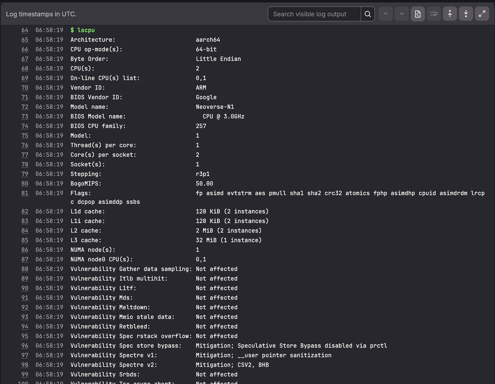

## Validate and test your Arm64 CI/CD pipeline

This section explains how to run, verify, and test your pipeline and container images on Arm64 infrastructure.

## Run the pipeline

Navigate to **Build** > **Pipelines** and select **Run pipeline**:


Select individual jobs to view their output and status:


## Verify Arm64 architecture

The `lscpu` command output confirms you're building on Arm64 architecture:



Key information from `lscpu` output:

- **Architecture**: aarch64 (Arm 64-bit)
- **CPU**: Neoverse-N1
- **Vendor ID**: ARM

This confirms your application compiles natively on Arm64 architecture, producing binaries optimized for Arm processors.

## Test the container image

Your built image is stored in GitLab Container Registry. Navigate to **Deploy** > **Container Registry** to find your image with tags including `latest` and the commit SHA.

To test the image on an Arm64 system:

```bash
docker login registry.gitlab.com
docker pull registry.gitlab.com/<namespace>/<project>:latest
docker run --rm registry.gitlab.com/<namespace>/<project>:latest
```

Replace `<namespace>` and `<project>` with your GitLab username and project name.

The expected output is:

```output
Hello from an Arm64 Docker image built on GitLab hosted Arm runners!
```

{}
This image runs only on Arm64 systems because it contains an Arm64 binary. To run on x86-64 systems, you need to rebuild using an x86-64 runner or use multi-architecture builds.
{}

## Pipeline editor tools

The pipeline editor provides helpful features:


- **Visualize**: View your pipeline as a graph showing stage dependencies
- **Validate**: Check pipeline syntax before committing changes


## What you've accomplished and what's next

You have:
- Configured a GitLab project with CI/CD pipeline
- Built a containerized application on Arm64 runners
- Verified native Arm64 compilation
- Published container images to GitLab Container Registry

You can now extend this pipeline for your own applications. GitLab's Arm64 runners eliminate cross-compilation overhead when building for Arm-based deployment targets, including cloud servers, edge infrastructure, and embedded systems.
