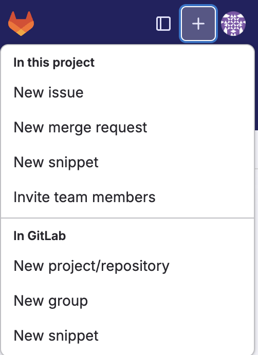
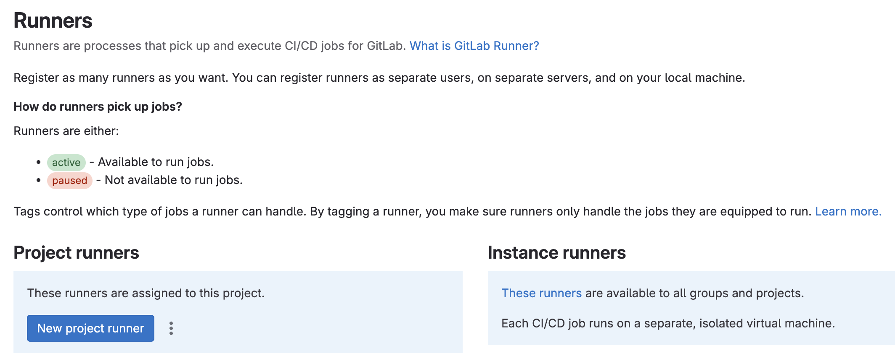
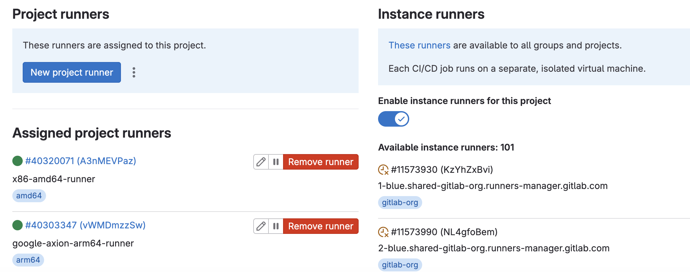

## What is a GitLab runner?
A GitLab Runner works with GitLab CI/CD to run jobs in a pipeline. It acts as an agent and executes the jobs you define in your GitLab CI/CD configuration. Some key points to note about GitLab Runner:

1. GitLab offers multiple types of runners - You can use GitLab-hosted runners, self-managed runners, or a combination of both. GitLab manages GitLab-hosted runners, while you install and manage self-managed runners on your own infrastructure.

2. Each runner is configured as an Executor - When you register a runner, you choose an executor, which determines the environment in which the job runs. Executors can be Docker, Shell, Kubernetes, etc.

3. Multi-architecture support: GitLab runners support multiple architectures including - `x86/amd64` and `arm64`

## What is Google Axion?
Axion is Google’s first Arm-based server processor, built using the Armv9 Neoverse V2 CPU. The VM instances are part of the `C4A` family of compute instances. To learn more about Google Axion refer to this [page](http://cloud.google.com/products/axion/).

## Install GitLab runner on a Google Axion VM

Create a repository in your GitLab account by clicking the "+" sign on top-left corner. Click on `New project/repository` and select a blank project, provide a name and initiate your project/repository.



After you create the repository, navigate to `Settings->CI/CD` in the left-hand pane. Expand the `Runners` section and under `Project Runners`, select `New Project Runner`.



Use `Tags` to specify the jobs that can be executed on the runner. In the `Tags` field, enter `arm64`. In `Runner description` enter `google-axion-arm64-runner` and click the `Create Runner` button

Once the runner is created, you need to register this runner. Select Linux as the Operating System.

In Google Cloud, the `C4A` VM instance is based on Google Axion. Create a `C4A` VM by following the [Create Arm-based VM in Google Cloud learning path](/learning-paths/servers-and-cloud-computing/csp/google/)

SSH to this VM and use the following steps to install GitLab Runner binaries.

Download the binaries using the command below

```console
sudo curl -L --output /usr/local/bin/gitlab-runner https://gitlab-runner-downloads.s3.amazonaws.com/latest/binaries/gitlab-runner-linux-arm64
```

Provide necessary permissions
```console
sudo chmod +x /usr/local/bin/gitlab-runner
```
Create a GitLab runner user
```console
sudo useradd --comment 'GitLab Runner' --create-home gitlab-runner --shell /bin/bash
```
Install the runner and run it as a service
```console
sudo gitlab-runner install --user=gitlab-runner --working-directory=/home/gitlab-runner
sudo gitlab-runner start
```
In the GitLab console, on the `Register Runner` page, copy the command from `Step 1` and run it on the `C4A` VM. The command should look like this:
```console
sudo gitlab-runner register  --url https://gitlab.com  --token <your-runner-token>
```
Go back to the SSH session for `C4A` VM. When prompted by the command line, keep the default for `GitLab instance URL` and enter a name for the runner. For the executor, use `shell` as the option.

After answering the prompts, the runner should be registered and you should see a message like the one below:

```output
Runner registered successfully. Feel free to start it, but if it's running already the config should be automatically reloaded!
```

You should see the newly registered runner in the Runners section of the GitLab console as shown below.



To create an `amd64` GitLab runner, follow the same steps as above, except for the `Download binaries` section. Change the download url to `https://gitlab-runner-downloads.s3.amazonaws.com/latest/binaries/gitlab-runner-linux-amd64`

Launch an `amd64` VM instance with the `E2` type in Google Cloud and install the runner binaries. Once done, you should be able to see both the runners as shown in the picture above.
