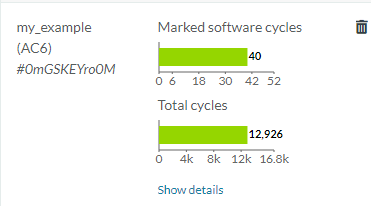
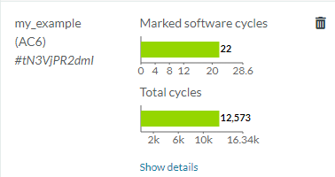

---
# User change
title: Upload and run your custom example

weight: 4 # 1 is first, 2 is second, etc.

# Do not modify these elements
layout: "learningpathall"
---
## Upload and run example

Return to the `IP Explorer` home page, and select `Simulate Processors`.

The `My Cortex-M0` and `My Cortex-M7` instances you created previously should be listed at the top.

Select `My Cortex-M0` and navigate to `Software Simulation` section. Click `+New` to open the `Start a new Software Simulation` pane.

From the `Select/Upload Software` pulldown, select `+New`.

Browse for the `custom-software.tgz` tarball created previously, and upload.

When processed, select `my_example` from the pulldown.

Select `AC6` (`Arm Compiler for Embedded`) as the compiler, and then click `Run`.

While the Cortex-M0 simulation is being processed, you can repeat for the `My Cortex-M7` system.

{}
You will receive email notification when each simulation run is complete.
{}

## Compare results

When execution is complete, you will see a summary of the performance of your application for each system.

The Cortex-M7 used in the simulation includes a Floating-Point Unit (FPU) which could execute the floating point addition directly. The Cortex-M0 used a C library routine.

#### Cortex-M0

#### Cortex-M7

## Show details

To further understand how the code executed, click `Show details`. It provides additional information on how the code executed, as well as output of any `printf()` statements you may have used.
