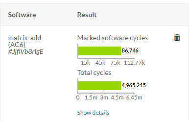
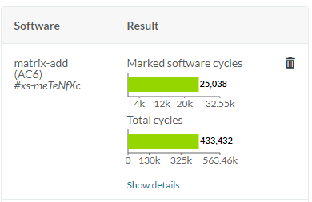

---
# User change
title: Run a pre-installed example and compare performance

weight: 2 # 1 is first, 2 is second, etc.

# Do not modify these elements
layout: "learningpathall"
---

[Arm IP Explorer](https://www.arm.com/products/ip-explorer) is a cloud-based platform to enable system architects to quickly and easily compare, evaluate, and configure Arm IP.

A key feature of IP Explorer is to be able to simulate RTL-based systems in the cloud, to be able to generate cycle accurate data for your key algorithms. The code is also executed on a [Fast Models](https://www.arm.com/products/development-tools/simulation/fast-models) based system to verify that the code can execute correctly.

This learning path will explain the basic steps to enable you to create your own such code examples for use with these systems.

## Access IP Explorer

First ensure you can access [IP Explorer](https://ipexplorer.arm.com/) and login. For more information, see the [Install Guide](/install-guides/ipexplorer).

## Run a pre-installed example

On the welcome screen, select 'Simulate Processors` to see a list of processors with simulations available.

{}
In this learning path you will compare `Cortex-M0` and `Cortex-M7`, but you could use any set of appropriate processors.
{}

### Run an Arm Cortex-M0 simulation {#M0simulation}

Select `Cortex-M0` from the list. If necessary use the filter options on-screen or the search box to locate. This will open the `Cortex-M0 Configuration` view.

Edit the name of the processor (for example `My Cortex-M0`) and save. This will add the processor to your list for easy tracking.

Scroll down to the `Software Simulation` area.

Click `+New`, to bring up the `Start a new Software Simulation` dialog. There is a diagram of the simulated system shown.

Select `matrix-add` from the pulldown, and `Arm Compiler 6` (`AC6`) as the desired toolchain to build the example with. Other options can remain as default.

Click `Run`.

The example code will be built by the chosen toolchain, loaded to the RTL simulation, and executed. This process will take a few minutes to complete. You will receive an email notification when done.

### Run an Arm Cortex-M7 simulation

Return to the welcome screen and repeat the [same steps](#M0simulation) for the supplied Cortex-M7 system. Though more configuration options are available, leave these as default.

## Compare results

When execution is complete, you will see a summary of the performance of your application for each system.

Comparing the results of `Marked software cycles` shows that the Cortex-M7 greatly improves on the Cortex-M0 for this application.

{}
The exact cycle count may vary depending on compiler version used.
{}

#### Cortex-M0

#### Cortex-M7

You can click `Show details` to get a deeper understanding of the data. You will return to this when custom software is used.

You have successfully run an example application on simulated systems and compared results. The next step is to create your own example.
