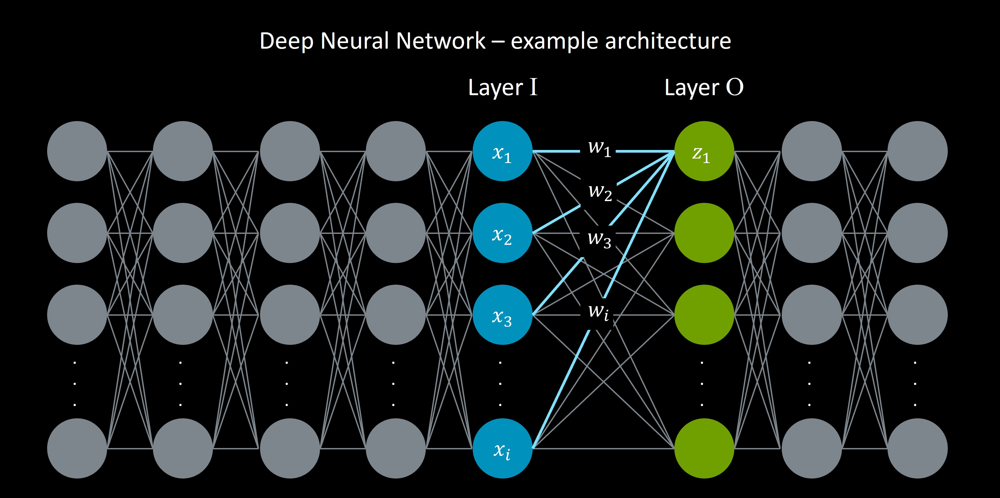

## What is KleidiAI?

KleidiAI is a set of micro-kernels that integrates into machine learning frameworks, accellerating your AI inference on Arm-based platforms. KleidiAI's micro-kernels are hand-optimized in Arm assembly code to leverage modern architecture instructions that greatly speed up AI inference on Arm CPUs. 

You don't need to do anything to get the benefits of KleidiAI. It will automatically apply if two conditions are met:
1. Your ML Framework integrates KleidiAI, and
2. Your hardware platform supports the required Arm instructions for your inference (covered further down this page).

## How does Generative AI mathmatically execute in hardware?

{}
“Any sufficiently advanced technology is indistinguishable from magic” - Arthur C. Clarke
{}

In the case of Generative AI models today, the math behind the precieved magic is **matrix multiplication**. To understand this, and better understand KleidiAI itself, this section offers a high-level explination of neural network architecture.

Neural networks consist of layers of neurons. Each neuron in a layer is connected to all neurons in the previous layer. Each of these connections has a unique connection strength, learned through training. This is called a connection's *weight*. 

During inference (such as trying to generate the next token/word with a given input), each neuron performs a weighted sum of inputs and then decides its value via an activation function. The weighted sum is the dot product of each connected neruon's input (*x*) and its connection weight (*w*). A layer of neuron's calculations can be efficiently calculated via matrix multiplication, where the input matrix is multiplied by the weight matrix. 

For example, in the image below, *z1* is calculated as a dot product of connected *x*'s and *w*'s from the previous layer. All *z* values in Layer 0 can therefore be effeciently calculated with a matrix multiplication operation.

Sidebar:  In addition to *weights*, each neuron in a neural network is assigned a *bias*. These weights and biases are learned during training and make up a model's parameters. For example, in the Llama 3 model with 8 billion parameters, the model has around 8 billion individual weights and biases that embody what it learned during training. Generally speaking, the more parameters a model has, the more information it can retain from its training, leading to more capable models.

### Why is speeding up matrix multiplication crucial for AI performance?
What does this all mean? An 8 billion parameter model generating one token requires billions of dot product calculations, with at least hundreds of millions of matrix multiplication operations. Therefore speeding up matrix multiplication is a critical piece to both running massive Generative AI models on servers and smaller models constrained devices like smartphones.

KleidiAI uses modern Arm CPU instructions to accelerating matrix multiplication and overall AI inference.

## What Arm features does KleidiAI leverage?
Each KleidiAI matrix multiplication micro-kernel uses a specific Arm architecture feature to enhance AI inference. Below is a description of each architecture feature KleidiAI uses to accelerate matrix multiplication:

* **Dot Product**: KleidiAI uses the `vdotq_s32` intrinsic, which is a vector dot product, introduced as part of SIMD. It computes the dot product of two vector 8-bit integers and accumlates the result into a 32-bit integer. View the `vdot` documentation [here](https://developer.arm.com/documentation/ddi0597/2024-03/SIMD-FP-Instructions/VDOT--by-element---BFloat16-floating-point-indexed-dot-product--vector--by-element--).

* **SMMLA**: KleidiAI also makes use of the Int8 Matrix Multiplication (i8mm) feature including the `SMMLA` instruction,  which stands for *Signed 8-bit integer matrix multiply-accumulate*. It multiplies a 2x8 matrix of 8-bit integers by a 8x2 matrix of 8-bit integers, which is accumulated into a 2x2 matrix of 32-bit integers. For more information view the *SMMLA* and *i8mm* documentation [here](https://developer.arm.com/documentation/ddi0602/latest/SIMD-FP-Instructions/SMMLA--vector---Signed-8-bit-integer-matrix-multiply-accumulate--vector--).

* **FMLA**: This instruction, which stands for *Floating-point Multiply Accumulate*, for 16-bit operations. It was included as part of the Advanced SIMD extension, multiplying and accumulating two vectors together, each containing eight 16-bit numbers. View the `FMLA` documentation [here](https://developer.arm.com/documentation/ddi0602/2024-03/SIMD-FP-Instructions/FMLA--vector---Floating-point-fused-Multiply-Add-to-accumulator--vector--).

* **FMOPA**: This instruction stands for *Floating-point outer product and accumulate*. It is included in the Arm Scalable Vector Extention 2 (SVE2). The single percision `FMOPA` varient enables optimized matrix multiplication on 32-bit numbers. View the `FMOPA` documentation [here](https://developer.arm.com/documentation/ddi0602/2023-12/SME-Instructions/FMOPA--non-widening---Floating-point-outer-product-and-accumulate-?lang=en).

Today, Arm-powered hardware containing these instructions exist in cloud servers and smartphones. Below are some examples of the first products from popular vendors that support KleidiAI:

| Area        | Example Product     | Arm-based SoC      | Arm Architecture  |
| ---------   | -----------------   | ----------------   | ----------- |
| Smartphone  | Google Pixel 6      | Google Tensor G1    | Armv8.2  |
| Smartphone  | OPPO Reno6 Pro 5G   | MediaTek Dimensity 1200 | Armv8.2  |
| Smartphone  | Vivo Y22            | MediaTek Helio G70  | Armv8.2  |
| Smartphone  | Xiaomi Mi 11        | Qualcomm Snapdragon 888 | Armv8.2  |
| Smartphone  | Samsung Galaxy S20 Ultra      | Samsung Exynos 990 | Armv8.2  |
| Smartphone  | Google Pixel 8 Pro | Google Tensor G3   | Armv9.0  |
| Smartphone  | Samsung Galaxy S22 | Snapdragon 8 Gen 1 | Armv9.0  |
| Smartphone  | OPPO Find X5 Pro   | Snapdragon 8 Gen 1 | Armv9.0  |
| Smartphone  | Xiaomi 12T         | Mediatek Dimensity 9000 | Armv9.0  |
| Server      | c8y                | Alibaba Yitian 710 | Armv9.0  |
| Server      | GB200 NVL72        | NVIDIA Grace       | Armv9.0  |
| Server      | C7g, M7g, R7g      | AWS Graviton 3     | Armv8.4  |

The remaineder of this Learning Path will answer the following questions while stepping through a C++ example:
* How does KleidAI 'just work' with ML Frameworks?
* What do the micro-kernels in KleidiAI functionally do?
* How are the KleidiAI micro-kernels actually speeding up matrix multiplication?
