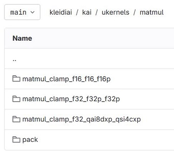

## High-level KleidiAI architecture
This section provides an abstracted overview of KleidiAI's components before diving into the specifics. The KleidiAI source files are publicly accessible in the [KleidiAI GitLab repository](https://gitlab.arm.com/kleidi/kleidiai). Navigate there in your web browser to follow along and discover KleidiAI's structure.

KleidiAI's micro-kernels are located in the `/kai/ukernels/matmul` directory; navigate there now. 

There are essentially two types of KleidiAI micro-kernels today:
1. Quantizing/Packing routines    - under the `pack` directory.
2. Matrix Multiplication routines - the three directories with the prefix `matmul_clamp`. Each directory contains routines specialized for a specific input data type.

### What are the quantization levels that KleidiAI supports?
KleidiAI has multiple matrix multiplication micro-kernels, and dynamic quantization routines, to optimally support all model quantization levels. To learn more about model quantization and how selecting the right quantization level affects your AI-based application, refer to [this Learning Path](/learning-paths/servers-and-cloud-computing/llama-cpu/llama-chatbot#quantization-format).

KleidiAI currently has three matrix multiplication directories that each handle input/output types differently, and which will evolve to broaden the reach of their support:

| uKernel                           |  Output type     | Input types     |
| ---------                         | -----------------   | --------------  | 
| `matmul_clamp_f16_f16_f16`        | 16-bit floating-point | 16-bit floating-point |
| `matmul_clamp_f32_f32_f32`        | 16-bit floating-point | 32-bit floating-point |
| `matmul_clamp_f32_qa8dxP_qs4cxP`  | 32-bit floating-point | 8-bit integer and 4-bit integer |

### How to select the right KleidiAI micro-kernel?

Only one matrix multiply micro-kernel is used for your given AI application. Each AI model and workload (for example using a [Gemma](https://huggingface.co/blog/gemma) model running text generation), has unique inference characteristics. KleidiAI has various matrix multiplication micro-kernel routines to optimize the inference speed of different workloads. The ML Framework provider selects the optimal micro-kernel on your behalf when implementing KleidiAI in their framework. No extra effort is required when using a framework with KleidiAI.

## KleidiAI in a real-world example 
Before deep-diving into KleidiAI's code, it is helpful to see how KleidiAI micro-kernels interact with a GenAI model and a ML Framework at a high-level. The steps below describe how KleidiAI speeds up matrix multiplication. The example is of a user asking a chatbot app a question on their smartphone. This is the example application stack to analyze:

### Simple inference walk through

#### Stage 1: Input
* **A user** inputs their question into the chatbot, such as "What is the capital of the United States?"
* **The chatbot app** uses MediaPipe to convert that text into a series of tokens representing the question as a matrix of FP16 numbers (the Gemma-2b model is in FP16 format). 
* **MediaPipe** invokes the large language model (LLM) inference with the tokenized input, feeding it into the first neural network layer of the Gemma-2b model.
* **XNNPack** starts executing the inference, managing the mathematical operations inside the LLM's neural network layers. 
* **KleidiAI** is called to accelerate the essential matrix multiplication operations propagating the input through the neural network.

#### Stage 2: KleidiAI Quantizing and Packing micro-kernels
* **KleidiAI** receives two large matrices of FP16 numbers to perform matrix multiplication. The *i8mm* micro-kernels were selected for this workload, requiring quantization from FP16 to lower precision numbers to enhance computational efficiency.
* **The matrix of inputs**, also known as the Left-Hand Side matrix (LHS), is quantized into INT8.
* **The matrix of model weights**, also known the Right-Hand Side matrix (RHS), is quantized into INT4, with two numbers packed into an INT8 memory space. This packing is done to take advantage of the *i8mm* architecture feature, which operates on 8-bit memory chunks.

#### Stage 3: KleidiAI Matrix Multiplication micro-kernels
* **KleidiAI** takes the prepared input and model weight matrices (LHS and RHS respectively) performs matrix multiplication using optimized *SMMLA* instructions from the *i8mm* micro-kernels.
* **KleidiAI** unpacks and de-quantizes the result back into the original FP16 number format sends the resulting matrix to XNNPack.

#### Stage 4: Finish Inference and Output
* **XNNPack** completes the inference by sending the output of each neural network layer into the next, continuing through all layers of the Gemma-2b, calling KleidiAI to execute dynamic quantization and matrix multiplication.
* **XNNPack** sends the inference result, a final matrix, to MediaPipe.
* **MediaPipe** decodes the numerical matrix into a series of tokens representing the answer to the original question.
* **The chatbot app** receives these tokens from MediaPipe and displays the answer to the user as it streams in from multiple inferences. 
* **The user** sees the answer on the screen: “The capital of the USA is Washington, D.C.”

{}
This is a brief overview, but is helpful to help you understand how KleidiAI interacts with ML Frameworks and Generative AI models.
{}

There are further details and nuances to these processes that will help you understand KleidiAI better.

### Why are model weights quantized to INT4, and inputs quantized to INT8?
KleidiAI optimizes for a balance of size, accuracy, and execution speed.

Model weights can be quantized down to INT4 without inducing large errors because after training, weights typically stay within a range suitable for INT4 quantization. Furthermore, model sizes are halved by selecting INT4 over INT8 or FP16 quantization, a significant benefit to both memory storage and throughput - especially critical when deploying to constrained devices like smartphones.

In contrast, neural network activations (described as 'inputs' so far) are highly variable and not as evenly distributed across the full data range. For example, a common activation function - ReLU - outputs zero for any negative input and leaves any positive input unchanged. This results in a number distribution with many small values but also occasional large values. Having only 16 distinct values (from INT4 quantization) results in large quantization errors. 

As a result, KleidiAI strategically-selected INT4 quantization for model parameters and INT8 for inputs propagating through the neural network. 

### Which AI model size should I select? 
Most models are trained in FP32 or FP16 formats and are by default available to download at that size. To realize the benefits of lower memory footprint, select a pre-quantized version of your desired AI model, ideally in INT4 format. You can quantize models yourself through various tools, but the quickest and easiest way is to locate a pre-quantized version of the same model.

KleidiAI supports matrix multiplication of models across FP32, FP16, INT8, and INT4 formats. Your ML framework provider selects the optimal KleidiAI micro-kernel to balance inference speed and accuracy for your use case. 

In short, it is recommended that you select an INT4 pre-quantized model when inference speed is critical, and especially on constrained devices like smartphones.

### Why does KleidiAI need to 'pack' before matrix multiplication?
The goal of KleidiAI's packing micro-kernels is to prepare the incoming matrices for efficient matrix multiplication. For each matrix multiplication routine is a corresponding packing routine, which may or may not require dynamic quantization depending on the incoming number formats. 

For example, the *SMMLA* instruction operates on 8-bit numbers. The role of packing after quantization is to organize two 4-bit integers into a single 8-bit memory space, and the *SMMLA* instructions are handwritten to efficiently operate on the two packed integers at once.

The power of KleidiAI stems from its deep understanding of AI workload requirements, quantization techniques, data packing strategies, and advanced Arm instructions, which combine to accelerate and optimize the performance of AI models on Arm CPUs.

The next section dives into the technical details of how KleidiAI delivers these performance uplifts by stepping through a C++ example.
