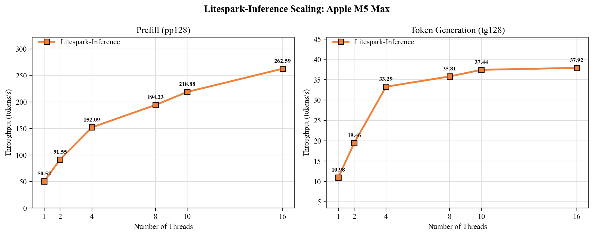

## Record your benchmark configuration

The `litespark-benchmark` command measures memory use, time to first token
(TTFT), prompt prefill throughput, and token-generation throughput. Use it
to establish a performance baseline on Arm Linux or macOS on Apple silicon.

{}
By default, the inference benchmark uses the torchless Litespark-Inference
runtime. It doesn't run a PyTorch baseline unless you add the `--pytorch` flag.
{}

Run the following commands from the virtual environment you created by following the
[Litespark-Inference install guide](/install-guides/litespark-inference/):

```bash
python -m pip show litespark-inference
litespark-inference info
```

Record the package version, CPU, active kernel, thread count, and embedding
data type with your results. Keep these values unchanged when comparing runs.
The active kernel should contain `neon` on Arm Linux and Apple silicon.

For consistent results, close CPU-intensive applications and run each test
under similar system load and thermal conditions.

## Run the benchmark on Arm Linux

Use `nproc` to set the benchmark to the number of available processing units:

```bash
litespark-benchmark \
    --inference \
    --no-matrix \
    --threads "$(nproc)" \
    --output results-arm-linux.json
```

## Run the benchmark on macOS

On Apple silicon, use `sysctl` to obtain the number of logical CPUs:

```bash
litespark-benchmark \
    --inference \
    --no-matrix \
    --threads "$(sysctl -n hw.logicalcpu)" \
    --output results-macos.json
```

Both commands run the BitNet inference workload with 128 prompt tokens
(`pp128`) and 128 generated tokens (`tg128`). They use the default torchless
backend and INT4 embeddings. The terminal output reports memory, TTFT, and
throughput. The JSON file preserves the configuration and detailed results.

## Compare with a PyTorch baseline

PyTorch is needed only when you add the `--pytorch` flag. The benchmark command doesn't install PyTorch. The current PyPI package declares PyTorch and Transformers
as dependencies, so they're already present after you follow the install
guide.

Verify that both packages are available in your virtual environment:

```bash
python -c "import torch, transformers; print(torch.__version__, transformers.__version__)"
```

On Arm Linux, add `--pytorch` to the benchmark command:

```bash
litespark-benchmark \
    --inference \
    --pytorch \
    --no-matrix \
    --threads "$(nproc)" \
    --output comparison-arm-linux.json
```

On macOS, run the equivalent comparison with the Apple silicon thread count:

```bash
litespark-benchmark \
    --inference \
    --pytorch \
    --no-matrix \
    --threads "$(sysctl -n hw.logicalcpu)" \
    --output comparison-macos.json
```

The PyTorch pass takes longer and uses substantially more memory than the
torchless-only benchmark. When both passes complete, the terminal displays a
comparison table for memory, TTFT, and throughput.

The following example output is from a 64-thread Arm Linux server. Results vary depending on the processor, thread count, and system load:

```output
======================================================================
COMPARISON: Litespark vs PyTorch
======================================================================

Metric                      PyTorch    Litespark  Improvement
----------------------------------------------------------
Memory (MB)                   4,602          776         5.9x
TTFT (ms)                  10,370.1      1,609.1         6.4x
Throughput (tok/s)             1.83        17.75         9.7x
----------------------------------------------------------
```

## Understand the benchmark flags

The following are the benchmark flags and the purpose they serve:

| Flag | Purpose |
|---|---|
| `--inference` | To run the BitNet `pp128` and `tg128` inference workload |
| `--no-matrix` | To skip the separate raw matrix-shape benchmark |
| `--threads N` | To set the OpenMP thread count so runs use the same CPU resources |
| `--embed-dtype bf16`, `int8`, or `int4` | To select the token-embedding data type. The default is `int4`. |
| `--pytorch` | To add the Hugging Face and PyTorch baseline. PyTorch isn't used when you omit this flag. |
| `--output FILE` | To save the configuration and results as JSON |

## Measure thread scaling

Run the same benchmark with several fixed thread counts to see how prefill and
token generation scale. Change only `--threads` between runs. 

Copy and paste the following loop directly into your terminal:

```bash
for threads in 1 2 4 8 16; do
    litespark-benchmark \
        --inference \
        --no-matrix \
        --threads "$threads" \
        --output "results-${threads}-threads.json"
done
```

Add higher thread counts such as 32 or 64 if your system has them available.

Prefill is compute-bound and generally continues to improve as you add
threads. Token generation is more memory-bound and can flatten out earlier.
The following chart illustrates this behavior on an Apple M5 Max.



## Measure energy use on macOS

The `--power` flag adds energy and joules-per-token measurements when the
platform exposes readable power counters. Energy measurement is available on
macOS through `powermetrics`. It isn't available on Arm Linux because
Arm-based systems don't expose powercap energy counters.

On macOS, refresh your `sudo` credentials so the benchmark can run
`powermetrics`, then start the measurement:

```bash
sudo -v
litespark-benchmark \
    --inference \
    --no-matrix \
    --threads "$(sysctl -n hw.logicalcpu)" \
    --power \
    --power-cooldown 10 \
    --output energy-macos.json
```

If the results report `available: false`, the platform doesn't expose a
supported counter. The memory and throughput results remain valid.

## Inspect the JSON results

The benchmark commands in the previous sections saved results to JSON files
using the `--output` flag. For example, the Arm Linux benchmark saved to
`results-arm-linux.json` and the comparison saved to `comparison-arm-linux.json`.

Format a saved JSON file with Python:

```bash
python -m json.tool results-arm-linux.json
```

Confirm that the `system` object reports `aarch64` or `arm64`, and that
`simd_features.neon` is `true`. In `benchmarks.inference`, check the kernel and
thread count. The kernel should contain `neon-torchless`, and the thread count
should match the value passed with `--threads`.

## What you've accomplished

You've now benchmarked Litespark-Inference on an Arm system with a controlled thread count. You've saved memory, TTFT, throughput, kernel, and system information as JSON, and measured how throughput changes with thread count. You've also identified when PyTorch and hardware energy counters are needed.

Use the saved JSON files to compare embedding data types or repeat the same
workload on another Arm system.
