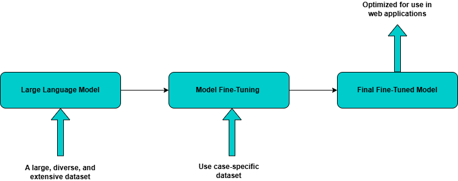

Fine-tuning in the context of large language models (LLMs) refers to the process of further training a pre-trained LLM on domain-specific or task-specific data to enhance its performance for a particular application. LLMs, such as GPT, BERT, and LLaMA, are initially trained on massive corpora containing billions of tokens, enabling them to develop a broad linguistic understanding. 

Fine-tuning refines this knowledge by exposing the model to specialized datasets, allowing it to generate more contextually relevant and accurate responses. Rather than training an LLM from scratch, fine-tuning leverages the pre-existing knowledge embedded in the model, optimizing it for specific use cases such as customer support, content generation, legal document analysis, or medical text processing. 

This approach significantly reduces computational requirements and data needs while improving adaptability and efficiency in real-world applications. 

## Advantages of fine-tuning

Fine-tuning is essential for optimizing large language models (LLMs) to meet specific application requirements, enhance performance, and reduce computational costs. While pre-trained LLMs have broad linguistic capabilities, they may not always produce domain-specific, contextually accurate, or application-tailored responses.

The advantages of fine-tuning include:

- Customization for specific domains
- Improved response quality and accuracy
- Task-specific adaptation
- Reduction in computational and data requirements
- Enhanced efficiency in real-world applications
- Alignment with ethical, regulatory, and organizational guidelines

## Fine-Tuning Methods

Fine-tuning LLMs uses different techniques based on the various use cases, computational constraints, and efficiency requirements. 

Below are the key fine-tuning methods:

### Full Fine-Tuning (Supervised Learning Approach)

Full fine-tuning involves updating all parameters of the LLM using task-specific data, requiring significant computational power and large labeled datasets, which provides the highest level of customization.

### Instruction Fine-Tuning

Instruction fine-tuning is a supervised learning method. A pre-trained large language model (LLM) is further trained on instruction-response pairs to improve its ability to follow human instructions accurately. Instruction fine-tuning has some key features using labeled instruction-response pairs, enhances model alignment with human intent. It is commonly used in chatbots and AI Assistants, and prepares models for zero-shot and few-shot learning.

### Parameter-Efficient Fine-Tuning (PEFT)

PEFT is an optimized approach that reduces the number of trainable parameters while maintaining high performance.

Some approaches are:

- ###### LoRA (Low-Rank Adaptation)
    - Introduces small trainable weight matrices (rank decomposition) while freezing the main model weights.
    - Significantly reduces GPU memory usage and training time.

- ###### QLoRA (Quantized LoRA)
    - Uses quantization (e.g., 4-bit or 8-bit precision) to reduce memory footprint while applying LoRA fine-tuning.
    - Ideal for fine-tuning large models on limited hardware.

- ###### Adapter Layers
    - Inserts small trainable layers between existing layers of the model and Keeps most parameters frozen, reducing computational overhead.

- ###### Reinforcement Learning from Human Feedback (RLHF)
    - Fine-tunes models based on human preferences using reinforcement learning.

- ###### Domain-Specific Fine-Tuning
    - Fine-tunes the LLM with domain-specific datasets and improves accuracy and relevance in specialized applications.

- ###### Multi-Task Learning (MTL) Fine-Tuning
    - Trains the model on multiple tasks simultaneously, enabling generalization across different applications.

## Fine-Tuning Implementation  

The following steps need to be performed to implement fine-tuning:

-   Base model selection: Choose a pre-trained model based on your use cases. You can find pre-trained models on [Hugging Face](https://huggingface.co/)
-   Fine-tuning method finalization: Select the most appropriate fine-tuning method (supervised, instruction-based, PEFT) based on your use case and dataset. You can typically find various datasets on [Hugging Face](https://huggingface.co/datasets) and [Kaggle](https://www.kaggle.com/datasets).
-   Dataset preparation: Organize your data for your use case-specific training, ensuring it aligns with the model's required format.
-   Training: Utilize frameworks such as TensorFlow and PyTorch to fine-tune the model.
-   Evaluate: Evaluate the model, refine it as needed, and retrain to enhance performance.

The steps are depicted in Figure 1 below:

With this background you are ready to get started with fine-tuning.