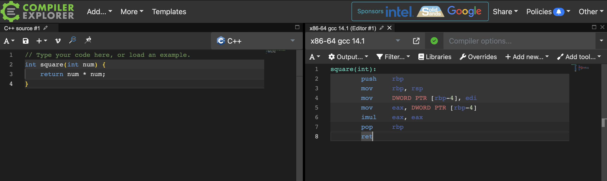
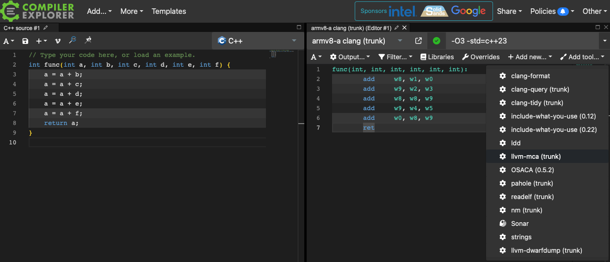
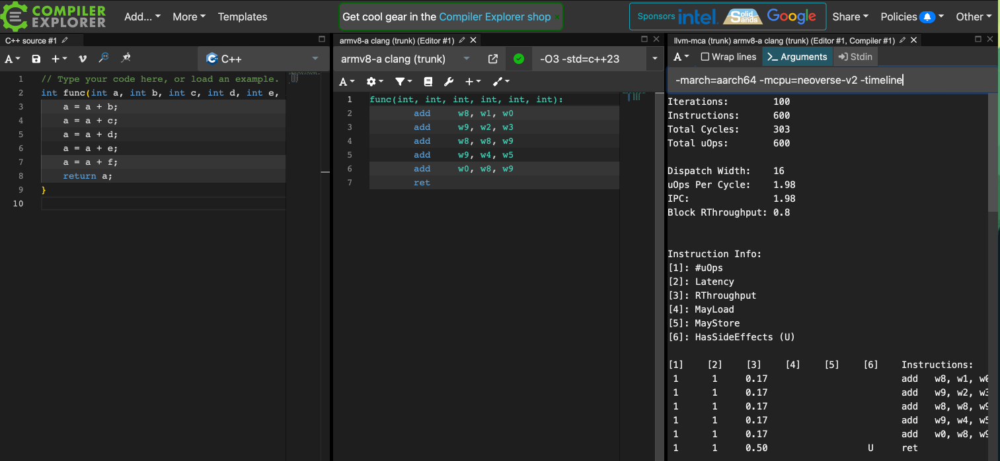

### What is Compiler Explorer?

Compiler Explorer is an interactive online compiler that is compatible with code in C/C++, Java, Python, and many other programming languages. It allows you to see what the code looks like after being compiled in real time. This is helpful when you want to try different compiler versions without installing them.

Compiler Explorer supports multiple compilers and has many tools available, including `llvm-mca`.

### Running MCA in Compiler Explorer

To access Compiler Explorer, open a browser and go to https://godbolt.org.

This leads you to the page shown below in Figure 1. Your view might be slightly different.



The left side of the page contains the source code. In Figure 1, the language is set to C++, but you can click on the programming language to select a different language for the source code.

Copy the code below and paste it into Compiler Explorer as C++ source code:

```C
int func(int a, int b, int c, int d, int e, int f) {
    a = a + b;
    a = a + c;
    a = a + d;
    a = a + e;
    a = a + f;
    return a;
}
```

The right side of the page contains the disassembly output from the compiler.

You can change the compiler by clicking on it and selecting a different one.

Select `armv8-a clang(trunk)` as the compiler to see Arm instructions.

Next, update the compiler flags by typing `-O3` in the `Compiler options` box.

You can view the full set of options passed to the compiler by clicking on the green tick next to the compiler.

Click the `Add tool` drop-down button to add `llvm-mca` as a tool as shown in Figure 2 below:



To add more flags to `llvm-mca`, click on the `Arguments` button and type them in.

Add `-mcpu=neoverse-v2`, as well as any other flags you choose to pass to `llvm-mca`.

To find what CPUs are supported you can check the [clang documentation](https://clang.llvm.org/docs/CommandGuide/clang.html#cmdoption-print-supported-cpus).

The right side of the page now contains the output from running `llvm-mca` on the disassembly of the source code, as shown in Figure 3 below:



You are now able to run `llvm-mca` using Compiler Explorer.
