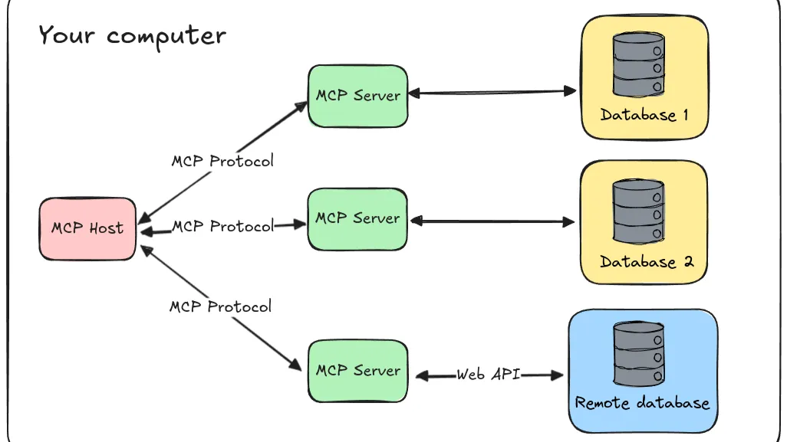

## Model Context Protocol (MCP)

The **Model Context Protocol (MCP)** is an open specification for wiring Large-Language-Model (LLM) agents to the *context* they need — whether that context is a database, a local sensor, or a SaaS API.
Think of it as USB-C for AI: once a tool or data source speaks MCP, any compliant LLM client can “plug in” and start using it immediately.

### Why use MCP?
- **Plug-and-play integrations:** A growing catalog of pre-built MCP servers (filesystem, shell, vector stores, web-scraping, etc.) gives your agent instant super-powers with zero custom glue code.

- **Model/vendor agnostic:** Because the protocol lives outside the model, you can swap models like GPT-4, Claude, or your own fine-tuned model without touching the integration layer.

- **Security by design:** MCP encourages running servers inside your own infrastructure, so sensitive data never leaves the perimeter unless you choose.

- **Cross-ecosystem momentum:** Recent roll-outs—from an official C# SDK to Wix’s production MCP server and Microsoft’s Azure support—show the MCP spec is gathering real-world traction.

### High-level architecture

- **MCP Host:** the LLM-powered application (Claude Desktop, an IDE plugin, OpenAI Agents SDK, etc.).
- **MCP Client:** the runtime shim that keeps a 1-to-1 connection with each server.
- **MCP Server:** a lightweight process that advertises tools (functions) over MCP.
- **Local data sources:** files, databases, or sensors your server can read directly.
- **Remote services:** external APIs the server can call on the host’s behalf.

{}
Learn more about AI Agents in the [AI Agent on CPU learning path](https://learn.arm.com/learning-paths/servers-and-cloud-computing/ai-agent-on-cpu/).
{}

