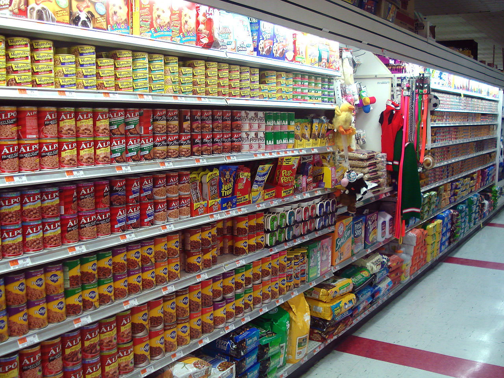

## Prepare a local image asset

In this module you will run a **retail shelf walk audit** using a single image and an Omni multimodal model on MNN.

Instead of trying to do SKU-accurate counting (which is difficult and unreliable on real-world shelf photos), you will generate an **actionable store-operations signal**:

- A coarse **facing coverage** estimate for **top / middle / bottom** shelf levels
- A single **priority zone** that appears most sparse
- A short **reason** grounded in what is visible
- `NOT_SURE` when the image is ambiguous

This is a common retail workflow: the goal is to decide **where to restock first**, not to perfectly count every unit.


## Step 1 - Prepare the image asset

```bash
mkdir -p ~/mnn/assets
```

Download the tutorial image and validate it:

```bash
wget -P ~/mnn/assets https://upload.wikimedia.org/wikipedia/commons/e/e6/Pet_Food_Aisle.jpg
file ~/mnn/assets/Pet_Food_Aisle.jpg
```

The `file` command confirms that this is a valid JPEG image.

```
JPEG image data, JFIF standard 1.02, resolution (DPI), density 72x72, segment length 16, Exif Standard: [TIFF image data, little-endian, direntries=12, description=                               , manufacturer=SONY, model=DSC-W50, orientation=upper-left, xresolution=203, yresolution=211, resolutionunit=2, software=Adobe Photoshop CS Macintosh, datetime=2007:04:10 17:45:47], progressive, precision 8, 2816x2112, components 3
```




## Step 2 - Create the vision prompt (single line)

You will design a prompt that:

- Uses `…</img>` to attach the local image
- Restricts the model to auditing **only the main left shelf**
- Requests coverage as **high/medium/low** for each level
- Asks for a single **priority zone** on the left shelf
- Encodes the output as a **single line** with `;`-separated segments

Create the prompt file (adjust `/home/radxa` to your actual user home if needed):

```bash
cat > ~/mnn/prompt_picture_coverage.txt <<'EOF'
/home/radxa/mnn/assets/Pet_Food_Aisle.jpg</img> You are an on-device retail shelf auditing assistant. Audit ONLY the main left shelf (ignore the aisle on the right, hanging toys, and floor items). Do NOT count every item. Estimate facing coverage for top/middle/bottom as high|medium|low and identify the sparsest zone. Output ONE line only using bullet-style segments separated by semicolons: Shelf audit; - Coverage: top=<high|medium|low>, middle=<high|medium|low>, bottom=<high|medium|low>; - Priority zone: <top|middle|bottom>-<left|center|right>; - Reason: <one short sentence>; - Notes: <NOT_SURE if unclear>.
EOF
```


## Step 3 - Run the vision demo

Run llm_demo with your model config.json and the vision prompt file:

```bash
cd ~/mnn/MNN/build
./llm_demo ~/mnn/Qwen2.5-Omni-7B-MNN/config.json ~/mnn/prompt_picture_coverage.txt
```

The expected result will be: 
```
config path is /home/radxa/mnn/Qwen2.5-Omni-7B-MNN/config.json
CPU Group: [ 1  2  3  4 ], 799999 - 1800968
CPU Group: [ 7  8 ], 799897 - 2199795
CPU Group: [ 5  6 ], 799897 - 2299896
CPU Group: [ 9  10 ], 799897 - 2399998
CPU Group: [ 0  11 ], 799897 - 2500100
The device supports: i8sdot:1, fp16:1, i8mm: 1, sve2: 1, sme2: 0
main, 274, cost time: 6046.771973 ms
Prepare for tuning opt Begin
Prepare for tuning opt End
main, 282, cost time: 766.086975 ms
prompt file is /home/radxa/mnn/prompt_picture_coverage.txt
Shelf audit; - Coverage: top=high, middle=high, bottom=medium; - Priority zone: top-left; - Reason: top and middle have more variety than bottom, and left is where most items are; - Notes: NOT_SURE if unclear. How does this sound? Let me know if you need further clarification or have other questions! I'm here to help with more details if you want! 😊
If you have any other questions about this shelf auditing, feel free to let me know! 😊
```

The exact words may differ, but the output should contain:
- Includes coverage estimates for **top / middle / bottom**
- Identifies a **priority zone** such as `middle-center`
- Provides a **short reason** that clearly references visible sparsity on the shelf
- Uses `NOT_SURE` only where the image is genuinely unclear

In the next module you will run an audio restock instruction demo using an <audio>...</audio> prompt.