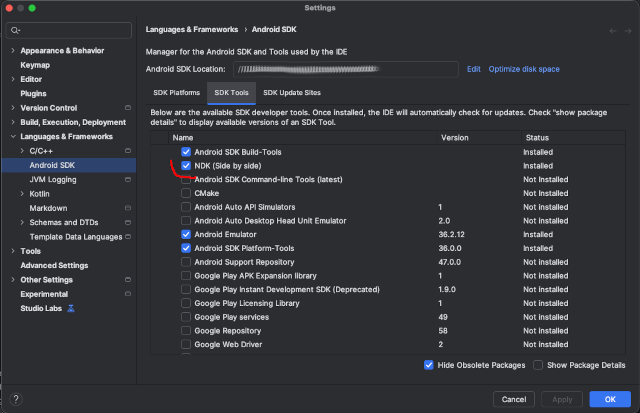

## Choose your SME2 setup: native or emulated


This Learning Path demonstrates how to use SME2 on macOS on a device with an M4 chip, or on some Android phones that have SME2 support. It does not provide instructions for using SME2 on iPhone or iPad, even though they have SME2 support.


To build or run SME2-accelerated code, first set up your development environment.
This section walks you through the required tools and two supported setup options:

* [**Native SME2 hardware**](#native-sme2) - build and run directly on a system with SME2 support, see [Devices with native SME2 support](#devices)

* [**Android with SME2 hardware**](#android-sme2) - cross build and run on Android phones with SME2 support, see [Devices with native SME2 support](#devices)

* [**Docker-based emulation**](#docker-sme2) - use a container to emulate SME2 in bare metal mode (without an OS)

## Download and explore the code examples

To get started, begin by [downloading the code examples](https://gitlab.arm.com/learning-code-examples/code-examples/-/archive/2632d7cae67fc1ce6b43438a38e00b9edb78f5d9/code-examples-2632d7cae67fc1ce6b43438a38e00b9edb78f5d9.tar.gz?path=learning-paths/cross-platform/multiplying-matrices-with-sme2).

Now extract the archive, and change directory to:
`code-examples/learning-paths/cross-platform/multiplying-matrices-with-sme2.`

```BASH
tar xfz code-examples-main-learning-paths-cross-platform-multiplying-matrices-with-sme2.tar.gz -s /code-examples-main-learning-paths-cross-platform-multiplying-matrices-with-sme2/code-examples/
cd code-examples/learning-paths/cross-platform/multiplying-matrices-with-sme2
```

The directory structure should look like this:

```TXT
code-examples/learning-paths/cross-platform/multiplying-matrices-with-sme2/
├── .clang-format
├── .devcontainer/
│   └── devcontainer.json
├── .git/
├── .gitignore
├── CMakeLists.txt
├── cmake/
│   ├── SME2_MATMUL.cmake
│   └── baremetal-toolchain.cmake
├── README.rst
├── docker/
│   ├── assets.source_me
│   ├── build-all-containers.sh
│   ├── build-my-container.sh
│   └── sme2-environment.docker
├── hello.c
├── main.c
├── matmul.h
├── matmul_asm.c
├── matmul_asm_impl.S
├── matmul_intr.c
├── matmul_vanilla.c
├── misc.c
├── misc.h
├── preprocess_l_asm.S
├── preprocess_vanilla.c
├── run-fvp.sh
└── sme2_check.c
```

Among other files, it includes:
- Code examples.
- A `CMakeLists.txt` to build the code together with a `cmake/` subdirectory that contains the toolchain file needed for baremetal builds as well as some function to hide some cmake details from the top-level `CMakeLists.txt`.
- `run-fvp.sh` to run the FVP model.
- A `docker` directory containing:
  - `assets.source_me` to provide tools information like versions and paths.
  - `build-my-container.sh`, a script that automates building the Docker image from the `sme2-environment.docker` file. It runs the Docker build command with the correct arguments so you don’t have to remember them.
  - `sme2-environment.docker`, a custom Docker file that defines the steps to build the SME2 container image. It installs all the necessary dependencies, including the SME2-compatible compiler and Arm FVP emulator.
  - `build-all-containers.sh`, a script to build multi-architecture images. It's the script that has been used to build the docker images for this Learning Path.
- `.devcontainer/devcontainer.json` for VS Code container support.

{}
From this point, all instructions assume that your current directory is
`code-examples/learning-paths/cross-platform/multiplying-matrices-with-sme2/`, so ensure that you are in the correct directory before proceeding.
{}

The build system is `cmake` based and we will use `ninja` as the build tool in this learning path. If you don't have hardware with SME2 support available and are going to use **Docker-based emulation**, then there is nothing to do, as `cmake` and `ninja` have already been installed for you in the docker container. If you're going to target **Native SME2 hardware** or **Android with SME2 hardware**, you first have to install them if they are not already available on your system:




sudo apt install cmake ninja-build



brew install cmake ninja




## Set up a system with native SME2 support {#native-sme2}

To run SME2 code natively, ensure your system includes SME2 hardware and uses a compiler version that supports SME2.

For the compiler, you can use [Clang](https://www.llvm.org/) version 18 or later, or [GCC](https://gcc.gnu.org/) version 14 or later. This Learning Path uses `clang`.

{}
At the time of writing, macOS ships with `clang` version 17.0.0, which doesn't support SME2. Use a newer version, such as 21.1.4, available through Homebrew.
{}

You can check your compiler version using the command: `clang --version` if it's already installed. If not, install `clang` using the instructions below, selecting either macOS or Linux/Ubuntu, depending on your setup:




sudo apt install clang



brew install llvm




You are now all set to start hacking with SME2.

## Set up a system to target Android phones with SME2 support {#android-sme2}

Targeting an Android phone means you will have to cross-compile the code examples using Android's NDK. The easiest way is to install [Android Studio](https://developer.android.com/studio) on your system, then in `Android Studio` go to `Tools` > `SDK manager` in the menu, then select the `SDK Tools` tab and tick `NDK (Side by side)` as show in the picture below:



Locate where the NDK has been installed on your machine and save the location to an `NDK` environment variable for use later when building the code examples. For example, on macOS, at the time of writing, the NDK is located in `/Users/$USER/Library/Android/sdk/ndk/29.0.14206865`:

```BASH
export NDK="/Users/$USER/Library/Android/sdk/ndk/29.0.14206865"
```

You will also need the `adb` (Android Debug Bridge) tool to upload and execute the programs on a mobile phone (with SME2 support).




sudo apt install adb



brew install android-platform-tools




The phone will have to be connected with a USB cable to your development machine in order for `adb` to work. Enable the `developper mode` on the Android phone, and connect it on your machine with the USB cable.

{}
You might have to perform some actions on the phone to enable the debug connection.
{}

Now, check that `adb` can see the phone:

```SH
adb devices -l
List of devices attached
57251FDCH0027M         device usb:32-0 product:blazer model:Pixel_10_Pro device:blazer transport_id:1
```
In the above case, `adb` can see a `Pixel 10 Pro` phone.

## Set up a system using SME2 emulation with Docker {#docker-sme2}

If your machine doesn't support SME2, or you want to emulate it, you can use the Docker-based environment.

The Docker container includes both a compiler and [Arm's Fixed Virtual Platform (FVP)
model](https://developer.arm.com/Tools%20and%20Software/Fixed%20Virtual%20Platforms)
for emulating code that uses SME2 instructions. You can either run the prebuilt container image provided in this Learning Path or build it yourself using the Docker file that is included with the help of `docker/build-my-container.sh` script.

If building manually, follow the instructions in the `sme2-environment.docker` file to install the required tools on your machine.

### Install and verify Docker

{}
Docker is optional, but if you don’t use it, you must manually install the compiler and FVP, and ensure they’re in your `PATH`.
{}

To begin, start by checking that Docker is installed on your machine:

```BASH { output_lines="2" }
docker --version
Docker version 28.5.1, build e180ab8
```

If the above command fails with an error message similar to "`docker: command not found`", then follow the steps from the [Docker install guide](/install-guides/docker/) to install Docker.

{}
You might need to log out and back in again or restart your machine for the changes to take
effect.
{}

Once you have confirmed that Docker is installed on your machine, you can check
that it is working with the following:

```BASH { output_lines="2-27" }
docker run hello-world
Unable to find image 'hello-world:latest' locally
latest: Pulling from library/hello-world
c9c5fd25a1bd: Pull complete
Digest: sha256:940c619fbd418f9b2b1b63e25d8861f9cc1b46e3fc8b018ccfe8b78f19b8cc4f
Status: Downloaded newer image for hello-world:latest

Hello from Docker!
This message shows that your installation appears to be working correctly.

To generate this message, Docker took the following steps:
 1. The Docker client contacted the Docker daemon.
 2. The Docker daemon pulled the "hello-world" image from the Docker Hub.
    (arm64v8)
 3. The Docker daemon created a new container from that image which runs the
    executable that produces the output you are currently reading.
 4. The Docker daemon streamed that output to the Docker client, which sent it
    to your terminal.

To try something more ambitious, you can run an Ubuntu container with:
 $ docker run -it ubuntu bash

Share images, automate workflows, and more with a free Docker ID:
 https://hub.docker.com/

For more examples and ideas, visit:
 https://docs.docker.com/get-started/
```

You can use Docker in the following ways:
- [Directly from the command line](#run-commands-from-a-terminal-using-docker) - for example, when you are working from a terminal on your local machine.

- [Within a containerized environment](#use-an-interactive-docker-shell) - by configuring VS Code to execute all the commands inside a Docker container, allowing you to work seamlessly within the
Docker environment.

### Run commands from a terminal using Docker

When a command is executed in the Docker container environment, you must prepend
it with instructions on the command line so that your shell executes it within
the container.

For example, to execute `COMMAND ARGUMENTS` in the SME2 Docker container, the
command line looks like this:

```BASH
docker run --rm -v "$PWD:/work" armswdev/sme2-learning-path:sme2-environment-v3 COMMAND ARGUMENTS
```

This invokes Docker, using the
`armswdev/sme2-learning-path:sme2-environment-v3` container image, and mounts
the current working directory (the
`code-examples/learning-paths/cross-platform/multiplying-matrices-with-sme2`)
inside the container to `/work` and runs `COMMAND ARGUMENTS` in this environment.

For example, to run `echo Hello`, you need to enter:

```BASH { output_lines="2" }
docker run --rm -v "$PWD:/work" armswdev/sme2-learning-path:sme2-environment-v3 echo Hello
Hello
```

### Use an interactive Docker shell

The standard `docker run` commands can be long and repetitive. To streamline
your workflow, you can start an interactive Docker session that allows you to
run commands directly --- without having to prepend docker run each time.

To launch an interactive shell inside the container, use the `-it` flag:

```BASH
docker run --rm -it -v "$PWD:/work" armswdev/sme2-learning-path:sme2-environment-v3
```

You are now in the Docker container, and you can execute all commands directly. For
example, the `make` command can now be simply invoked with:

```BASH { output_lines="2" }
echo Hello
Hello
```

To exit the container, simply hit CTRL+D.

{}
The container is not persistent (it was invoked with `--rm`), so each invocation
will use a container freshly built from the image. All files in `/work` reside
outside the container though, so changes you make to them will be persistent
across sessions.
{}

###  Develop with Docker in Visual Studio Code

If you are using Visual Studio Code as your IDE, the container setup is already
configured with `devcontainer/devcontainer.json`.

Make sure you have the [Microsoft Dev Containers](https://marketplace.visualstudio.com/items?itemName=ms-vscode-remote.remote-containers) extension installed.

Then select the **Reopen in Container** menu entry as shown below.

It automatically finds and uses `.devcontainer/devcontainer.json`:


All your commands now run within the container, so there is no need to prepend
them with a Docker invocation, as VS Code handles all this seamlessly for you.

{}
For the rest of this Learning Path, shell commands include the full Docker
invocation so that if you are not using VS Code you can copy the complete command line.
However, if you are using VS Code, you only need to use the `COMMAND ARGUMENTS`
part.
{}

### Devices with native SME2 support {#devices}

These Apple devices support SME2 natively.

| Device                              | Release Date | Chip Options              |
|-------------------------------------|--------------|---------------------------|
| iPhone 16                           | 2024         | A18                       |
| iPhone 17                           | 2025         | A19                       |
| iPad Pro (7th generation)           | 2024         | M4                        |
| iMac (2024)                         | 2024         | M4                        |
| Mac Mini (2024)                     | 2024         | M4, M4 Pro, M4 Max        |
| MacBook Pro (14-inch, 16-inch, 2024)| 2024         | M4 Pro, M4 Max            |
| MacBook Air (2025)                  | 2025         | M4                        |

These Android phones support SME2 natively.

| Device                              | Release Date | Chip Options              |
|-------------------------------------|--------------|---------------------------|
| Vivo X300                           | 2025         | MediaTek Dimensity 9500 featuring an 8-core Arm C1 CPU cluster and Arm G1-Ultra GPU |
| OPPO Find X9                        | 2025         | MediaTek Dimensity 9500 featuring an 8-core Arm C1 CPU cluster and Arm G1-Ultra GPU |
