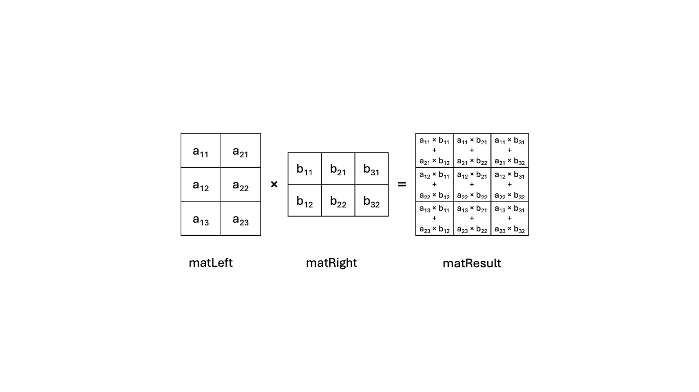

## Overview

In this section, you'll implement a basic matrix multiplication algorithm in C using row-major memory layout. This version acts as a reference implementation that you'll use to validate the correctness of optimized versions later in the Learning Path.

## Vanilla matrix multiplication algorithm

The vanilla matrix multiplication operation takes two input matrices:

* Matrix A [`Ar` rows x `Ac` columns] 
* Matrix B [`Br` rows x `Bc` columns]

It produces an output matrix C [`Cr` rows x `Cc` columns]. 

The algorithm works by iterating over each row of A and each column of B. It multiplies the corresponding elements and sums the products to generate each element of matrix C, as shown in the figure below.

The diagram below shows how matrix C is computed by iterating over rows of A and columns of B:



This implies that the A, B, and C matrices have some constraints on their
dimensions:

- The number of columns in A must equal the number of rows in B: `Ac == Br`.
- Matrix C must have the dimensions Cr == Ar and Cc == Bc.

For more information about matrix multiplication, including its history,
properties and use, see this [Wikipedia article on Matrix Multiplication](https://en.wikipedia.org/wiki/Matrix_multiplication).

## Variable mappings in this Learning Path

The following variable names are used throughout the Learning Path to represent matrix dimensions and operands:

- `matLeft` corresponds to the left-hand side argument of the matrix multiplication.
- `matRight`corresponds to the right-hand side of the matrix multiplication.
- `M` is `matLeft` number of rows.
- `K` is `matLeft` number of columns (and `matRight` number of rows).
- `N` is `matRight` number of columns.
- `matResult`corresponds to the result of the matrix multiplication, with `M` rows and `N` columns.

## C implementation

Here is the full reference implementation from `matmul_vanilla.c`:

```C { line_numbers="true" }
void matmul(uint64_t M, uint64_t K, uint64_t N,
            const float *restrict matLeft, const float *restrict matRight,
            float *restrict matResult) {
    for (uint64_t m = 0; m < M; m++) {
        for (uint64_t n = 0; n < N; n++) {

            float acc = 0.0;

            for (uint64_t k = 0; k < K; k++)
                acc += matLeft[m * K + k] * matRight[k * N + n];

            matResult[m * N + n] = acc;
        }
    }
}
```

## Memory layout and pointer annotations

In this Learning Path, the matrices are laid out in memory as contiguous sequences of elements, in [row-major order](https://en.wikipedia.org/wiki/Row-_and_column-major_order). The `matmul` function performs the algorithm described above.

The pointers to `matLeft`, `matRight` and `matResult` have been annotated as `restrict`, which informs the compiler that the memory areas designated by those pointers do not alias. This means that they do not overlap in any way, so that the compiler does not need to insert extra instructions to deal with these cases. The pointers to `matLeft` and `matRight` are marked as `const` as neither of these two matrices are modified by `matmul`.

This function gives you a working baseline for matrix multiplication. You'll use it later in the Learning Path to verify the correctness of optimized implementations using SME2 intrinsics and assembly.