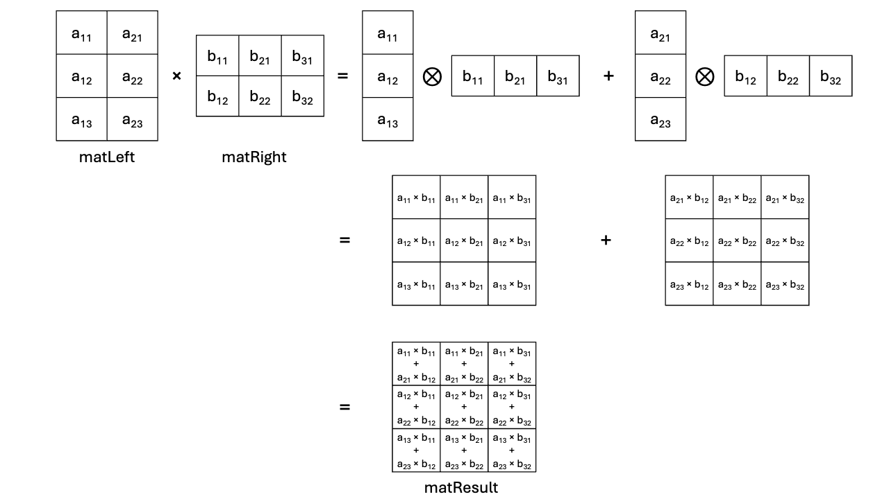

## Overview

In this section, you'll learn how to improve matrix multiplication performance using the SME engine and outer product operations.

This approach increases the number of multiply-accumulate (MAC) operations per memory load, reducing bandwidth pressure and improving overall throughput.

## Increase MAC efficiency using outer products

In the vanilla implementation, the core multiply-accumulate step looks like this:

```C
                acc += matLeft[m * K + k] * matRight[k * N + n];
```

This translates to one multiply-accumulate operation, known as `mac`, for two loads (`matLeft[m * K + k]` and `matRight[k * N + n]`). It therefore has a 1:2 `mac` to `load` ratio of multiply-accumulate operations (MACs) to memory loads - one multiply-accumulate and two loads per iteration, which is inefficient. This becomes more pronounced in triple-nested loops and when matrices exceed cache capacity.

To improve performance, you want to increase the `mac` to `load` ratio, which means increasing the number of multiply-accumulate operations per load - you can express matrix multiplication as a sum of column-by-row outer products.

The diagram below illustrates how the matrix multiplication of `matLeft` (3 rows, 2
columns) by `matRight` (2 rows, 3 columns) can be decomposed into a sum of column-by-row outer
products:



The SME engine builds on the [Outer
Product](https://en.wikipedia.org/wiki/Outer_product) because matrix
multiplication can be expressed as the [sum of column-by-row outer
products](https://en.wikipedia.org/wiki/Outer_product#Connection_with_the_matrix_product).

## Optimize memory layout with transposition

From the previous page, you will recall that matrices are laid out in row-major order. This means that loading row-data from memory is efficient as the memory-system operates efficiently with contiguous data. An example of this is where caches are loaded row by row, and data prefetching is simple - just load the data from `current address + sizeof(data)`. This is not the case for loading
column-data from memory though, as it requires more work from the memory system.

To further improve matrix multiplication effectiveness, it is desirable to change the layout in memory of the left-hand side matrix, called `matLeft` in the code examples in this Learning Path. The improved layout ensures that elements from the same column are located next to each other in memory. This is essentially a matrix transposition, which changes `matLeft` from
row-major order to column-major order.

{}
This transformation affects only the memory layout. From a mathematical perspective, `matLeft` is not transposed. It is reorganized for better data locality.
{}

### Transposition in practice

The SME engine operates on tiles - 2D blocks of data stored in the ZA storage. SME provides dedicated instructions to load, store, and compute on tiles efficiently.

For example, the [FMOPA](https://developer.arm.com/documentation/ddi0602/latest/SME-Instructions/FMOPA--non-widening---Floating-point-outer-product-and-accumulate-?lang=en) instruction takes two vectors as input and accumulates their outer product into a tile. The tile in ZA storage allows SME to increase the `macc` to`load` ratio by loading all the tile elements to be used with the SME outer
product instructions.

But since ZA storage is finite, you need to you need to preprocess `matLeft` to match the tile dimensions - this includes transposing portions of the matrix and padding where needed.

### Preprocessing with preprocess_l

The following function shows how `preprocess_l` transforms the matrix at the algorithmic level:

```C { line_numbers = "true" }
void preprocess_l(uint64_t nbr, uint64_t nbc, uint64_t SVL,
                  const float *restrict a, float *restrict a_mod) {

    // For all tiles of SVL x SVL data
    for (uint64_t By = 0; By < nbr; By += SVL) {
        for (uint64_t Bx = 0; Bx < nbc; Bx += SVL) {
            // For this tile
            const uint64_t dest = By * nbc + Bx * SVL;
            for (uint64_t j = 0; j < SVL; j++) {
                for (uint64_t i = 0; i < SVL && (Bx + i) < nbc; i++) {
                    if (By + j < nbr) {
                        a_mod[dest + i * SVL + j] = a[(By + j) * nbc + Bx + i];
                    } else {
                        // These elements are outside of matrix a, so zero them.
                        a_mod[dest + i * SVL + j] = 0.0;
                    }
                }
            }
        }
    }
}
```

This routine is defined in `preprocess_vanilla.c.` It's used to ensure the assembly and intrinsics-based matrix multiplication routines work with the expected input format.

{}
In production environments, it might be possible to arrange for `matLeft` to be
stored in column-major order, eliminating the need for transposition and making
the preprocessing step unnecessary. Matrix processing frameworks and libraries
often have attributes within the matrix object to track if it is in row- or
column-major order, and whether it has been transposed to avoid unnecessary
computations.
{}