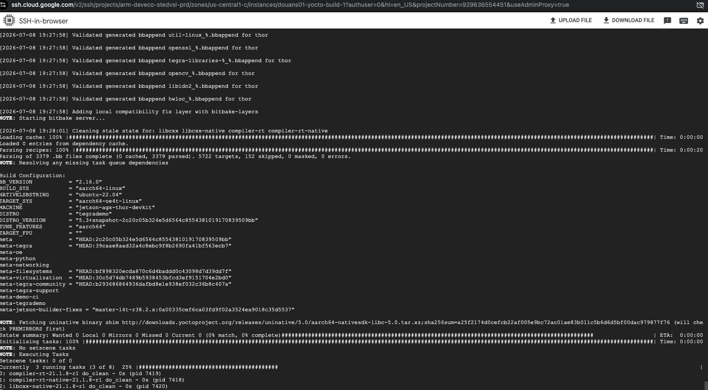
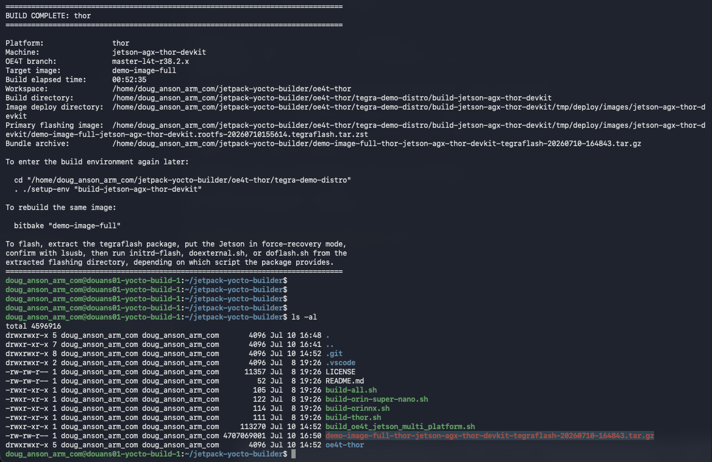
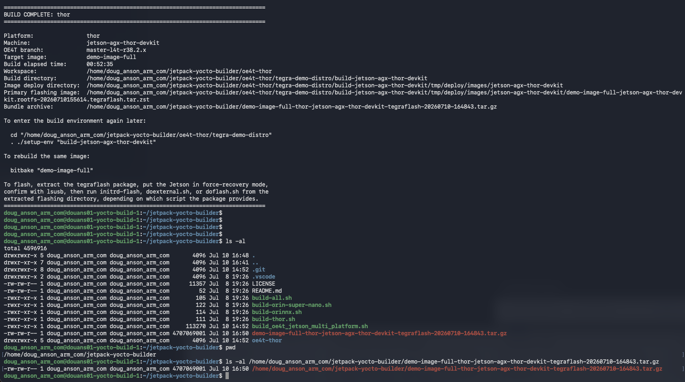

## Overview

In this section, the configured C4A instance will now get further configured to execute a yocto build process to produce a custom linux distribution image for a given Nvidia Jetson platform. 

## Initial Setup

Within the SSH shell to your C4A instance, clone this repo:

```bash
cd $HOME
git clone https://github.com/DougAnsonAustinTx/jetpack-yocto-builder
```

## Invoke the build

After cloning the above repo, lets explore the repo contents:  

```bash
cd $HOME/jetpack-yocto-builder
chmod 755 *.sh
ls
```

These scripts support building a yocto image for Jetson Thor, Jetson Orin NX, and Jetson Orin Nano/Super Nano:

        ./build-thor.sh:  The build script for Nvidia Jetson Thor
        ./build-orinnx.sh: The build script for Nvidia Jetson Orin NX
        ./build-orin-super-nano.sh: The build script for Nvidia Jetson Orin Nano and Super Nano
        ./build-all.sh: Builds all 3 platforms as 3 independent builds

The primary "build" script is: ./build_oe4t_jetson_multi_platform.sh. 

A single argument, "--bundle" is available to collect up into an archive file all of the required contents needed to flash the device later. 

Lets initiate the build for the Jetson Thor:

```bash
cd $HOME/jetpack-yocto-builder
./build-thor.sh --bundle 2>&1 1>$HOME/build.log &
```

The script will first install all of the necessary pre-requisites needed for yocto builds

{}
You may be prompted initially to restart things during the initial prerequisite installation process... just press "tab" and "Ok" for any of them that are presented. 
{}

Eventually the core "yocto" build process (via Yocto "bitbake") will start:



This script will continue building until the yocto image for Thor is ready.

{}
This invocation will take a few hours to complete (sometimes more than 3 hours in fact).
{}

## Yocto build process - some caveats

#### Building Yocto images takes time

The yocto build process constructs an entire linux distribution by pulling down source code from numerous repos and configuring, compiling, and installing thousands of applications. This takes some time.

{}
This invocation will take a few hours to complete (sometimes more than 3 hours.... please be patient).
{}

#### Yocto builds can occasionally fail

While alternate source code mirrors are checked if needed, occasionally a given source code package is simply not downloadable at a given point in time. This will cause the yocto build process to fail. 

{}
If the script detects failure, just re-run the script... to ensure the greatest "repeatable" outcome, "re-builds" with this script start from scratch... not from their last build point. 
{}

## Examining the built result

Once the Yocto build is complete, depending on which platform you built (Orin Super Nano, Orin NX, Thor), you should see something similar to this:



With the "--bundle" option having been supplied to the build script, the following file (again, depending onthe specific platform you compiled for...) is the primary file that will be used to flash our Nvidia device:



Please record the full path of the this file as the file will need to be downloaded in order to be flashed.

## What we learned

In this section, we configured and built out our yocto-based custom linux distribution for a selected Nvidia Jetson platform.  

Next, lets flash the created image onto our Nvidia Jetson platform and run the image. 
