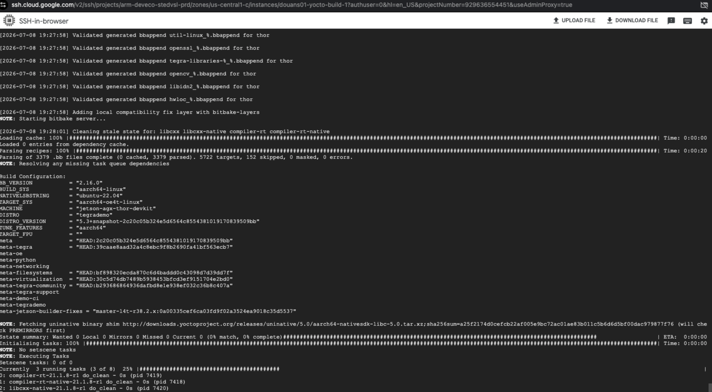
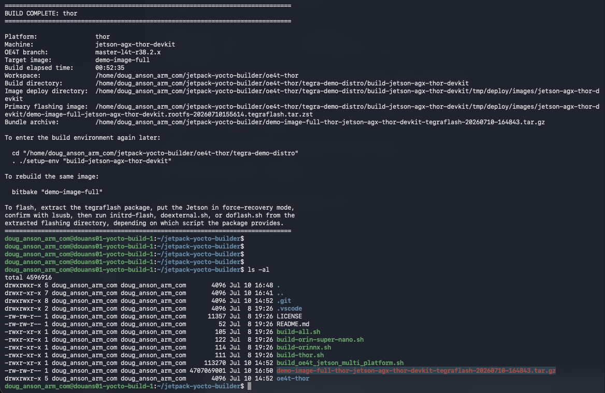
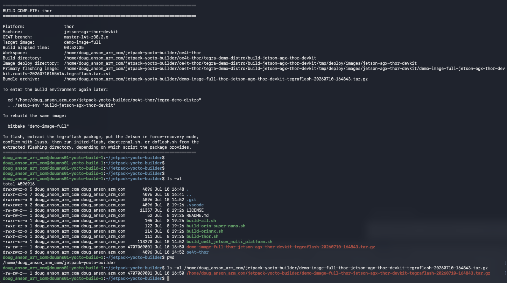

## Build and bundle a Yocto image

Use the Google Axion C4A VM you provisioned to build and bundle a Yocto image for a supported NVIDIA Jetson platform. The bundled archive contains the files needed for flashing in the next section.

## Clone the build scripts

In the SSH session connected to your C4A instance, clone the build scripts repository:

```bash
cd $HOME
git clone https://github.com/DougAnsonAustinTx/jetpack-yocto-builder
```

## Start the Yocto build

Change to the cloned repository and ensure the scripts are executable:

```bash
cd $HOME/jetpack-yocto-builder
chmod 755 *.sh
```

The repository provides wrapper scripts for each supported target:

| Target | Build script |
|---|---|
| NVIDIA Jetson AGX Thor | `./build-thor.sh` |
| NVIDIA Jetson Orin NX | `./build-orinnx.sh` |
| NVIDIA Jetson Orin Nano Super | `./build-orin-super-nano.sh` |
| All three targets | `./build-all.sh` |

{}
For demonstration purposes, the steps in the Learning Path are focused on NVIDIA Jetson AGX Thor. To flash the other targets or all three targets, use the appropriate wrapper script.
{}

Each wrapper calls `build_oe4t_jetson_multi_platform.sh`. Pass `--bundle` to create the flashing archive used later.

The build takes several hours. Start a `tmux` session so the build survives SSH disconnections:

```bash
sudo apt install -y tmux
tmux new -s yocto-build
```

If your SSH connection drops during the build, reconnect and reattach:

```bash
tmux attach -s yocto-build
```

Inside the `tmux` session, start the NVIDIA Jetson AGX Thor build and create a flashing archive:

```bash
./build-thor.sh --bundle 2>&1 | tee "$HOME/build.log"
```

The script installs the required host packages before starting the Yocto build.

{}
If Ubuntu displays a service-restart dialog during package installation, press Tab to select **OK**, then press Enter to continue.
{}

After installing the host packages, the script starts BitBake to build the image:



The script runs until the Yocto image and flashing archive are ready.

## Restart a failed Yocto build

Source downloads can fail temporarily even when alternate mirrors are available. If a download error stops the build, rerun the same build command.

{}
The wrapper script removes the previous OE4T workspace before rebuilding. A restarted build begins from a clean workspace rather than resuming from the failure point.
{}

## Verify the build output

When the build completes, the script prints a summary containing the workspace, deploy directory, primary flashing image, and bundle archive path:



The `--bundle` option creates a compressed flashing archive in the cloned repository:



Verify that the script created the bundled flashing archive:

```bash
ls -lh $HOME/jetpack-yocto-builder/demo-image-full-*-tegraflash-*.tar.gz
```

Record the displayed path. You’ll transfer this archive to the Ubuntu flashing host in the next section.

## What you've accomplished and what's next

You’ve now built and bundled a Yocto image for an NVIDIA Jetson platform on a Google Axion VM.

Next, transfer the archive to your Ubuntu host and flash the image to the Jetson platform.
