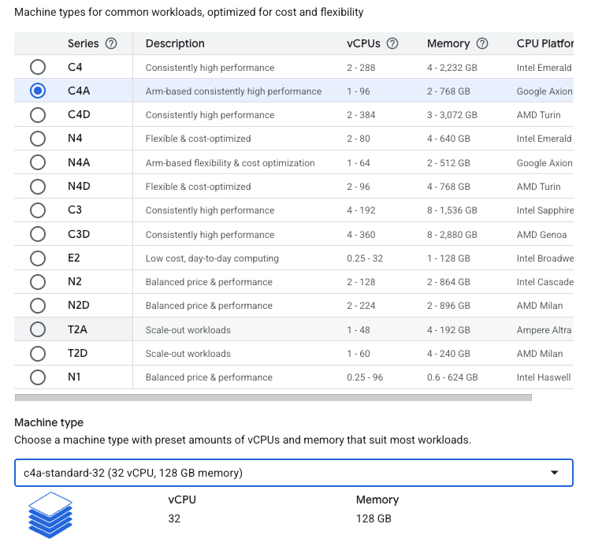
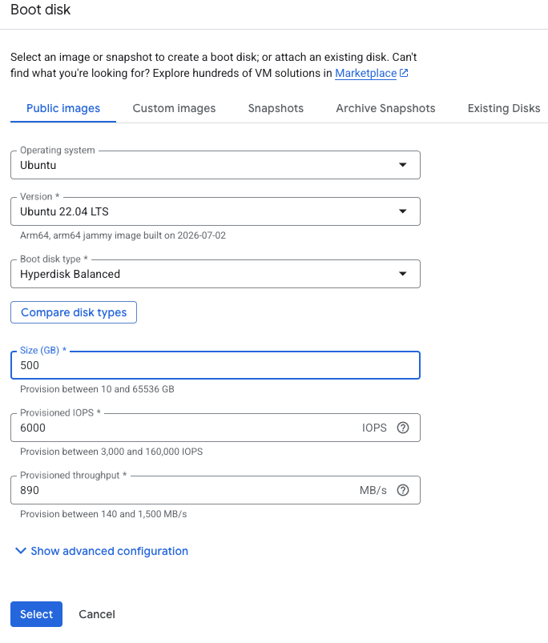
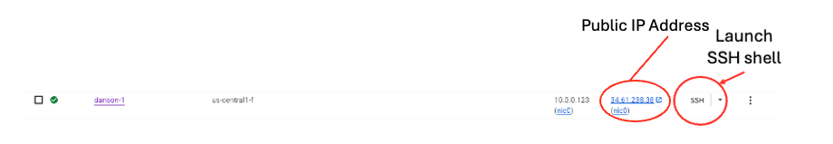
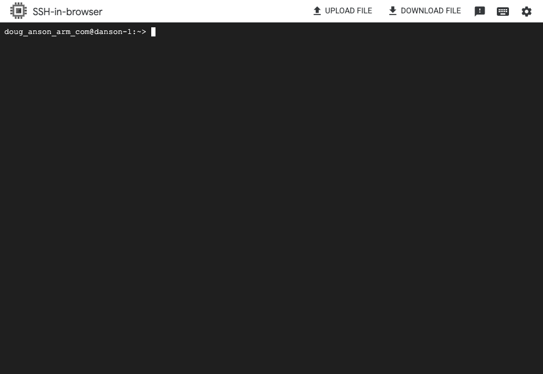

## Set up a virtual machine on Google Cloud Platform

You'll provision a Google Axion C4A virtual machine (VM) on Google Cloud Platform (GCP) using the `c4a-standard-32` machine type. 

`c4a-standard-32` provides 32 vCPUs and 128 GB of memory. This VM size is required for building a Yocto-based image. 

{}
For general guidance on setting up a Google Cloud account and project, see the Learning Path [Getting started with Google Cloud Platform](/learning-paths/servers-and-cloud-computing/csp/google/). 
{}

### Provision a Google Axion C4A VM in Google Cloud console

To create a virtual machine using the C4A instance type:

- Open the [Google Cloud Console](https://console.cloud.google.com/).
- Go to **Compute Engine** > **VM instances**.
- Select **Create instance**.
- Under **Machine configuration**:
  - Specify an **Instance name**, **Region**, and **Zone**.
  - Set **Series** to **C4A**.
  - Select **c4a-standard-32** as the machine type.

- Under **OS and storage**, select **Change**, then choose an Arm-based operating system image.
  - For this Learning Path, select **Ubuntu 22.04 LTS** (Arm64).
  - Increase **Size (GB)** from **10** to **500** to allocate sufficient disk space.
- Select **Choose** to apply the image changes.

- Under **Networking**, keep the default settings. Browser-based SSH access works without additional firewall rules.
- Select **Create** to launch the virtual machine.

After the instance starts, select **SSH** next to the VM in the instance list to open a browser-based terminal session.

A new browser window opens with a terminal connected to your VM.

{}
The `c4a-standard-32` instance has significant compute costs. Delete the VM after you complete the Learning Path.
{}

## What you've accomplished and what's next

You've now provisioned a Google Axion C4A VM and configured it for Arm-based Yocto image builds.

Next, you'll use this VM to build a Yocto image for your target hardware. 
