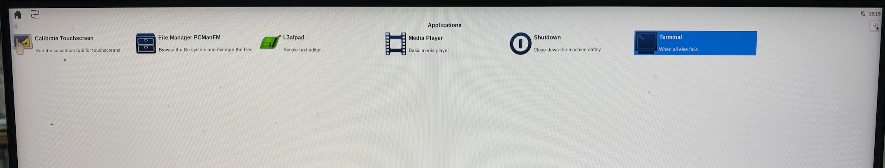
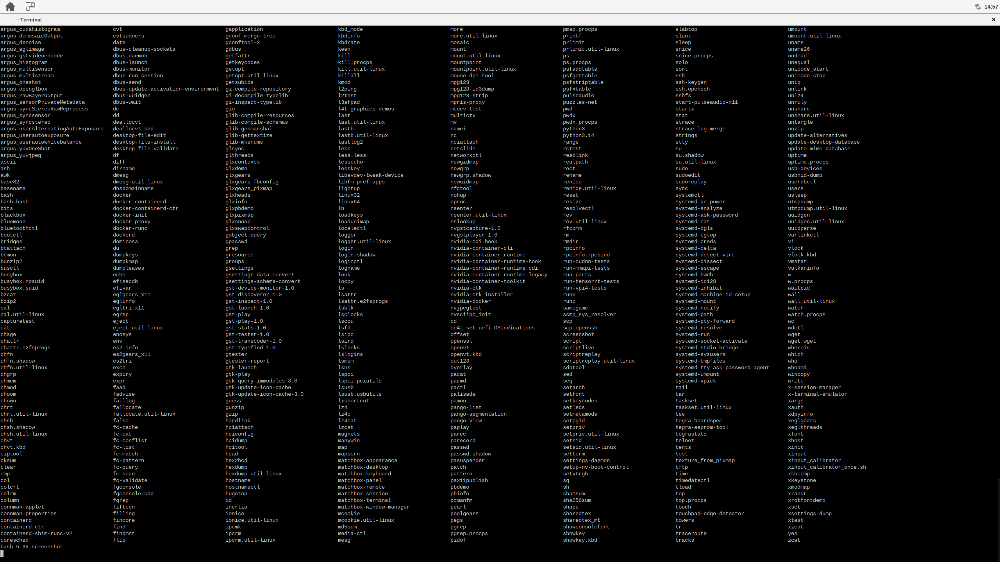
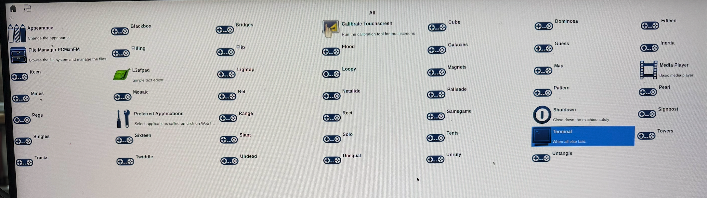

## Overview

Now that our Nvidia Jetson device has been successfully flashed with our newly created Yocto image, lets run the Nvidia Jetson device with the new image. 

## Yocto Desktop

Our particular Yocto build makes use of the matchbox window manager by default when launched.  Other recipes can be integrated with our install that can change the default window manager if desired. 

Once the Nvidia Jetson device boots, a desktop similar to the following will be presented:

Clicking on the "Terminal" icon will bring up a simple shell into our Yocto instance:

Additionally, applications and simple games can be viewed and selected if desired:

Explore your newly created and highly customized linux distribution for your Nvidia Jetson device.  You will find that the complete Nvidia GPU driver set is available as is a fully functional nvidia-optimized Docker runtime in your image. Explore!

## What we've learned

We have completely created, from source, a fully customized linux distribution for our Nvidia Jetson device. Once created, the created distribution was flashed onto the Nvidia device and run.  The custom distribution contains the entire BSP (Board Support Package) that Nvidia has created to fully enable all hardware features on our Nvidia Jetson platform including: Full GPU support, Full nvidia-container Docker support, Networking support, as well as WiFi support.