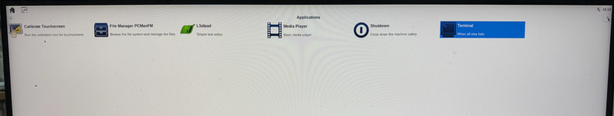
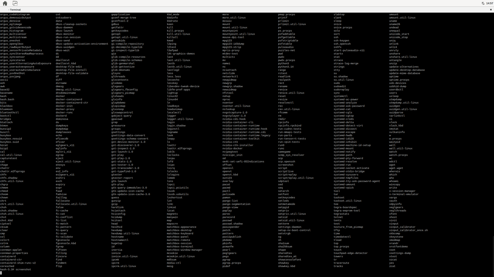
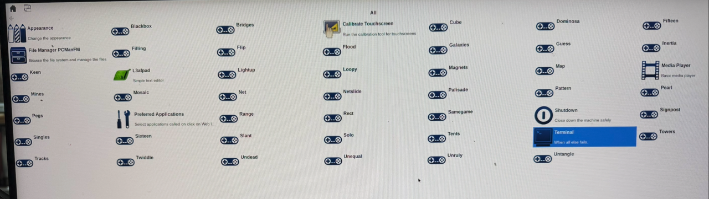

## Boot the NVIDIA Jetson device

After flashing completes and you connect a monitor, keyboard, and power supply, the NVIDIA Jetson device boots into the custom Yocto image.

## Explore the Yocto desktop

The default Yocto build uses the Matchbox window manager. After the device boots, a desktop appears as follows:



Select the **Terminal** icon to open a shell session:



Select the application menu to browse installed applications and sample programs:



## Verify the image

Confirm that the NVIDIA GPU drivers are loaded and the Docker runtime is available:

```bash
nvidia-smi
docker --version
```

The image includes the full NVIDIA Board Support Package (BSP): GPU drivers, the NVIDIA-optimized container runtime, networking support, and Wi-Fi support.

## What you've accomplished

You've now built a custom Yocto-based Linux distribution from source, flashed it onto an NVIDIA Jetson device, and confirmed it boots with GPU and Docker support. 

You can use the image for application development, container workloads, or further customization through additional Yocto layers and recipes.
