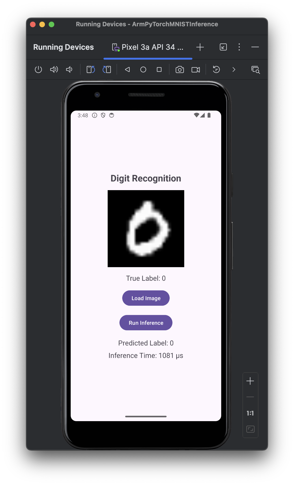
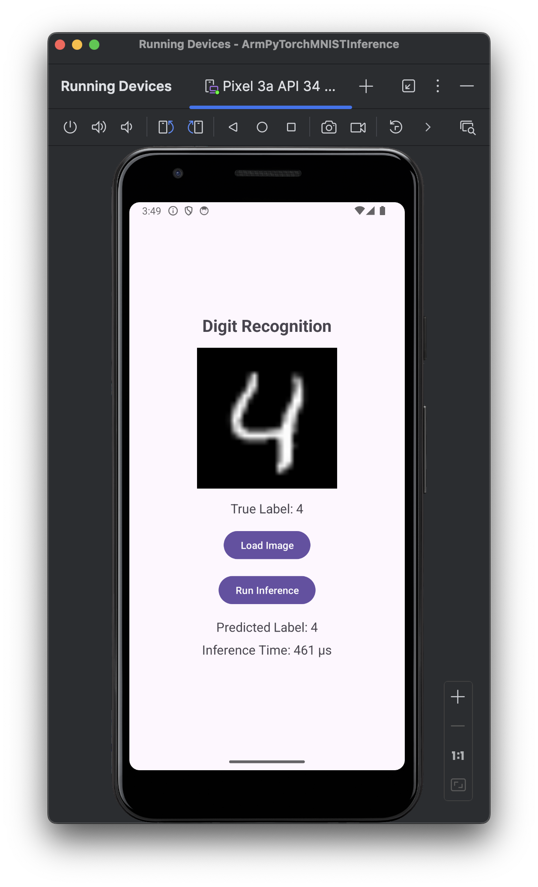

---
# User change
title: "Run the Application"

weight: 10

layout: "learningpathall"
---

You are now ready to run the Android application. The screenshots below show an emulator, but you can also use a physical device. 

To run the app in Android Studio using an emulator, follow these steps:

1. Configure the Emulator:

* Go to **Tools** > **Device Manager**, or click the Device Manager icon on the toolbar.
* Click **Create Device** to set up a new virtual device, if you haven’t done so already.
* Choose a device model, such as the Pixel 4, and click **Next**.
* Select a system image, such as Android 11, API level 30, and click **Next**.
* Review the settings, and click **Finish** to create the emulator.

2. Run the App:

* Make sure the emulator is selected in the device drop-down menu in the toolbar, next to the **Run** button.
* Click the **Run** button, which is a green triangle. Android Studio builds the app, installs it on the emulator, and then launches it.

3. View the App on the Emulator:
  
* Once the app is installed, it automatically opens on the emulator screen, allowing you to interact with it as if it were running on a real device.

Once the application starts, click the **Load Image** button. It loads a randomly-selected image. Then, click **Run Inference** to recognize the digit. The application displays the predicted label and the inference time as shown below:

In the next step of this Learning Path, you will learn how to further optimize the model.
