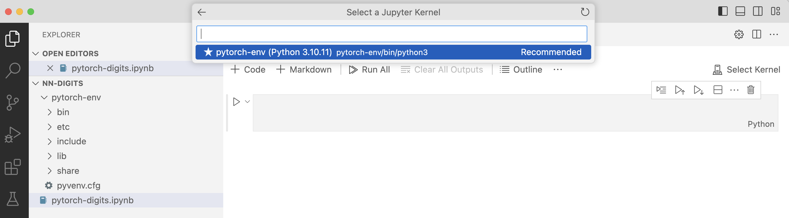
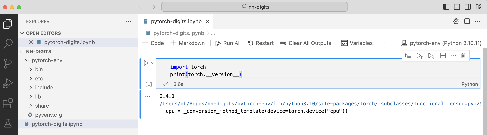

---
# User change
title: "Prepare a PyTorch Development Environment"

weight: 2

layout: "learningpathall"
---

## Introduction to PyTorch

Meta AI have designed an Open Source deep learning framework called PyTorch, that is now part of the Linux Foundation.

PyTorch provides a flexible and efficient platform for building and training neural networks. It has a dynamic computational graph that allows users to modify the architecture during runtime, making debugging and experimentation easier, and therefore making it popular among developers.

PyTorch provides a more flexible, user-friendly deep learning framework that reduces the limitations of static computational graphs found in earlier tools, such as TensorFlow. 

Prior to PyTorch, many frameworks used static computational graphs that require the entire model structure to be defined before training, which makes experimentation and debugging cumbersome. PyTorch introduced dynamic computational graphs, also known as “define-by-run”, that allow the graph to be constructed dynamically as operations are executed. This flexibility significantly improves ease of use for researchers and developers, enabling:

* Faster prototyping.
* Easier debugging.
* More intuitive code.

PyTorch also seamlessly integrates with Python, which creates a native coding experience. Its deep integration with GPU acceleration also makes it a powerful tool for both research and production environments. This combination of flexibility, usability, and performance has ensured PyTorch’s rapid adoption, particularly in academic research, where experimentation and iteration are crucial activities.

A typical process for creating a feedforward neural network in PyTorch involves defining a sequential stack of fully-connected layers, which are also known as linear layers. Each layer transforms the input by applying a set of weights and biases, followed by an activation function like ReLU. PyTorch supports this process using the torch.nn module, where layers are easily defined and composed.

To create a model, users subclass the torch.nn.Module class, defining the network architecture in the __init__ method, and implement the forward pass in the forward method. PyTorch’s intuitive API and support for GPU acceleration make it ideal for building efficient feedforward networks, particularly in tasks such as image classification and digit recognition.

In this Learning Path, you will explore how to use PyTorch to create and train a model for digit recognition.

## Before you begin

Before you begin, make sure Python3 is installed on your system. You can check this by running:

```console
python3 --version
```

You should then see the Python version printed in the output, for example:

```output
Python 3.11.2
```

If Python3 is not installed, you can download and install it from [python.org](https://www.python.org/downloads/). 

Alternatively, you can also install Python3 using package managers such as Homebrew or APT. 

If you are using Windows on Arm, see the [Python install guide](https://learn.arm.com/install-guides/py-woa/).

Next, if you do not already have it, download and install [Visual Studio Code](https://code.visualstudio.com/download).

## Install PyTorch and additional Python packages

To prepare a virtual Python environment, first you need to install PyTorch, and then move on to installing the additional tools that you will need for this Learning Path.

1. Open a terminal or command prompt, and navigate to your project directory. 

2. Create a virtual environment by running:

```console
python -m venv pytorch-env
```

This creates a virtual environment called `pytorch-env`. 

3. Activate the virtual environment:

* On Windows, run the following:
```console
pytorch-env\Scripts\activate
```

* On macOS or Linux, run this code: 
```console
source pytorch-env/bin/activate
```

Once activated, you can see the virtual environment name `(pytorch-env)` before your terminal prompt.

4. Install PyTorch using Pip:

```console
pip install torch torchvision --index-url https://download.pytorch.org/whl/cpu
```

5. Install torchsummary, Jupyter and IPython Kernel:

```console
pip install torchsummary
pip install jupyter
pip install ipykernel
```

6. Register your virtual environment as a new kernel:

```console
python3 -m ipykernel install --user --name=pytorch-env
```

7. Install the Jupyter Extension in VS Code:

* Open VS Code and go to the **Extensions** view, by clicking on the **Extensions** icon or pressing Ctrl+Shift+X.

* Search for “Jupyter” and install the official Jupyter extension.

* Optionally, also install the Python extension if you have not already, as it improves Python language support in VS Code.

To ensure everything is set up correctly, follow these next steps:

1. Open Visual Studio Code. 

2. Click **New file**, and select `Jupyter Notebook .ipynb Support`.

3. Save the file as `pytorch-digits.ipynb`.

4. Select the Python kernel you created earlier, `pytorch-env`. To do so, click **Kernels** in the top right-hand corner. Then, click **Jupyter Kernel...**, and you will see the Python kernel as shown below:



5. In your Jupyter notebook, run the following code to verify PyTorch is working correctly:

```console
import torch
print(torch.__version__)
```

It will look as follows:


Now you have set up your development environment, you can move on to creating a PyTorch model.
