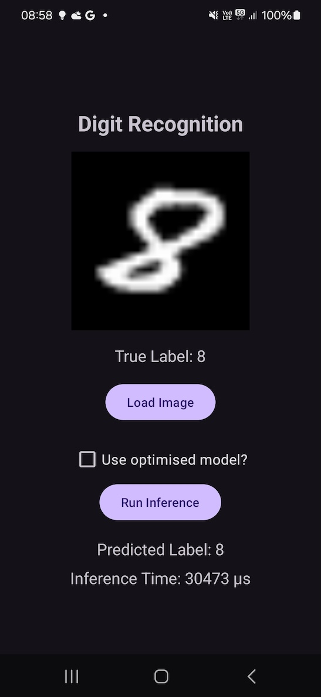

---
# User change
title: "Modify an Android App"

weight: 14

layout: "learningpathall"
---

You will now use the optimised model in the Android App we developed earlier in this Learning Path.

Start by modifying the activity_main.xml by adding the CheckBox:

```XML
<!-- CheckBox to use optimised model -->
<CheckBox
    android:id="@+id/checkboxOptimizedModel"
    android:layout_width="wrap_content"
    android:layout_height="wrap_content"
    android:text="Use optimised model?"
    android:textSize="16sp"/>
```

Then copy the optimised model to assets folder of the Anroid App project, and replace the MainActivity.kt by the following code:

```Kotlin
package com.arm.armpytorchmnistinference

import android.graphics.Bitmap
import android.graphics.BitmapFactory
import android.os.Bundle
import android.widget.Button
import android.widget.CheckBox
import android.widget.ImageView
import android.widget.TextView
import androidx.activity.enableEdgeToEdge
import androidx.appcompat.app.AppCompatActivity
import org.pytorch.IValue
import org.pytorch.Module
import org.pytorch.Tensor
import java.io.File
import java.io.FileOutputStream
import java.io.IOException
import java.io.InputStream
import kotlin.random.Random
import kotlin.system.measureNanoTime

class MainActivity : AppCompatActivity() {
    private lateinit var imageView: ImageView
    private lateinit var trueLabel: TextView
    private lateinit var selectImageButton: Button
    private lateinit var runInferenceButton: Button
    private lateinit var predictedLabel: TextView
    private lateinit var inferenceTime: TextView
    private lateinit var model: Module
    private lateinit var checkboxOptimizedModel: CheckBox  // Add CheckBox for switching models
    private var currentBitmap: Bitmap? = null
    private var currentTrueLabel: Int? = null

    override fun onCreate(savedInstanceState: Bundle?) {
        super.onCreate(savedInstanceState)
        enableEdgeToEdge()
        setContentView(R.layout.activity_main)

        // Initialize UI elements
        imageView = findViewById(R.id.imageView)
        trueLabel = findViewById(R.id.trueLabel)
        selectImageButton = findViewById(R.id.selectImageButton)
        runInferenceButton = findViewById(R.id.runInferenceButton)
        predictedLabel = findViewById(R.id.predictedLabel)
        inferenceTime = findViewById(R.id.inferenceTime)
        checkboxOptimizedModel = findViewById(R.id.checkboxOptimizedModel)

        // Initially load the appropriate model based on the CheckBox state
        loadModel()

        // Set up button click listener for selecting random image
        selectImageButton.setOnClickListener {
            selectRandomImageFromAssets()
        }

        // Set up button click listener for running inference
        runInferenceButton.setOnClickListener {
            currentBitmap?.let { bitmap ->
                runInference(bitmap)
            }
        }

        // Set up listener for checkbox to switch models dynamically
        checkboxOptimizedModel.setOnCheckedChangeListener { _, _ ->
            loadModel()  // Reload the model when checkbox state changes
        }
    }

    // Load the appropriate model based on the CheckBox state
    private fun loadModel() {
        try {
            model = if (checkboxOptimizedModel.isChecked) {
                // Load the optimized model
                Module.load(assetFilePath("optimized_model.ptl"))
            } else {
                // Load the original model
                Module.load(assetFilePath("model.pth"))
            }
        } catch (e: IOException) {
            e.printStackTrace()
            trueLabel.text = "Error loading model"
        }
    }

    private fun selectRandomImageFromAssets() {
        try {
            // Get list of files in the mnist_bitmaps folder
            val assetManager = assets
            val files = assetManager.list("mnist_bitmaps") ?: arrayOf()

            if (files.isEmpty()) {
                trueLabel.text = "No images found in assets/mnist_bitmaps"
                return
            }

            // Select a random file from the list
            val randomFile = files[Random.nextInt(files.size)]
            val inputStream: InputStream = assetManager.open("mnist_bitmaps/$randomFile")
            val bitmap = BitmapFactory.decodeStream(inputStream)

            // Extract the true label from the filename (e.g., 07_00.png -> true label is 7)
            currentTrueLabel = randomFile.split("_")[0].toInt()

            // Display the image and its true label
            imageView.setImageBitmap(bitmap)
            trueLabel.text = "True Label: $currentTrueLabel"

            // Set the current bitmap for inference
            currentBitmap = bitmap
        } catch (e: IOException) {
            e.printStackTrace()
            trueLabel.text = "Error loading image from assets"
        }
    }

    // Method to convert a grayscale bitmap to a float array and create a tensor with shape [1, 1, 28, 28]
    private fun createTensorFromBitmap(bitmap: Bitmap): Tensor {
        // Ensure the bitmap is in the correct format (grayscale) and dimensions [28, 28]
        if (bitmap.width != 28 || bitmap.height != 28) {
            throw IllegalArgumentException("Expected bitmap of size [28, 28], but got [${bitmap.width}, ${bitmap.height}]")
        }

        // Convert the grayscale bitmap to a float array
        val width = bitmap.width
        val height = bitmap.height
        val floatArray = FloatArray(width * height)
        val pixels = IntArray(width * height)
        bitmap.getPixels(pixels, 0, width, 0, 0, width, height)

        for (i in pixels.indices) {
            // Normalize pixel values to [0, 1] range, assuming the grayscale image stores values in the R channel
            floatArray[i] = (pixels[i] and 0xFF) / 255.0f
        }

        // Create a tensor with shape [1, 1, 28, 28] (batch size, channels, height, width)
        return Tensor.fromBlob(floatArray, longArrayOf(1, 1, height.toLong(), width.toLong()))
    }

    private fun runInference(bitmap: Bitmap, N: Int = 100) {
        // Convert bitmap to a float array and create a tensor with shape [1, 1, 28, 28]
        val inputTensor = createTensorFromBitmap(bitmap)

        // Run inference and measure time
        val inferenceTimeMicros = measureTimeMicros {
            var maxIndex = 0
            var scores: FloatArray = FloatArray(10)

            // Run inference N times
            for (i in 1..N) {
                // Forward pass through the model
                val outputTensor = model.forward(IValue.from(inputTensor)).toTensor()
                scores = outputTensor.dataAsFloatArray
            }

            // Get the index of the class with the highest score
            maxIndex = scores.indices.maxByOrNull { scores[it] } ?: -1

            predictedLabel.text = "Predicted Label: $maxIndex"
        }

        // Update inference time TextView in microseconds
        inferenceTime.text = "Inference Time: $inferenceTimeMicros µs"
    }

    // Method to measure execution time in microseconds
    private inline fun measureTimeMicros(block: () -> Unit): Long {
        val time = measureNanoTime(block)
        return time / 1000 // Convert nanoseconds to microseconds
    }

    // Helper function to get the file path from assets
    private fun assetFilePath(assetName: String): String {
        val file = File(filesDir, assetName)
        assets.open(assetName).use { inputStream ->
            FileOutputStream(file).use { outputStream ->
                val buffer = ByteArray(4 * 1024)
                var read: Int
                while (inputStream.read(buffer).also { read = it } != -1) {
                    outputStream.write(buffer, 0, read)
                }
                outputStream.flush()
            }
        }
        return file.absolutePath
    }
}
```

Here is the proofread and expanded version:

---

In this updated version of the Android app, we made modifications to the Android Activity to dynamically load the model based on the state of the **CheckBox**. When the **CheckBox** is selected, the app loads the **optimized model**, which has been quantized and fused for improved performance. If the **CheckBox** is not selected, the app loads the original unoptimized model. 

After the model is loaded, we proceed to run the inference. To better estimate the execution time, we also modified the `runInference` method to execute the inference **100 times** in a loop. This gives us a more reliable measure of the average inference time by smoothing out any inconsistencies from single executions.

Once you run the app on an actual device, you will see the results shown below. These results indicate that, on average, the optimized model reduced the inference time to about **65%** of the original model's execution time, showing a significant improvement in performance. This optimization showcases the benefits of quantization and layer fusion for mobile inference, and there is further potential for enhancement by enabling **hardware acceleration** on supported devices. This would allow the model to take full advantage of the device's computational capabilities, potentially reducing the inference time even more.



# Summary
Here, we successfully optimized a neural network model for mobile inference using techniques such as quantization and layer fusion. The model was optimized through quantization and layer fusion, removing unnecessary elements like the Dropout layers during inference. By running multiple iterations of the inference process, we demonstrated that the optimized model significantly reduced the average inference time to around 65% of the original time, especially beneficial for deployment on resource-constrained mobile devices. Additionally, there is potential for further performance improvements by leveraging hardware acceleration.