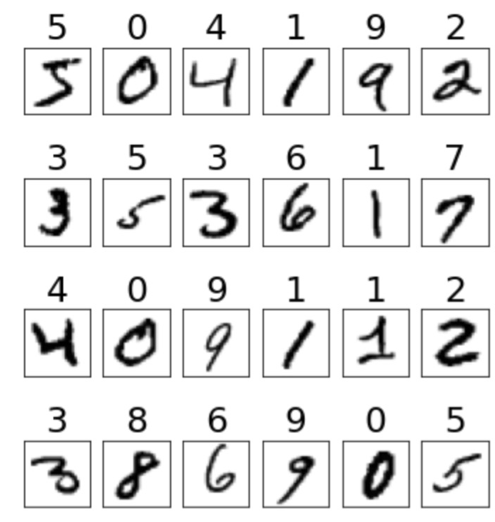
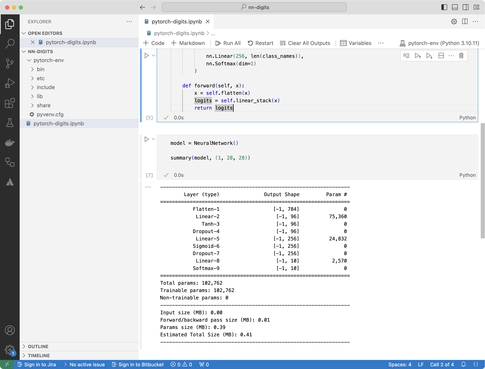

---
# User change
title: "Create a PyTorch model for MNIST"

weight: 3

layout: "learningpathall"
---

You can create and train a feedforward neural network to classify handwritten digits from the MNIST dataset. This dataset contains 70,000 images, comprising 60,000 training images and 10,000 testing images of handwritten numerals (0-9), each with dimensions of 28x28 pixels. Some representative MNIST digits with their corresponding labels are shown in Figure 3:



The neural network begins with an input layer containing 28x28 = 784 input nodes, with each node accepting a single pixel from a MNIST image. 

You will add a linear hidden layer with 96 nodes, using the hyperbolic tangent (tanh) activation function. To prevent overfitting, you will apply a dropout layer, randomly setting 20% of the nodes to zero.

You will then include another hidden layer with 256 nodes, followed by a second dropout layer that again removes 20% of the nodes. Finally, you will reach a situation where the output layer consists of ten nodes, each representing the probability of recognizing one of the digits (0-9).

The total number of trainable parameters for this network is calculated as follows:

* First hidden layer:  784 x 96 + 96 = 75,360 parameters (weights and biases).
* Second hidden layer:  96 x 256 + 256 = 24,832 parameters.
* Output layer:  256 x 10 + 10 = 2,570 parameters.

In total, the network has 102,762 trainable parameters.

## Implementation

To implement the model, supplement the `pytorch-digits.ipynb` notebook with the following statements:

```Python
from torch import nn
from torchsummary import summary

class_names = range(10)

class NeuralNetwork(nn.Module):
    def __init__(self):
        super(NeuralNetwork, self).__init__()
        self.flatten = nn.Flatten()
        self.linear_stack = nn.Sequential(
            nn.Linear(28*28, 96),            
            nn.Tanh(),            
            nn.Dropout(.2),
            
            nn.Linear(96, 256),
            nn.Sigmoid(),
            nn.Dropout(.2),

            nn.Linear(256, len(class_names)),
            nn.Softmax(dim=1)
        )

    def forward(self, x):
        x = self.flatten(x)
        logits = self.linear_stack(x)
        return logits
```

To build the neural network in PyTorch, define a class that inherits from PyTorch’s nn.Module. This approach is similar to TensorFlow’s subclassing API. 

Define a class named NeuralNetwork, which consists of two main components:

1. __init__ method 

This method serves as the constructor for the class. 

First initialize the nn.Module with super(NeuralNetwork, self).__init__(). Inside this method, define the architecture of the feedforward neural network. The input is first flattened from its original 28x28 pixel format into a 1D array of 784 elements using nn.Flatten(). 

Next, create a sequential stack of layers using nn.Sequential. 

The network consists of:

* A fully-connected (Linear) layer with 96 nodes, followed by the Tanh activation function.
* A Dropout layer with a 20% dropout rate to prevent overfitting.
* A second Linear layer, with 256 nodes, followed by the Sigmoid activation function.
* Another Dropout layer, that removes 20% of the nodes.
* A final Linear layer, with 10 nodes (matching the number of classes in the dataset), followed by a Softmax activation function that outputs class probabilities.

2. Forward method 

This method defines the forward pass of the network. It takes an input tensor x, flattens it using self.flatten, and then passes it through the defined sequential stack of layers (self.linear_stack). 

The output, called logits, represents the class probabilities for the digit prediction.

The next step initializes the model and displays the summary using the torchsummary package:

```Python
model = NeuralNetwork()

summary(model, (1, 28, 28))
```

After running the notebook, you will see the output as shown in Figure 4:



You will see a detailed summary of the NeuralNetwork model’s architecture, including the following information:

1.	Layer Details

The summary lists each layer of the network sequentially, including:

* The flatten layer, which reshapes the 28x28 input images into a 784-element vector.
* The linear layers with 96 and 256 nodes, respectively, along with the activation functions (Tanh and Sigmoid) applied after each linear transformation.
* The dropout layers that randomly-deactivate 20% of the neurons in the respective layers.
* The final linear layer with 10 nodes, corresponding to the output probabilities for the 10 digit classes, followed by the softmax function.

2. Input and Output Shapes 

For each layer, the summary shows the shape of the input and output tensors, helping to trace how the data flows through the network. For example, the input shape starts as (1, 28, 28) for the image, which gets flattened to (1, 784) after the flatten layer.

3.	The summary 

The summary provides the total number of trainable parameters in each layer, including both weights and biases. 

This includes:

* 75,360 parameters for the first Linear layer (784 inputs × 96 nodes + 96 biases).
* 24,832 parameters for the second Linear layer (96 nodes × 256 nodes + 256 biases).
* 2,570 parameters for the output Linear layer (256 nodes × 10 output nodes + 10 biases).
* At the end, you will see the total number of parameters in the model, which is 102,762 trainable parameters.

This summary provides a clear overview of the model architecture, the dimensional transformations happening at each layer, and the number of parameters that will be optimized during training.

Running the model now will produce random outputs, as the network has not been trained to recognize any patterns from the data. The next step is to train the model using a dataset and an optimization process, such as gradient descent, so that it can learn to make accurate predictions.

At this point, the model makes predictions, but since it hasn’t been trained, the predictions are random and unreliable. The network’s weights are initialized randomly, or use the default initialization methods, so the output probabilities from the softmax layer are essentially random.

The output is still a probability distribution over the 10 digit classes (0-9), but the values do not correspond to the images, because the model has not learned the patterns from the MNIST dataset.

Technically, the code will run without errors as long as you provide it with an input image of the correct dimensions, which is 28x28 pixels. The model can accept input, pass it through the layers, and return a prediction - a vector of 10 probabilities. However, the results are not useful until the model is trained.

## What have you learned so far?

You have successfully defined and initialized a feedforward neural network using PyTorch. 

The model was designed to classify handwritten digits from the MNIST dataset, and details of the architecture were printed using the **summary()** function. 

The network consists of input flattening, two hidden layers with activation functions and dropout for regularization, and an output layer with a softmax function to predict the digit class probabilities. 

You also confirmed that the model has a total of 102,762 trainable parameters.

The next step is to train the model using the MNIST dataset, which involves feeding the data through the network, calculating the loss, and optimizing the weights based on backpropagation to improve the model's accuracy in digit classification.
