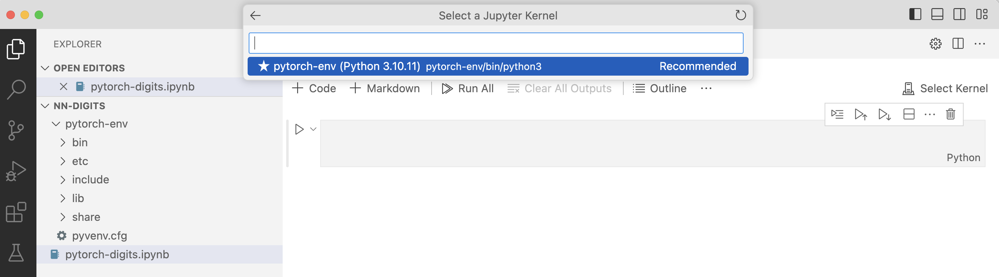

---
# User change
title: "Background and Installation"

weight: 2

layout: "learningpathall"
---

## Background
PyTorch is an open-source deep learning framework developed by Facebook’s AI Research lab, designed to provide a flexible and efficient platform for building and training neural networks. It is widely used due to its dynamic computational graph, which allows users to modify the architecture during runtime, making debugging and experimentation easier. 

The major motivation for introducing PyTorch was to provide a more flexible, user-friendly deep learning framework that addressed the limitations of static computational graphs found in earlier tools like TensorFlow. Prior to PyTorch, many frameworks used static computation graphs that required the entire model structure to be defined before training, making experimentation and debugging more cumbersome. PyTorch introduced dynamic computational graphs (also known as “define-by-run”), which allow the graph to be constructed on the fly as operations are executed. This flexibility significantly improved ease of use for researchers and developers, enabling faster prototyping, easier debugging, and more intuitive code.

Additionally, PyTorch was designed to have seamless integration with Python, encouraging a more native coding experience. Its deep integration with GPU acceleration also made it a powerful tool for both research and production environments. This combination of flexibility, usability, and performance contributed to PyTorch’s rapid adoption, especially in academic research, where experimentation and iteration are crucial.

A typical process for creating a feedforward neural network in PyTorch involves defining a sequential stack of fully connected layers (also known as linear layers). Each layer transforms the input by applying a set of weights and biases, followed by an activation function like ReLU. PyTorch supports this process using the torch.nn module, where layers are easily defined and composed.

To create a model, users subclass the torch.nn.Module class, defining the network architecture in the __init__ method, and implement the forward pass in the forward method. PyTorch’s intuitive API and strong support for GPU acceleration make it ideal for building efficient feedforward networks, particularly in tasks like image classification and digit recognition.

In this learning path, you will explore how to use PyTorch for creating a model for digit recognition. 

## Before you begin
Before you begin make sure Python3 is installed on your system. You can check by running:

```console
python3 --version
```

If Python3 is not installed, download and install it from [python.org](https://www.python.org/downloads/).

Then, download and install [Visual Studio Code](https://code.visualstudio.com/download).

## Install PyTorch and other tools
Now, you will prepare a virtual Python environment, install PyTorch, and other tools you will need for this learning path:
1. Open a terminal or command prompt and navigate to your project directory. Create a virtual environment by running:
```console
python -m venv pytorch-env
```
This will create a virtual environment named pytorch-env. You can replace pytorch-env with your desired name.

2. Activate the virtual environment:
* On Windows:
```console
pytorch-env\Scripts\activate
```
* On macOS/Linux: 
```console
source pytorch-env/bin/activate
```

Once activated, you should see the virtual environment name in your terminal prompt.

3. Install PyTorch by typing:
```console
pip install torch torchvision --index-url https://download.pytorch.org/whl/cpu
```

4. Install torchsummary, Jupyter and IPython Kernel:
```console
pip install torchsummary
pip install jupyter
pip install ipykernel
```

5. Register your virtual environment as a new kernel:
```console
python3 -m ipykernel install --user --name=pytorch-env
```

6. Install the Jupyter Extension in VS Code:
* Open VS Code and go to the Extensions view (click on the Extensions icon or press Ctrl+Shift+X).
* Search for “Jupyter” and install the official Jupyter extension.
* Optionally, also install the Python extension if you haven’t already, as it improves Python language support in VS Code.

To ensure everything is set up correctly:
1. Open Visual Studio Code. 
2. Click New file, and select `Jupyter Notebook .ipynb Support`.
3. Save the file as `pytorch-digits.ipynb`.
4. Select the Python kernel you created earlier (pytorch-env). To do so, click Kernels in the top right corner. Then, click Jupyter Kernel..., and you will see the Python kernel as shown below:



5. In your Jupyter notebook, run the following code to verify PyTorch is working correctly:
```console
import torch
print(torch.__version__)
```

It will look as follows:


Now, when everything is set up you can proceed to creating a model.