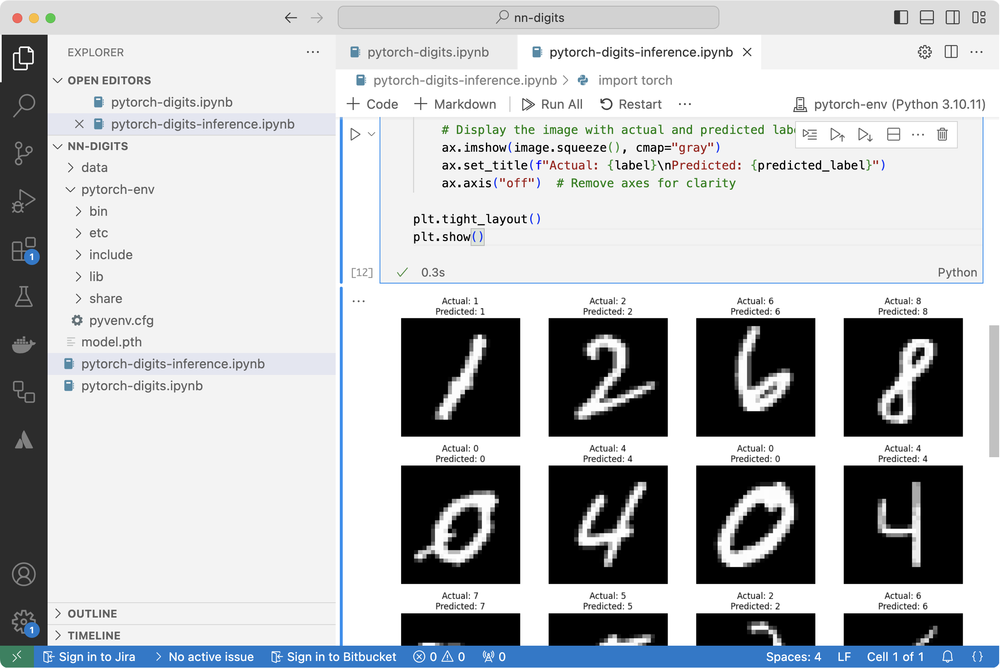

---
# User change
title: "Inference"

weight: 4

layout: "learningpathall"
---

The inference process involves using a trained model to make predictions on new, unseen data. It typically follows these steps:

1. **Load the Trained Model**: the model, along with its learned parameters (weights and biases), is loaded from a saved file.
2. **Prepare the Input Data**: the input data is preprocessed in the same way as during training (e.g., normalization, tensor conversion) to ensure compatibility with the model.
3. **Make Predictions**: the preprocessed data is fed into the model, which computes the output based on its trained parameters. The output is often a probability distribution over possible classes.
4. **Interpret the Results**: the predicted class is usually the one with the highest probability. The results can then be used for further analysis or decision-making.

This process allows the model to generalize its learned knowledge to make accurate predictions on new data.

# Running inference in PyTorch

You can inference in PyTorch using the previously saved model. To display results you can use matplotlib. 

Start by installing matplotlib package:

```console
pip install matplotlib
```

Then, in Visual Studio Code create a new file named `pytorch-digits-inference.ipynb` and modify the file to include the code below:

```python
import torch
from torchvision import datasets, transforms
import matplotlib.pyplot as plt
import random

# Define a transformation to convert the image to a tensor
transform = transforms.Compose([
    transforms.ToTensor()
])

# Load the test set with transformation
test_data = datasets.MNIST(
    root="data",
    train=False,
    download=True,
    transform=transform
)

# Load the entire model
model = torch.jit.load("model.pth")

# Set the model to evaluation mode
model.eval()

# Select 16 random indices from the test dataset
random_indices = random.sample(range(len(test_data)), 16)

# Plot the 16 randomly selected images
fig, axes = plt.subplots(4, 4, figsize=(12, 12))  # Create a 4x4 grid of subplots

for i, ax in enumerate(axes.flat):
    # Get a random image and its label
    index = random_indices[i]
    image, label = test_data[index]

    # Add a batch dimension (model expects a batch of images)
    image_batch = image.unsqueeze(0)

    # Run inference
    with torch.no_grad():
        prediction = model(image_batch)

    # Get the predicted class
    predicted_label = torch.argmax(prediction, dim=1).item()

    # Display the image with actual and predicted labels
    ax.imshow(image.squeeze(), cmap="gray")
    ax.set_title(f"Actual: {label}\nPredicted: {predicted_label}")
    ax.axis("off")  # Remove axes for clarity

plt.tight_layout()
plt.show()
```

The above code performs inference on the saved PyTorch model using 16 randomly selected images from the MNIST test dataset and displays them along with their actual and predicted labels.

As before, start by importing the necessary Python libraries: torch, datasets, transforms, matplotlib.pyplot, and random. torch is used for loading the model and performing tensor operations. datasets and transforms from torchvision are used for loading and transforming the MNIST dataset. Use matplotlib.pyplot for plotting and displaying images, and random is used for selecting random images from the dataset.

Next, load the MNIST test dataset using datasets.MNIST() with train=False to specify that it’s the test data. The dataset is automatically downloaded if it’s not available locally.

Load the saved model using torch.jit.load("model.pth") and set the model to evaluation mode using model.eval(). This ensures that layers like dropout and batch normalization behave appropriately during inference.

Subsequently, select 16 random images and create a 4x4 grid of subplots using plt.subplots(4, 4, figsize=(12, 12)) for displaying the images.

Afterward, perform inference and display the images in a loop. Specifically, for each of the 16 selected images, the image and its label are retrieved from the dataset using the random index. The image tensor is expanded to include a batch dimension (image.unsqueeze(0)) because the model expects a batch of images. Inference is performed with model(image_batch) to get the prediction. The predicted label is determined using torch.argmax() to find the index of the maximum probability in the output. Each image is displayed in its respective subplot with the actual and predicted labels. We use plt.tight_layout() to ensure that the layout is adjusted nicely, and plt.show() to display the 16 images with their actual and predicted labels.

This code demonstrates how to use a saved PyTorch model for inference and visualization of predictions on a subset of the MNIST test dataset.

After running the code, you should see results similar to the following figure:



# Summary

In this exercise, you went through the complete process of training and using a PyTorch model for digit classification on the MNIST dataset. Using the training dataset, you optimized the model’s weights and biases over multiple epochs. You employed the CrossEntropyLoss function and the Adam optimizer to minimize prediction errors and improve accuracy. You periodically evaluated the model on the test dataset to monitor its performance, ensuring it was learning effectively without overfitting.

After training, you saved the model using TorchScript, which captures both the model’s architecture and its learned parameters. This made the model portable and independent of the original class definition, simplifying deployment.

Next, you performed inference. You loaded the saved model and set it to evaluation mode to ensure that layers like dropout and batch normalization behaved correctly during inference. You randomly selected 16 images from the MNIST test dataset to evaluate the model’s performance on unseen data. For each selected image, you used the model to predict the digit, comparing the predicted labels with the actual ones. You displayed the images alongside their actual and predicted labels in a 4x4 grid, visually assessing the model’s accuracy and performance.

This comprehensive process, from model training and saving to inference and visualization, illustrates the end-to-end workflow for building and deploying a machine learning model in PyTorch. It demonstrates how to train a model, save it in a portable format, and then use it to make predictions on new data.