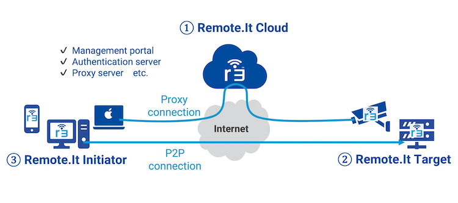

## Connections

The [Remote.It Web Dashboard](https://app.remote.it) creates proxy connections between the initiator and target devices. The Remote.It Web Dashboard is the easiest to set up because Remote.It software is installed on the target device only. The initiator device connects to the target device without any additional software installed. It uses only standard software such as SSH. All traffic is routed through a Remote.It server.

Peer to Peer connections provide an alternative to proxy connections. Peer to Peer connections are direct between initiator and target. Peer to Peer connections are also referred to as P2P.

The advantages are:

- Consistency in URL and port values (proxy connection information changes on reconnect)
- No timeouts when connections are idle (proxy connections timeout when idle and need to be reconnected)
- Higher performance by eliminating the proxy server

Peer to Peer connections are created by installing a software package with initiator support on the initiator device. Install the Remote.It Desktop application or Remote.It CLI on your initiator device to support Peer to Peer connection.



## Peer to Peer Connections

Peer to Peer connections to the target computer appear as a local port on the initiator computer.

{}
Examples here are for the Remote.It Desktop Application.

Refer to [Install CLI](/learning-paths/cross-platform/remoteit/cli) to create connections by command line.
{}

Connections made with the Desktop or CLI will default to connect using Peer to Peer and if that fails will try a Proxy connection. You can change this setting by updating the Routing in your connection configuration.

Start the SSH service from the Desktop application on the initiator computer. The url provided resolves to `localhost`. This is so you can bookmark these connections and the connection url can help you identify the connection without knowing which connection and port it is. 

SSH is now available using the connection url from the initiator computer with the assigned port. The port will not change, even if there are no connections for some time.

For example:

```console
ssh ubuntu@mymachine-ssh.at.remote.it -p 33004
```

You should now be connected to the target device.

Peer to Peer provides easy access and the best performance.