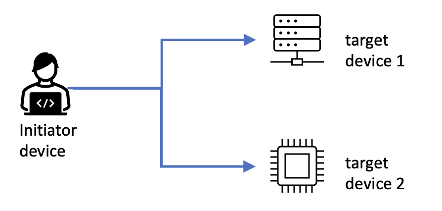
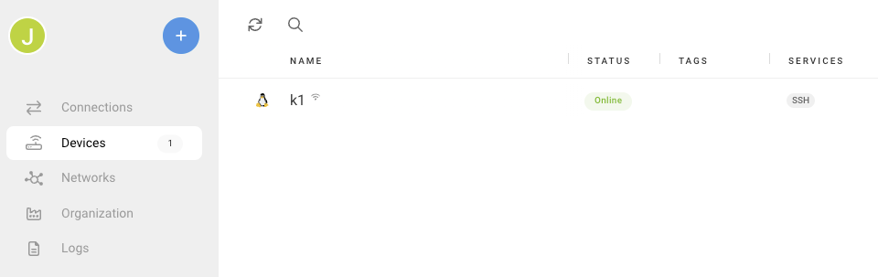

## Before you begin

Any Windows, macOS, or Linux computer with a browser can be used for this section. 

[Remote.it](https://www.remote.it) provides simple, secure connections between computers. Support for multiple operating systems and different Arm hardware make it a useful tool for developers. Remote.it creates connections to virtual machines running in the public cloud and to single board computers running on your desk at work or at home. 

## Definitions

For this Learning Path, **computer** refers to a laptop, desktop, server, single board computer, tablet, or phone. 

An **initiator device** is the computer you want to connect from, normally the computer in front of you.

A **target device** is the computer you want to connect to, normally a remote computer you want to access. A target device may also be referred to as an **endpoint**. 

A **service** is a configuration on the remote device used to access an application. SSH and VNC are examples of services.

## Account creation

You can try remote.it by creating a personal account. Personal accounts limit the number of target devices and are for non-commercial use. A personal account is a good way to try remote.it for free and evaluate the results.  

Create an account using the [remote.it web application](https://app.remote.it/)

After account creation, log in to see the dashboard in your browser.

Remote.it works nearly the same for any type of target device. A Raspberry Pi 4 running Raspberry Pi OS works the same way as an Arm server from a cloud service provider.

Remote.it provides safe, secure networking connections between initiator devices and target devices. It’s important to remember remote.it assumes the required software services are correctly installed and configured. For example, if you want to access a remote device using SSH then an SSH server must be configured and running.

The next sections highlight common ways developers use remote.it. 

