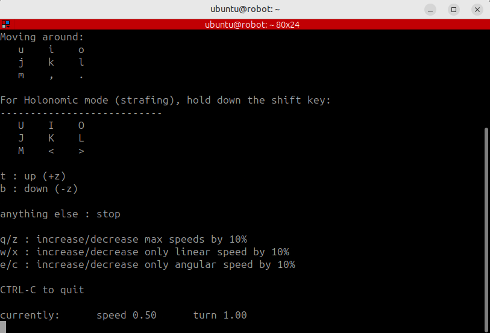

## Understand the velocity interface

After visualizing and navigating the robot with RViz, control the robot directly using the velocity interface.

The ROX base subscribes to the `/cmd_vel` topic using the `geometry_msgs/Twist` message type. The message carries linear and angular velocity commands.

Any process that publishes to `/cmd_vel` can control the base. Navigation2 uses this same interface, so it's one publisher to the robot rather than a privileged control path.

Open a sourced bash shell in the `robot` container:

```bash
source ~/workshop_env.bash
```

## Control the robot with the keyboard

Start keyboard teleoperation:

```bash
just teleop
```

Use the key bindings displayed in the terminal to drive the robot while you observe its movement in RViz.



## Publish a velocity command

You can also publish forward velocity at `0.2 m/s` and a fixed rate of 10 Hz:

```bash
ros2 topic pub --rate 10 /cmd_vel geometry_msgs/msg/Twist "{linear: {x: 0.2}}"
```

Let the command run for approximately three seconds, then press **Ctrl+C** to stop the publisher. Stop the robot by publishing a zero-velocity command:

```bash
ros2 topic pub --once /cmd_vel geometry_msgs/msg/Twist "{}"
```

These commands use the same `/cmd_vel` interface as teleoperation and Navigation2.

## Verify movement with odometry

Read one odometry message and display the robot position:

```bash
ros2 topic echo /odom --once | grep -A2 position
```

The `x` position should advance when the robot moves. The output is similar to:

```output
      x: 0.3899999883542309
```

On the supplied reference system, a 3-second command at `0.2 m/s` moved the robot from approximately `x = 0` to `x = 0.39 m`. This value is an example, not an exact target. Acceleration behaviour and the robot's starting position affect the result.

{}
The UR10 arm on the ROX uses a `JointTrajectory` action rather than `Twist`. Publishing `Twist` to the base and `JointTrajectory` to the arm follows the standard ROS interface for each mechanism.
{}

## What you've learned and what's next

You've controlled the robot through the same velocity interface used by Navigation2 and confirmed its movement through `/odom`. 

Next, you'll inspect the CPU cost, simulation speed, and internal traffic of the running system.
