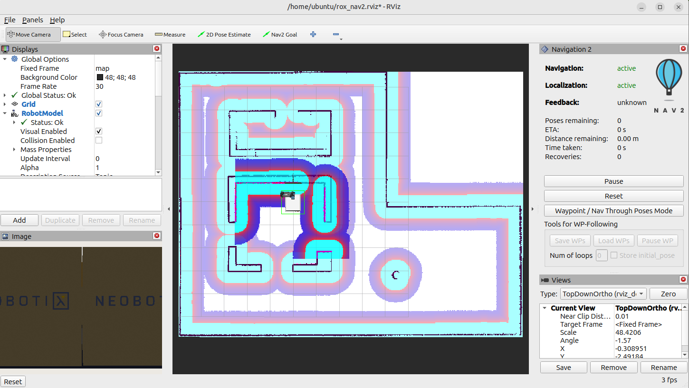

## Understand the RViz navigation view

RViz subscribes to ROS 2 topics and displays the robot model, laser scans, camera data, map, and Navigation2 costmaps. It also provides tools that publish messages, including the goal tool used here.

The navigation view contains several layers:

- The *map* shows the known environment
- The *global costmap* combines the static map with navigation costs across the mapped area
- The *local costmap* moves with the robot and reflects live sensor data nearby
- The *inflation layer* creates the red-to-blue gradient near walls, increasing the cost of paths that pass close to obstacles

## Start RViz

Open a new terminal in the `robot` container, source the environment, and start the Navigation2 RViz configuration:

```bash
source ~/workshop_env.bash
just rviz_nav2
```

Wait for the map and costmaps to render. The light blue area represents free space. The small window that follows the robot is the local costmap, while the fixed background is the global costmap.

## Send a navigation goal

1. Click Nav2 Goal in the top toolbar.
2. Move your mouse onto the mapped area in the centre.
- Click and hold somewhere in the free/light-blue area.
- While holding the mouse button, drag a short distance. You'll see an arrow appear.
3. Where you first clicked = where you want the robot to go.
4. Direction of the arrow = direction you want the robot facing when it arrives.
5. Release the mouse button.

Nav2 should then calculate a path and the robot should begin moving.

Goals outside the mapped costmap don't have a valid planned path, so the robot won't move toward them.



## Verify the navigation result

The robot should plan a path, drive to the goal, and report `Feedback: reached`. A successful reference result is:

```output
Navigation: active
Feedback: reached
Distance remaining: 0.03 m
Recoveries: 0
```

The final remaining distance can vary with the selected goal and simulation run. Reaching the goal without recovery behaviour is the success criterion.

## What you've accomplished and what's next

You've interpreted the map, costmaps, and inflation layer, then set a goal position and orientation with RViz. Next, you'll bypass Navigation2's planner and publish velocity commands directly to the robot base.
