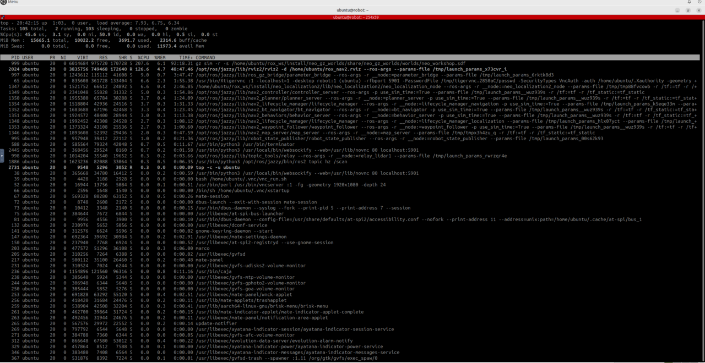

## Understand the measurements

The simulation runs Gazebo, Navigation2, Zenoh, and sensor-processing nodes in one container. Three workshop commands show how this workload uses the Arm server:

- `just top` displays CPU usage per workshop-user process with full command lines
- `just rt_factor` reports Gazebo's real-time factor, which is simulated time divided by wall-clock time
- `just iftop_lo` reports traffic on the loopback interface and excludes browser desktop traffic

These measurements establish a baseline before you enable shared-memory transport.

## Run the monitoring commands

Run each command in turn. Press **Ctrl+C** to stop the current command before starting the next one.

```bash
just top
just rt_factor
just iftop_lo
```

Each command provides a different view of the workload:

- In `just top`, `gz sim` is multi-threaded and uses roughly two to three CPU cores on the supplied reference system. Its 20-core Arm server remains largely idle.
- In `just rt_factor`, a value near `1.0` means simulation time keeps pace with wall-clock time. A substantially lower value indicates that other workloads or the simulation are constraining the available CPU.
- In `just iftop_lo`, the reference system carries several hundred Mbps over TCP loopback, dominated by point-cloud data.



{}
CPU load, real-time factor, and traffic levels depend on your Arm server and other running workloads. Treat the supplied figures as reference observations, not guaranteed results.
{}

Confirm that all three commands produce output. Record the loopback traffic shown by `just iftop_lo` so you can compare it with the shared-memory run.

## What you've learned and what's next

You've measured process load, simulation speed, and internal TCP traffic. Next, you'll move large local messages to Zenoh shared memory and repeat the latency and traffic observations.
