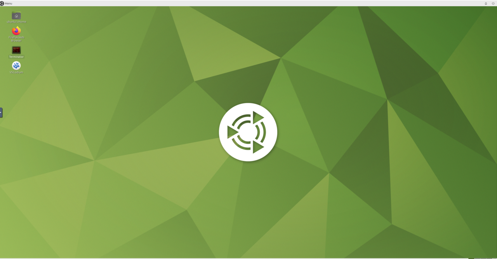

## Understand the container environment

You'll create and use two Docker containers built from the same image:

- The `robot` container runs the ROS 2 simulation, Zenoh router, and Gazebo environment used in this Learning Path
- The `control` container acts as a remote operator station for later Learning Paths

Each container provides an Ubuntu desktop that you can access in a web browser. You'll use only the `robot` container to complete this Learning Path, but starting both containers prepares the environment for the rest of the series.

This setup is more than a container exercise. Gazebo, simulated camera and LiDAR data, Navigation2, RViz, and `rmw_zenoh` run together as a representative Physical AI robotics workload on Arm.

The environment uses official `arm64` binaries without architecture-specific modifications.

Run the provided commands on your selected Arm server. After the browser-based VNC desktop opens, run commands with an `ubuntu@robot` prompt in the `robot` container.

## Download the Docker Compose configuration

Create a working directory:

```bash
mkdir -p ros_zenoh
cd ros_zenoh
```

The Docker Compose configuration used in this Learning Path is available in the [ros2-zenoh-arm GitHub repository](https://github.com/odincodeshen/ros2-zenoh-arm/blob/main/docker-compose.yaml).

Download the configuration:

```bash
curl -L https://raw.githubusercontent.com/odincodeshen/ros2-zenoh-arm/main/docker-compose.yaml \
  -o docker-compose.yaml
```

The Compose file defines the `robot` and `control` containers used throughout this Learning Path.

The configuration includes settings used later in this Learning Path and the wider series:

- `shm_size` reserves space for Zenoh shared-memory transport
- `memlock` removes the default memory-lock limit so Zenoh can allocate shared-memory regions
- `NET_ADMIN` lets later Learning Paths apply network shaping inside the containers

Don't change these settings.

## Start and verify the containers

Pull the image, start both containers, and check their status:

```bash
docker compose pull
docker compose up -d
docker compose ps
```

Docker creates the `container_volumes/` directories when it first starts the containers. Compose derives the container-name prefix from the `ros_zenoh` working directory.

The output should show both containers as `Up`:

```output
NAME                  STATUS
ros_zenoh-control-1   Up
ros_zenoh-robot-1     Up
```

Open the browser desktops and sign in with the password `ubuntu`:

- Robot container: `http://<server_ip>:6080/`
- Control container: `http://<server_ip>:6081/`

{}
Don't expose ports `6080`, `6081`, or `7447` directly to the public internet from your Arm server. Use a private network, VPN, SSH tunnel, or restrictive firewall or security-group rules so that only trusted clients can reach these services.
{}



The container network uses the following addresses:

| Container | Purpose in the series | Internal IP | Browser port | Zenoh port `7447` exposed to host |
|---|---|---|---|---|
| `robot` | Simulation and robot services | `172.1.0.2` | `6080` | Yes |
| `control` | Remote operator station | `172.1.0.3` | `6081` | No |

## What you've accomplished and what's next

You've started the browser-accessible ROS 2 environment and verified that both containers are running.

Next, you'll configure the router and session files that `rmw_zenoh` uses inside the `robot` container.
