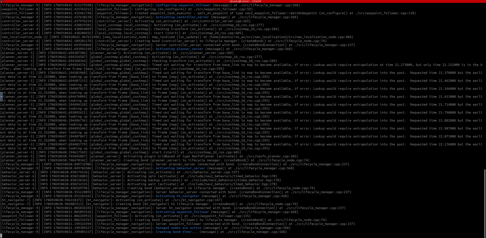

## Understand the simulation stack

After observing router discovery behavior, start the robot simulation.

The running robot uses two components:

- `rox_simu` loads the Neobotix ROX model into Gazebo, simulates its sensors and motors, and publishes laser scan, camera, and odometry data
- `rox_nav2` runs Navigation2 for localization, path planning, and velocity control

The simulation and navigation stack run as separate processes so you can start, stop, and observe each component independently.

Stop the talker and listener from the router experiment. Keep the router running.

Open two new bash shells in the `robot` container and source the environment in each one:

```bash
source ~/workshop_env.bash
```

## Start the headless Gazebo simulation

In the first shell, start the simulation:

```bash
just rox_simu no_gui
```

The `no_gui` argument disables the Gazebo 3D viewer, not the simulation. Gazebo continues to simulate the robot and publish sensor data while using less CPU.

## Start Navigation2

In the second shell, start the navigation stack:

```bash
just rox_nav2
```

Wait for Navigation2 to activate its managed nodes.

It's normal for output to stop after it's active. Navigation2 remains idle until it receives a navigation goal.



## Verify the simulated sensors

In a third sourced bash shell, check the laser scan frequency:

```bash
ros2 topic hz /scan
```

The `/scan` topic should arrive at approximately 8 Hz. This rate is an expected operating observation, so small variations are normal. Press **Ctrl+C** in this shell to stop the scan.

Next, list the camera topics to confirm that they are present:

```bash
ros2 topic list | grep camera
```

The output should include `/camera/image_raw`, `/camera/points`, and `/camera/depth/image_raw`.

## What you've accomplished and what's next

You've started the headless Gazebo simulation, activated Navigation2, and verified that laser and camera sensor data is available. 

Next, you'll use RViz to inspect the navigation data and send the robot a goal.
