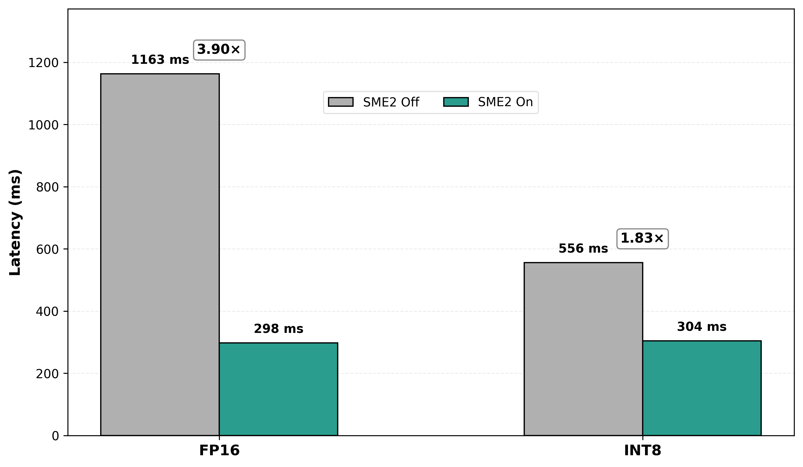
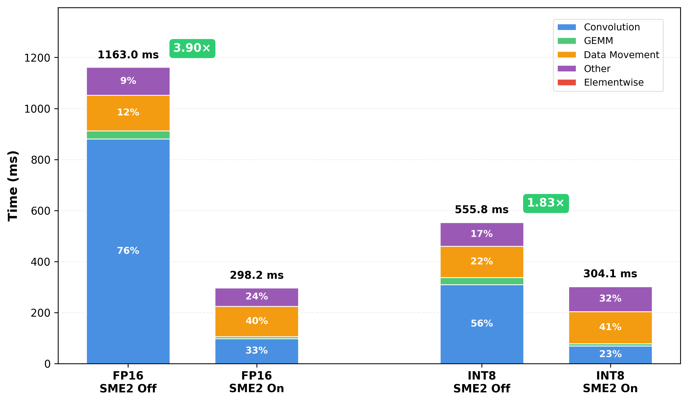

## Identify performance bottlenecks in ExecuTorch models

This Learning Path provides a hands-on, reproducible workflow for analyzing ExecuTorch model performance on Arm-based devices and identifying optimization opportunities after enabling SME2 acceleration.

When SME2 acceleration is enabled, inference latency often improves significantly. Just as importantly, faster compute exposes how execution time is distributed across the rest of the model. Model Inference time is typically spent in several broad operator categories:
   * Matrix compute (for example, convolution and GEMM)
   * Non-linear operations (elementwise activations, normalization)
   * Data movement (transpose, reshape, layout conversion, memory copies)
In many models, matrix compute dominates latency, making it the primary bottleneck.

SME2 accelerates CONV and GEMM operations, often by 3–15×, removing the primary compute bottleneck. Once compute is faster, data movement costs become visible and may emerge as the next dominant contributor to latency.

Key idea:
End-to-end latency alone tells you that a model is faster, but not why or where time is still spent. Operator-level profiling reveals how execution time shifts across categories when SME2 is enabled, making it clear which operations should be optimized next.

## Build a model-agnostic performance analysis pipeline

You will construct a model-agnostic performance analysis pipeline for ExecuTorch models running on Arm-based devices:

1. Export any PyTorch model to ExecuTorch `.pte` format
2. Run the same model with SME2 enabled and disabled for an apples-to-apples comparison
3. Collect ETDump traces with operator-level timing
4. Aggregate operators into high-level categories (CONV, GEMM, Data Movement, Elementwise, Other)
5. Identify where bottlenecks move after SME2 acceleration

Key principle: Once you have a .pte file, the same pipeline and commands apply to any model. Only the export step is model-specific.

## Clone the profiling repository

All profiling and analysis steps in this Learning Path use a single, shared code repository. This repository contains the scripts, configuration, and example models for exporting ExecuTorch models, running profiling with SME2 enabled and disabled, and analyzing the resulting performance data.

You will use the [sme-executorch-profiling](https://github.com/ArmDeveloperEcosystem/sme-executorch-profiling) repository throughout this Learning Path. The repository includes example models (EdgeTAM image segmentation and a video-focused segmentation model), predefined ExecuTorch runners, and scripts for profiling, trace collection, and analysis.

Clone the performance analysis kit repository:

```bash
mkdir -p ~/sme2_analysis_work
cd ~/sme2_analysis_work
git clone https://github.com/ArmDeveloperEcosystem/sme-executorch-profiling.git executorch_sme2_kit
cd executorch_sme2_kit
```

This creates a self-contained workspace. Your Python virtual environment, ExecuTorch build outputs, models, and profiling runs will all live under this directory.

## Understand the ExecuTorch execution stack with XNNPACK and KleidiAI

Before running the pipeline, it helps to understand how the execution stack is composed, since the profiling results reflect behavior across multiple layers. The diagram below summarizes the CPU execution stack used in this workflow.


**PyTorch to ExecuTorch export**: Models are defined using standard PyTorch APIs and exported to a .pte (Portable ExecuTorch Executable) format. During export, backend delegation is specified, in this case XNNPACK, indicating which operators should be executed by the backend at runtime.

**ExecuTorch runtime and delegation**: At runtime, ExecuTorch schedules operators and delegates supported operations (such as Conv2d and Linear) to XNNPACK. XNNPACK, in turn, uses Arm KleidiAI kernels, which exploit SME2 acceleration on supported hardware. This delegation is transparent to the model author. 

**Why operator-level profiling matters**: ExecuTorch's ETDump captures timing for each operator in the execution graph. This makes backend behavior visible, which operators are delegated, which kernels are used, and how much time each operation consumes. Aggregating operators into categories allows you to see where SME2 delivers gains and where non-compute costs dominate.

## Run the profiling pipeline

This Learning Path supports profiling on both Android and macOS (Apple Silicon). Android represents real-world edge ML deployment, while macOS provides convenient developer learning and experimentation. The workflow is identical on both platforms; only the runner binaries differ.

Android runs provide the most representative performance results because they reflect real device constraints such as memory bandwidth, thermal behavior, and platform-specific scheduling. macOS is included to simplify learning the workflow and validating the pipeline before running on target devices.

The steps below walk through the full workflow end to end: setting up the environment, building ExecuTorch runners, running a profiling pass, and generating analysis artifacts.

Step 1: Set up the environment and ExecuTorch
This step creates a Python virtual environment, clones and builds ExecuTorch, and installs all required dependencies.

```bash
bash model_profiling/scripts/setup_repo.sh
```
Step 2: Build SME2-enabled and SME2-disabled runners
Next, build the ExecuTorch runner binaries used for profiling. Both SME2-enabled and SME2-disabled runners are built so that you can perform a direct comparison later.
On macOS, the runners are built automatically.
On Android, this step requires the ANDROID_NDK environment variable to be set and a compatible NDK installed.

```bash
bash model_profiling/scripts/build_runners.sh
```

Step 3: Run a smoke test end to end
This step performs a complete smoke test of the pipeline: exporting a model, running it through ExecuTorch, collecting ETDump traces, and validating that profiling data is generated correctly.
On macOS, the test runs locally.
On Android, a compatible device must be connected via adb.

```bash
python model_profiling/scripts/run_quick_test.py
```

Step 4: Inspect and analyze results
By default, the pipeline automatically analyzes the collected traces and generates CSV and JSON summaries. You do not need to run analysis manually unless you want to repeat or customize it.
If needed, you can rerun the analysis script directly and point it at a specific run directory.
```bash
python model_profiling/scripts/analyze_results.py --run-dir model_profiling/out_toy_cnn/runs/mac
```
After this step completes, you have operator-level timing data and aggregated operator-category breakdowns for SME2-on and SME2-off runs.

## Review ETDump traces and profiling artifacts

Running the pipeline generates a consistent set of artifacts that capture both raw performance data and derived analysis results.
The most important artifacts are the ETDump trace files, which contain operator-level timing information collected during execution. All higher-level summaries are derived from these traces.

The generated artifacts are listed below:

- Model artifacts
  - `out_<model>/artifacts/<model>_xnnpack_fp16.pte` (runnable ExecuTorch model)
  - `out_<model>/artifacts/<model>_xnnpack_fp16.pte.etrecord` (optional; operator metadata for better attribution)
- Run artifacts
  - `out_<model>/runs/<platform>/<experiment>/*.etdump` (ETDump traces, the primary data source)
  - `out_<model>/runs/<platform>/<experiment>/*.log` (runner stdout/stderr)
  - `out_<model>/runs/<platform>/<experiment>/*.csv` (CSV files generated automatically by pipeline: timeline, operator stats)
  - `out_<model>/runs/<platform>/manifest.json` (optional; run metadata for reproducibility)
  - `out_<model>/runs/<platform>/metrics.json` (optional; summary latencies)
  - `out_<model>/runs/<platform>/<model_stem>_pipeline_summary.json` (pipeline summary with robust statistics)
  - `out_<model>/runs/<platform>/<model_stem>_pipeline_summary.md` (pipeline summary markdown)
- Analysis artifacts
  - `out_<model>/runs/<platform>/analysis_summary.json` (operator-category breakdown, generated automatically by pipeline)

Although multiple file formats are generated, the .etdump files are the authoritative data source. All analysis scripts operate on these traces.

## Interpret SME2 performance results

After analyzing your artifacts, you'll see two key insights: end-to-end latency improvements and the bottleneck shift. The case study below shows results from SqueezeSAM, an interactive image segmentation model, running on an SME2-enabled Android device. The performance analysis kit includes EdgeTAM's image segmentation module as the example model, which is a more recent video-focused segmentation model that demonstrates advanced model onboarding patterns.

**End-to-end latency**: With SME2 enabled, FP16 inference improves by 3.9× (from 1,163 ms to 298 ms on a single CPU core), making on-device execution viable for interactive use cases. INT8 also sees substantial speedups (1.83×), demonstrating that SME2 accelerates both quantized and floating-point models.

SqueezeSAM on SME2-enabled Android device Results:


**The bottleneck shift**: After SME2 accelerates CONV and GEMM operations, data movement operations (transpose, reshape, layout conversions) become the dominant cost. This is expected, as SME2 reveals the next optimization frontier. The operator-category breakdown makes it obvious where to focus next.



The operator-category breakdown shows CONV/GEMM shrink while data movement becomes the dominant cost after SME2 acceleration. It makes it clear where further optimization effort should be focused once compute is no longer the limiting factor.

## Explore next steps

  - Continue to [Setup and pipeline](/learning-paths/cross-platform/sme-executorch-profiling/02-setup-and-pipeline/) to understand the environment setup and runner build process in more detail.
  - Continue to [Model onboarding and performance analysis](/learning-paths/cross-platform/sme-executorch-profiling/03-model-onboarding-and-profiling/) to export additional models and analyze their performance.
  - Continue to [Agent skills](/learning-paths/cross-platform/sme-executorch-profiling/04-agent-skills/) to explore how this workflow can be automated using AI-assisted tooling.
